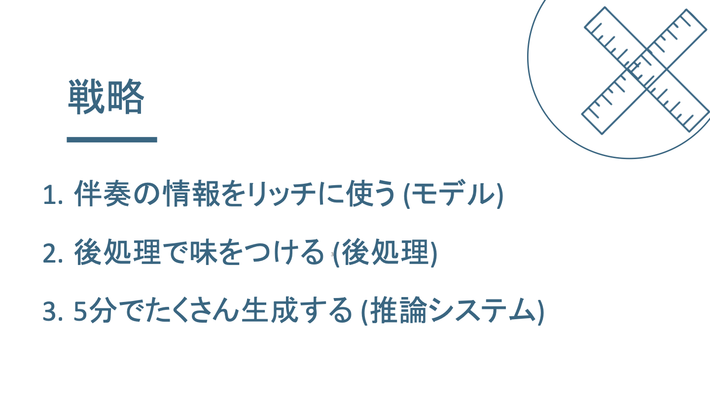
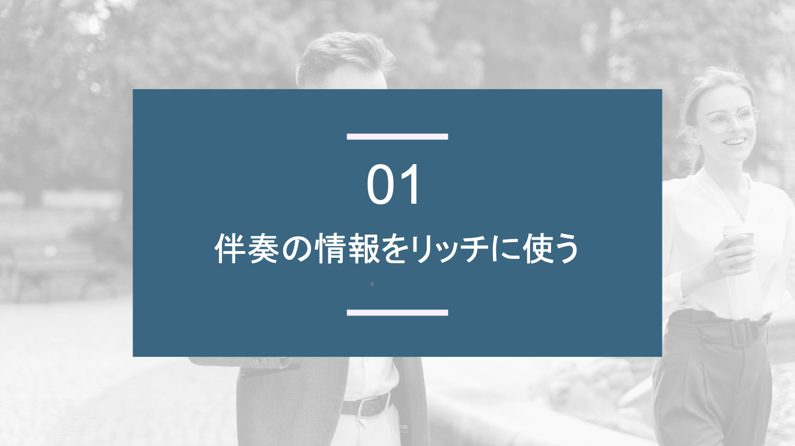
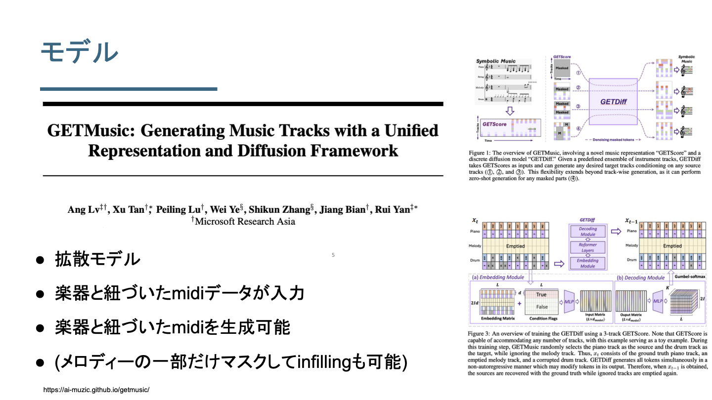
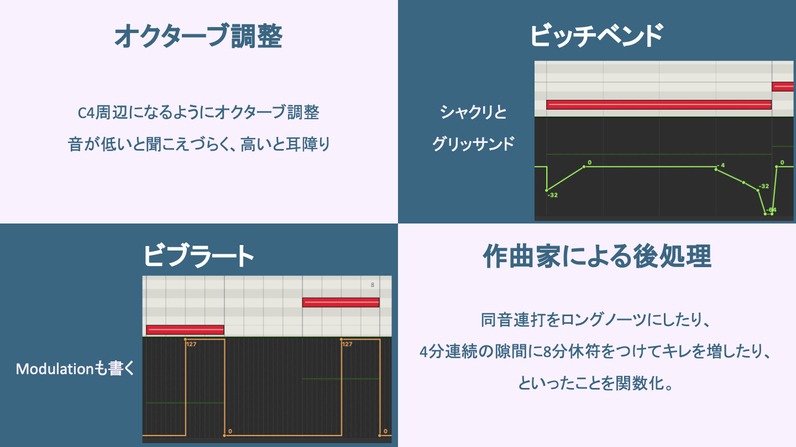
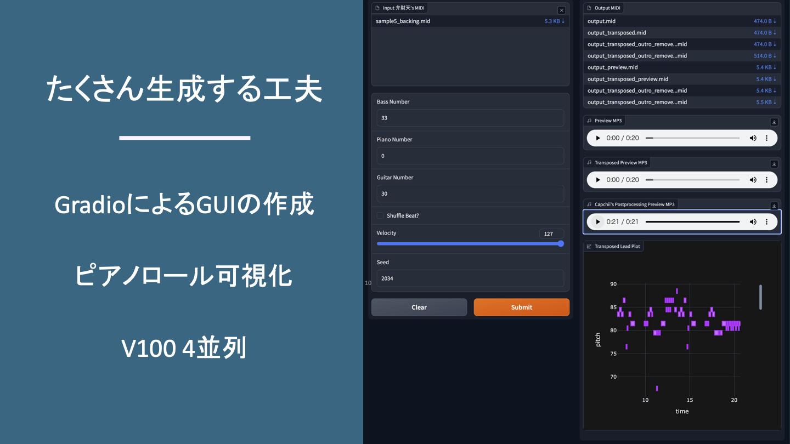

### 概要
2023年10月28日、「弁財天」というAIメロディー生成コンテストにチームメンバーのCapchiiと一緒に出場した。
コンテストは、運営から伴奏のデータが提供され、それに対して各チームは制限時間内に自身のメロディー生成システムを実行し、生成されたメロディーが聴講者の投票によって評価されるものとなっている。結果として、我々のチームは2位(7チーム中)を獲得。
私たちが心がけていたポイントは、王道なメロディーの作成やメロディーの選定、そして後処理を施すことだった。
本ブログでは、このイベントについての振り返りを行う。実際に生成したメロディーや出場しての感想等を提供する。

### 対象の読者
本ブログの対象者としては、

- AIを用いた音楽生成の技術に興味のある方。
- AIで現状どれほどのメロディーができるのか聞いてみたい方。
- AIメロディー生成コンテスト 弁財天 というイベントに興味のある方。
- 私の日記に興味のある方。

等が考えられる。また、専門用語について詳解しないので、音楽理論や機械学習の知識があるとより深く内容を理解できると思う。
一方で以下の方には向いていない内容である。

- 具体的な実装を知りたい方
- 網羅的に音楽生成技術の全体像を把握したい方

### 大会の仕組み
弁財天とは、AIメロディー生成コンテストである。トーナメント方式で勝ち上がっていく形式で開催された。

対戦ルールの簡単な説明は以下の通り。

- 対戦者には、伴奏のデータ(MIDIやコード進行のテキスト)が与えられる。
- 対戦者は自身が開発したメロディー生成システムをその場で実行する。(制限時間5分)
- 勝敗は、生成されたメロディーをその場で聞いて聴講者のその場の投票によって決定される。

前回の大会の様子はyoutubeに上がってる。
例えば決勝戦ではこんなメロディーが提示された。
https://youtu.be/XGJ9yYTPLvk?si=KeIgCtrprG_1fzI6&t=253

これに対し、対戦者たちは以下のようなメロディーを生成した。
https://youtu.be/XGJ9yYTPLvk?si=iv0JcjopxnSrL-uD&t=680

### 各対戦の結果と生成したメロディー
惜しくも2位となった我々のチームが生成したメロディーを振り返る。

#### 初戦
補足すると、今大会はメロディーラインの楽器がフルートである。大きくフルー聞こえるフルートの音が生成されたメロディーである。

https://youtu.be/Y4CM584SY48

(対戦相手のメロディーは公式のuploadを待って更新します。)

これはギリギリの勝利だった。マジで危ない。おそらく1票差なんじゃないかという感じ。
ここで、重大な事を予感した。我々の考える良いメロディーとは、キャッチーで覚えやすいようなJ-pop王道なメロディーだった(詳しくは後述)。しかし投票結果を見る限り、それらのメロディーを好む人は少ないんじゃないかという予感がした。

#### 準決勝
そして、大波乱の準決勝。これまでの対戦で一番難しい伴奏が提示された。
まずは、伴奏と生成したメロディーを聞いてもらおう。

https://youtu.be/gTyMoIHVE2A
 
これには以下の難しい要素がある。

- コード進行が一定かつ、メロディーの繰り返し構造が一定であるため、メロディーの生成が難しい。
- そもそもメロディーなしの状態で完成されている。
- ピアノがメロディーラインとなっていて、下手にメロディーをつけると邪魔になる。
- こういう曲がそもそも学習データに少ない。

この伴奏が流れた瞬間4チームとも一気に表情が変わったのを覚えている。作成者の思惑通りだった。

https://x.com/orinera/status/1718294370615689571?s=20

#### 決勝
これが渾身のサブミッションだ！俺たちは、椎名林檎になる！！！

https://youtu.be/b7mVzkvoUFk

なれませんでした。

これまじで、いいメロディーだと思うんだけどなぁ。集計の円グラフを見ると、おそらく1,2票差での敗北。

Jackさん、対戦ありがとうございました。とてもアドリブ感が強く、ジャズっぽい飽きのこないメロディだったのを覚えています。

### 解法と敗因
#### 解法LT
解法をざっくりと共有する。3分LTの資料なので本当にざっくりと雰囲気を感じ取ってもらえたら嬉しい。

#### 我々の思う良いメロディーとは
以上のシステムでメロディーを生成したが、生成したものを選定するという重要な作業がある。その際に、我々が心がけていたことは以下の通りである。

- とにかく王道なメロディー
    - モチーフと言われる短いメロディーの繰り返し構造がちゃんと存在するか？
        - 繰り返し構造といいつつ、やはり段々と変化していくものがよい。
        - これが王道なメロディーの作り方と言われている。参考 https://soundquest.jp/quest/melody/melody-mv1/motif-and-variations/ 
    - 適度に休符は存在するか？
        - これは息継ぎだけでなく、聴講者にメロディーを理解/記憶させる時間を作るという重要な役割を果たす。
    - アウトロではちゃんと中心音に着地するようなメロディーが生成されるか？
        - これは、聴講者に明確な終止感を与える。
- フルート、ボーカルっぽいメロディー
- キャッチーなメロディー
- 減点が少ないメロディー

#### 敗因(と推測されること)
優勝できるんじゃないかと考え参加したが、残念ながら準優勝止まりであった。そこには大きく2つの理由が考えられる。

- 投票者の好みには合わなかった
    - 現状、このイベントはマニアックなイベントとなっており、相当な音楽好きが参加する傾向である。
    - とすれば、キャッチーなメロディ、王道なメロディーというのは、もはや投票者からすると飽きられているものになっていたのかもしれない。
    - 投票の傾向からすると、アドリブギターソロみたいな詰め込み系っぽいメロディーを好む人が多いと推測される。
- アドリブっぽいメロディーではなかった
    - 投票フォームには「どちらのアドリブが良かったか」と記載されている。
    - そのため、よりアドリブ演奏っぽいものが選ばれる傾向になったのかもしれない。

### 感想
まずは、チームメンバーの Capchii ([X](https://twitter.com/Capchii), [Youtube](https://www.youtube.com/channel/UCmNqrPSZg13AUyxsrY7iylg)) に感謝です。音楽知識の周りで大変お世話になりました。MIDIの仕様の理解、味をつける後処理の実装など二人でなければなかなかできないことは多かったと思います。

競技では、チームメンバー二人とも納得の行くサブ(メロディー選定、および提出のこと)をできたので後悔はない。とはいえ、優勝できなかったのは悔しい。メロディーのキャッチーさでいえば、優勝していたと個人的に思っている(負け惜しみ)。

