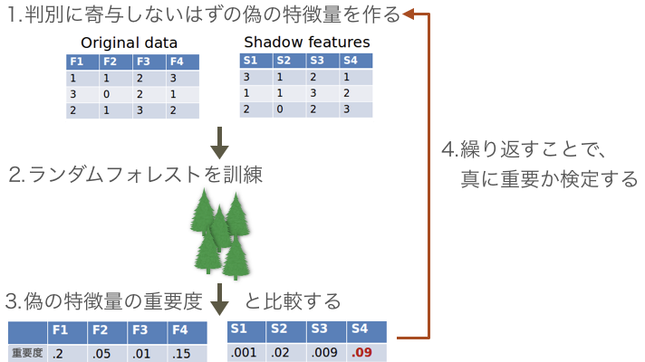
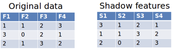
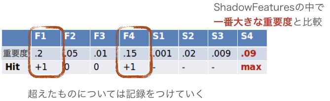
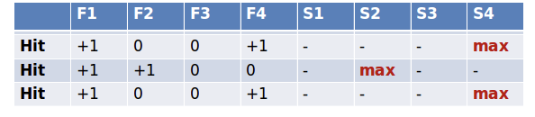
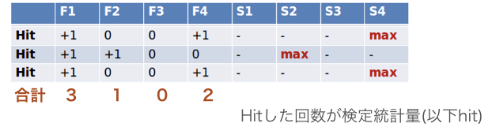
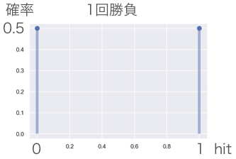
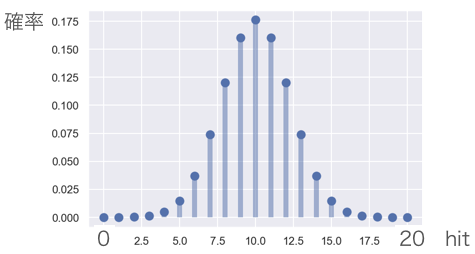
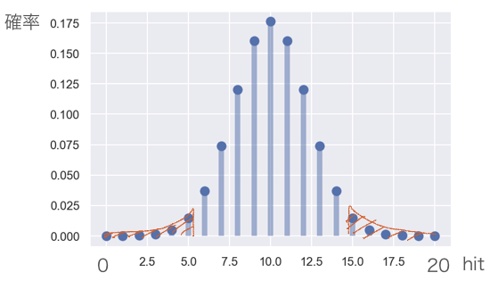
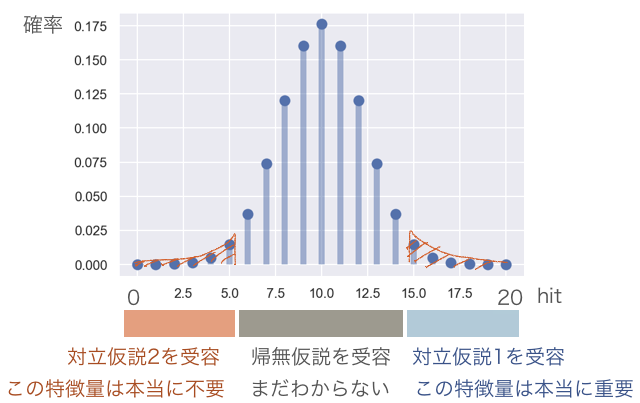

## ランダムフォレストと検定を用いた特徴量選択手法 Boruta

### 特徴量選択とは
特徴量選択(Feature Selection, 変数選択とも)はデータサイエンスにおいて非常に重要である。
Kaggle等のコンペティションではひたすら判別の精度を重要視するが、実務上どうしてそのような判別をしたのかという理由のほうが大事である(回帰問題も同様)。
例えば、なにかの製造工程をイメージしてみよう。
当然欠陥品は生じるだろうが、この欠陥品を見分けるシステムよりも欠陥品を減らせる改良のほうが良いだろう(もちろん見分けるのも大事だが)。
そこで、判別においてどのような特徴量が重要だったか選ぶことができれば、改良への糸口が見えてくるだろう。

また、特徴量選択した結果、モデルの学習や推論が高速化されたり、過学習しづらくなったり、結果判別の精度が良くなったりする。

### Borutaとは
ランダムフォレストと検定を用いた特徴量選択の方法の一つである。
Witold R. Rudnicki, Miron B. Kursaらが考案。

R実装
https://cran.r-project.org/web/packages/Boruta/index.html

Python実装(バグあり。まとめ後に補足します。)
https://github.com/scikit-learn-contrib/boruta_py

(名前の由来はスラヴ神話の森の神の名前らしいです。こんな見た目してます。)


このBorutaという手法は経験上非常に強力で、判別や回帰の性能が著しく低下したことはない。低下しても誤差の範囲内。むしろ性能が良くなることが多い。

一応、特徴量選択の手法としてよく知られているものとの比較というか私感
- ランダムフォレスト
    - どれぐらいの特徴量重要度があったら重要だと言えるのかがイマイチ
    - ランダム性から訓練するたびに特徴量重要度が変動する
- Forward selectionやBackward eliminationと言ったステップワイズな方法
    - 計算量が多い
    - 選んだ特徴量が過学習する
- lasso
    - 選んだ特徴量が過学習する
    - ロジスティクス回帰やSVMで用いたことしかないので、めっちゃ効く手法もあるかも

### とりあえず使ってみる
理論を説明する前に、まず実際に使ってBorutaの威力を実感していただこう。
Pythonで実装する。
用いるデータセットはMadelon datasetという人工データ。

- Madelon Dataset
  - 判別問題(-1, 1のクラスラベルがついている)
  - サンプル数は2000
  - 特徴量は500個
  - 特徴量のうち20個は本当に判別に寄与する特徴量で、残りはデタラメ
  - サンプルのうち1500サンプルをtrainに500サンプルをtestに
  - [データの取得先](http://archive.ics.uci.edu/ml/datasets/madelon)

また、分析のストーリーは以下である。

- ベースラインとしての判別
  1. すべての特徴量を用いてtrainでランダムフォレストを訓練。
  2. testでconfusion matrixを示す。
- Borutaを用いた判別
  1. trainを用いてborutaで特徴量選択。
  2. 選ばれた特徴量に限定してtrainでランダムフォレストを訓練。
  3. testでconfusion matrixを示す。

#### ベースラインの判別
ベースラインを実行すると以下のような判別を結果が得られる
``` Python
rf=RandomForestClassifier(
    n_estimators=500,
    random_state=42,
    n_jobs=int(cpu_count()/2)
)
rf.fit(X_train.values, y_train.values)
print(rf.classes_)
print(confusion_matrix(y_test.values,rf.predict(X_test.values),labels=rf.classes_))
```
```
[-1  1] #クラスの並び順
[[179  70]
 [ 96 155]]
```
判別を誤ったのは500サンプル中166サンプルであった。

#### Borutaの判別
まずBorutaで重要そうな特徴量を選択する。
```Python
rf = RandomForestClassifier(n_jobs=int(cpu_count()/2), max_depth=7)
feat_selector = BorutaPy(rf, n_estimators='auto', two_step=False,verbose=2, random_state=42)
# two_stepがない方、つまりBonferroniを用いたほうがうまくいく

# データの二度漬けになるので特徴量選択する際にもtestを含めてはいけない
feat_selector.fit(X_train.values,y_train.values)
```
```
BorutaPy finished running.

Iteration: 	52 / 100
Confirmed: 	18
Tentative: 	0
Rejected: 	482
```
重要な特徴量20個をすべて選ぶことはできなかったが、それでも18個選ぶことができた。
データを選んだ特徴量だけに変形しよう。
```Python
X_train_selected = X_train.iloc[:,feat_selector.support_]
X_test_selected = X_test.iloc[:,feat_selector.support_]
```
そして、trainで再びランダムフォレストを学習
```Python
rf=RandomForestClassifier(
    n_estimators=500,
    random_state=42,
    n_jobs=int(cpu_count()/2)
)
rf.fit(X_train_selected.values, y_train.values)

print(rf.classes_)
print(confusion_matrix(y_test.values,rf.predict(X_test_selected.values),labels=rf.classes_))
```
```
[-1  1] #クラスの並び順
[[219  30]
 [ 29 222]]
```

Borutaを使って特徴量選択した場合は、誤判別が500サンプル中59個まで減った。

これでBorutaの凄さを実感できたことだろう。

### Borutaのアイデアの概要
では、どのようにしてBorutaが特徴量を選択しているのだろう。
そのアイデア自体はシンプルである。

ざっくりと一言で言うならば、「ニセの特徴量を作って重要度を比較する」というもの。

具体的には以下の4ステップの手順を踏んでいる。

1. 判別に寄与しないはずの偽の特徴量を作る。
2. 偽の特徴量と一緒にランダムフォレストを訓練。
3. 各特徴量の重要度と偽の特徴量の特徴量を比較。
4. 複数回比較し検定を行うことで、本当に重要な特徴量のみを選択。



以下では判別(回帰)に少しでも寄与するという意味を込めて「重要」と呼ぶことにする。
### Borutaのアルゴリズム
#### 1. 判別に寄与しないはずの偽の特徴量を作る。

もともとのDataFrame(Original data)をコピーする。これをShadow featuresと呼ぶことにする。
Shadow featuresの各列に対して、サンプルをシャッフルする。これで各特徴量は判別に寄与しないはずの特徴量になった。



#### 2. 偽の特徴量と一緒にランダムフォレストを訓練。
Original dataとShadow featuresを結合してランダムフォレストを訓練する入力とする。

#### 3. 各特徴量の重要度と偽の特徴量の特徴量を比較。
ランダムフォレストを訓練したら、Original dataとShadow featuresの双方から特徴量の重要度を得ることができる。


Shadow featuresの中で一番大きな特徴量重要度を記録しておく。この操作によって、「寄与しないはずの特徴量でもこれぐらいの重要度になりえる」という目安になる。

ではこの「Shadow featuresの中で一番大きな重要度を持つ特徴量」よりも重要な特徴量が、真に重要だと言ってしまって良いのだろうか。ランダムフォレストの性質により、特徴量の重要度は訓練するたびに変動する。一回の訓練ではたまたま選ばれたり、たまたま選ばれなかったりする特徴量も出てきてしまう。

#### 4. 複数回比較し検定を行うことで、本当に重要な特徴量のみを選択。

何回もランダムフォレストを訓練し、重要そうな特徴量を複数回記録する。そして各特徴量に対して重要かどうかの検定を行う。

重要そうな特徴量の記録については下図のように非常にシンプルである。



Shadow featuresの中で最大の重要度よりも大きな特徴量について、それが選ばれるたびhitを+1していく。例えばランダムフォレストを3回訓練し、3回とも選ばれるような特徴量が存在したら、その特徴量のhitには3が格納されている。逆に一回も選ばれなければhitは0である。直感的にはhitが多いほど重要で、少ないほど重要じゃないとなる。



では具体的ランダムフォレストを訓練した回数に対してhitがどれぐらい多ければ重要だと言えるのだろうか。この部分に、ランダムフォレストを訓練した回数をn、p=0.5としたときの二項分布を用いて検定を行う。
詳細は次章で述べる。

### 検定について
検定は一般的に以下のような手続きで行われる。詳細と直感的な解釈は後で与えるので、さらっと読んでもらえれば良い。
1. 棄却したい帰無仮説と受容したい対立仮説を用意する。
2. 観測値から検定統計量Tを定める。
3. 帰無仮説が正しいとしてTの分布を求める。
4. 十分小さい有意水準αを定め、帰無仮説が正しいときに $P(T \in C_\alpha)=\alpha$ となる領域$C_\alpha$を棄却域とする。
5. 観測されたTが$C_\alpha$に入っていたら対立仮説を受容し、入っていなければ帰無仮説を受容する。

#### 1. 棄却したい帰無仮説と受容したい対立仮説を用意する。
検定を行う際にここでは仮説を3つ用意する。

- 帰無仮説
    - この特徴量の重要度は、判別(回帰)に寄与しない特徴量の重要度と同じである。
- 対立仮説1
    - この特徴量の重要度は、判別(回帰)に寄与しない特徴量の重要度よりも大きい。
- 対立仮説2
    - この特徴量の重要度は、判別(回帰)に寄与しない特徴量の重要度よりも小さい。


#### 2. 観測値から検定統計量Tを定める。
検定統計量は都合のいいように設計できるが、今回hit(重要だとされた回数）がそのまま検定統計量Tとなる。




#### 3. 帰無仮説が正しいとしてTの分布を求める。
帰無仮説は「この特徴量の重要度は、判別(回帰)に寄与しない特徴量の重要度と同じである。」というものだった。
つまり、複数回ランダムフォレストを構築し何度も重要度の勝ち負けを見たときに、「この特徴量と寄与しない特徴量は同じぐらい勝ったり負けたりする。」と言える。勝率0.5である。これを確率分布で表すと二項分布になる。
例えば、一回ランダムフォレストを訓練したときに、この特徴量のhitが0なのか1なのかを確立で表すと、50%50%だろう。これがn=1の場合の二項分布である。図にすると下図のようになる。



これを20回勝負にすると下図。勝率0.5なのに、全敗(hit=0)や全勝（hit=20）する確率はほぼないわけである。



結論として考えるべき分布は、ランダムフォレストを訓練した回数をnとしたときの二項分布がhitの従う分布である。以下、ランダムフォレストを20回訓練した状況について考える。(n=20の二項分布)

#### 4. 十分小さい有意水準αを定め、帰無仮説が正しいときに$P(T \in C_\alpha)=\alpha$となる領域$C_\alpha$を棄却域とする。
有意水準αを仮に0.05と設定したとき、棄却域は下図のように設定できる。



左端のオレンジ色で示した棄却域は、「帰無仮説が正しければ、
20回勝負してhitが5以下になる確率は0.05以下」ということを示している。
右端も同様に、「帰無仮説が正しければ、
20回勝負してhitが15以上になる確率は0.05以下」。


#### 5. 観測されたTが$C_\alpha$に入っていたら対立仮説を受容し、入っていなければ帰無仮説を受容する。
今、対立仮説が2つあるので、対応関係を示すとこうなる。



ランダムフォレストを20回訓練し、hitが18だった場合、いま考えている特徴量はめでたく対立仮説1を受容し、重要だと言えるわけである。

逆に対立仮説2を受容してしまった特徴量は、計算から省くことでborutaは繰り返し計算をどんどん軽くしている。
また有意水準αは固定ではなく、borutaではBonferroni correctionという手法で決定している。python実装にはBonferroni correctionの代わりに、Benjamini Hochberg FDRを用いることができるが、経験上前者のほうがよい結果を出す。

### まとめ
- データを用いて原因分析を行うタスクには特徴量選択が使える。
- Borutaは特徴量選択を行う手法の一つで非常に強力。
- 人口データ実験では特徴量を選択した結果、誤判別が166->59まで減った。
- Borutaのアイデアは「ニセの特徴量を作って重要度を比較する」というシンプルなもの。
- 真に重要かを検定するために性能が良い。


### 補足
https://github.com/scikit-learn-contrib/boruta_py

BorutaのPython実装にはまだバグがあり動かないこともあります。
また、PyPIの更新をしていないのか`pip install boruta`では相当古いバージョンが入ります。

ひとまず、issueをあさり、動くようにしたものをここにおいて置くので、使う際は同一ディレクトリに入れて`from boruta_py import BorutaPy`してください。

https://raw.githubusercontent.com/masakiaota/blog/master/boruta/boruta_py.py

また分析に用いたnotebookへのリンクはこちらです。

https://github.com/masakiaota/blog/blob/master/boruta/Madalon_Data_Set.ipynb


### 参考

http://danielhomola.com/2015/05/08/borutapy-an-all-relevant-feature-selection-method/

https://www.listendata.com/2017/05/feature-selection-boruta-package.html
