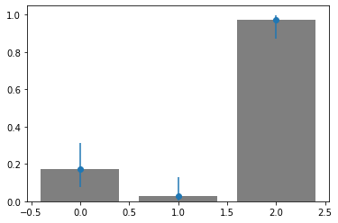

クリックレートやコンバージョンレートといった二項母集団の母比率の信頼区間 精密法のPython実装
===

### 前提
本記事ではクリックレート(CTR)やコンバージョンレート(CVR)といった二項母集団の母比率について信頼区間を計算するPython実装を与える。データ数が少ない状況においてはCTRやCVRだけではなく、その不確実性も考慮し比較、議論するのが望ましい。
二項母集団の母比率の信頼区間の算出方法は近似法がメジャーであるが、データ数が少ない状況においては誤差が大きくなる。ここでは精密法を用いて算出する。

本記事で求めるものを厳密に定式化するなら以下のようになる。

ベルヌーイ分布に従う確率変数が[tex:X]が[tex:n]個存在する。[tex:X]は[tex:0,1]のいずれかを実現値として取る。

[tex:X_1, ... ,X_n  \overset{i.i.d.}{\sim} Be(p)]

現実で例えれば、広告を見た人が[tex:n]人いて、それぞれの人について広告を見たら1、広告を見てなければ0ということに対応する。広告を見る確率は[tex:p]である。

次に広告を見た人数を[tex:S_n]とする。[tex:S_n]も確率変数であり二項分布に従う。

[tex:S_n=\sum_{i}^{n} X_i \ \ (S_n \sim \mathcal{B}(n,p))]

[tex:S_n]の実現値を[tex:s]とする。

#### データ
n回試行してs回成功した(n回表示してs回クリックされた)。

#### 求めたいもの
[tex:\hat{p}(=\frac{s}{n})]の信頼区間の上限と下限 (信頼係数 1-[tex:\varepsilon] )

### 実装
この神資料のP27に従って実装した。理解は... http://www.math.u-ryukyu.ac.jp/~sugiura/2014/act_math2014.pdf

```python
from scipy.stats import f as F
import numpy as np
from typing import Union

# CTRやCVRそのもの
def p_hat(n:Union[int,np.ndarray],
          s:Union[int,np.ndarray]):
    return s/n


# 信頼区間の下限
def confidence_interval_left(n:Union[int,np.ndarray], #サンプル数
                             s:Union[int,np.ndarray], #成功回数
                             eps=0.1)->Union[int,np.ndarray]: #両側棄却域の大きさ
    assert type(n)==type(s)
    if not isinstance(n,int):
        acceptable = [np.int8,np.int16,np.int32,np.int64,np.uint8,np.uint16,np.uint32,np.uint64]
        assert n.dtype in acceptable and s.dtype in acceptable

    denominator=s+(n-s+1)*F.ppf(1-eps/2,dfn=2*(n-s+1), dfd=2*s)
    numerator=s
    return numerator/denominator

# 信頼区間の上限
def confidence_interval_right(n:Union[int,np.ndarray], #サンプル数
                             s:Union[int,np.ndarray], #成功回数
                             eps=0.1)->Union[int,np.ndarray]: #両側棄却域の大きさ
    assert type(n)==type(s)
    if not isinstance(n,int):
        acceptable = [np.int8,np.int16,np.int32,np.int64,np.uint8,np.uint16,np.uint32,np.uint64]
        assert n.dtype in acceptable and s.dtype in acceptable

    denominator=n-s+(s+1)*F.ppf(1-eps/2, dfn=2*(s+1), dfd=2*(n-s))
    numerator=(s+1)*F.ppf(1-eps/2,dfn=2*(s+1), dfd=2*(n-s))
    return numerator/denominator
```


### 確認
適当なn,sを決めて、90%信頼区間を可視化してみる。

```python
import matplotlib.pyplot as plt

n=np.array([35,35,35]) #nは揃えなくてもおk
s=np.array([6,1,34])

CTR=p_hat(n,s)
upperto=confidence_interval_right(n,s)-CTR # エラーの上方向
bottomto=CTR-confidence_interval_left(n,s) # エラーの下方向

plt.bar(list(range(3)),CTR,color='C7')
plt.errorbar(list(range(3)), 
             CTR, 
             yerr=np.vstack([bottomto,upperto]),fmt='o')

```



おしまい。