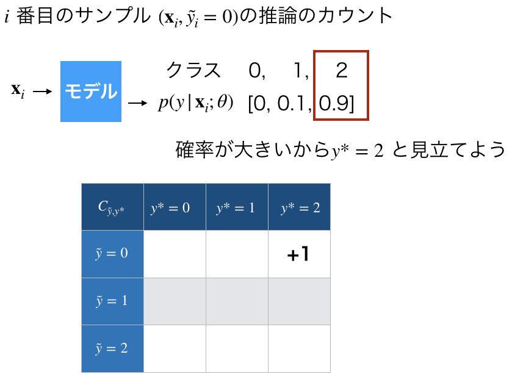
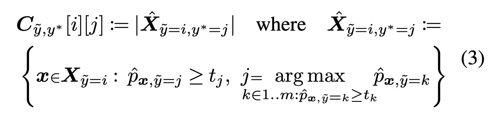
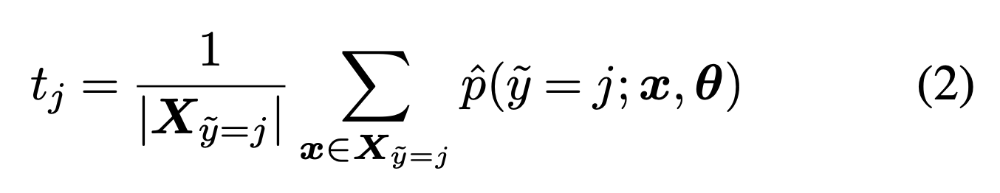
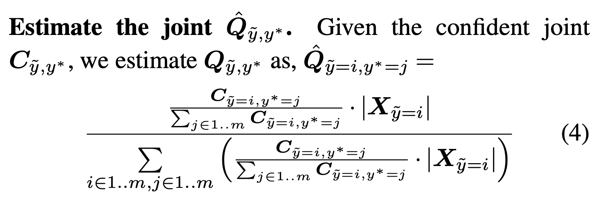
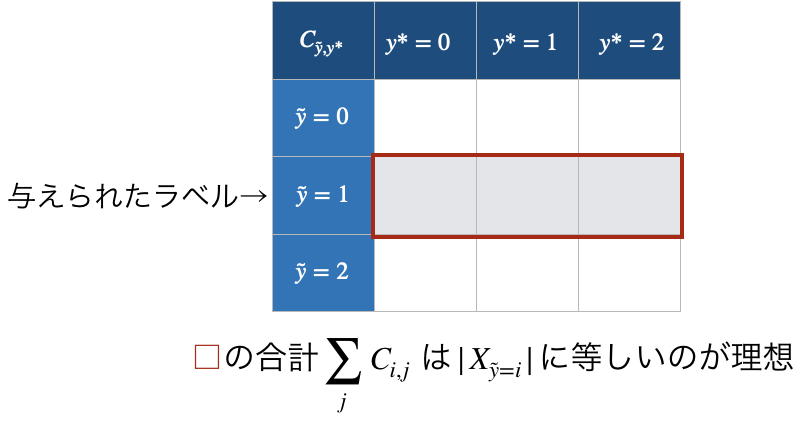
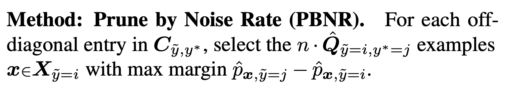
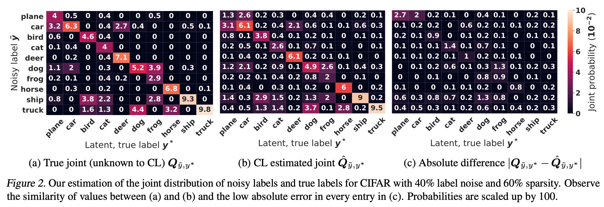
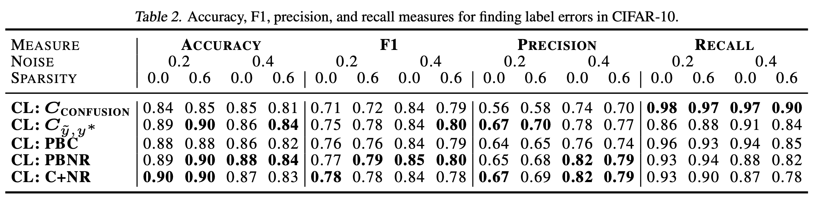
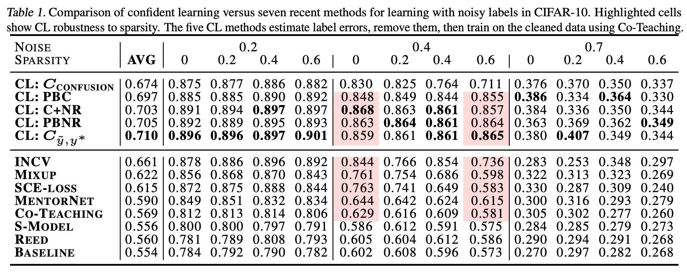

Confident Learning -そのラベルは本当に正しいのか？-
==

### これは何？

ICML2020に投稿された Confident Learning: Estimating Uncertainty in Dataset Labels の論文が非常に面白かったので、その論文まとめを公開します。

論文 https://arxiv.org/abs/1911.00068

著者解説ブログ https://l7.curtisnorthcutt.com/confident-learning

[TOC]

### 超概要
- データセットにラベルが間違ったものがある(noisy label)。そういうサンプルを検出したい
- Confident Learningという方法を提案。現実的な状況下でSOTAを達成。
- PyPIに実装を公開済みですぐに使用可能。(`pip install cleanlab`)
https://github.com/cgnorthcutt/cleanlab/

### 私感
- シンプルな手法かつ直感的に納得の行くもの
- すぐに使えるようにpython packageにしてくれているのが神か？
- ハイパーパラメータないのも神か？
- 使うモデルに制約が(すく)ないのが良い。ニューラルネットでもランダムフォレストでもロジスティック回帰でも
- 論文の結果を見る限り、ノイジーラベルに対する第一選択肢として良さそう
- 他手法との組み合わせも可能そう。例えば、ノイジーとされたラベルにPseudo-Labelをつけたり、mixupなどと組み合わせるなども可能。実際に論文の実験ではCo-teachingのあわせ技でモデルを学習。

<!-- ### 実験などをしてもいいかも -->

### 論文の概要
- Noisy Labeledなデータセットに対しての課題
  - ラベルノイズがどのような特徴を持っているか？
  - どのサンプルのラベルが間違っているのか？
  - ノイズありの状況下で訓練したら良いのか？
- 上記の課題に対応するためのアプローチConfident Learning(CL)を提案
- CLを使うメリット
  - どのクラスはどのラベルに間違えられやすいかを取得可能
  - どのサンプルのラベルが間違っていそうか取得可能
  - (確率と見なせるものを出力するならば)どんな判別器に対しても使用可能
  - 多クラス分類対応
  - すぐに使用可能 (`pip install cleanlab`)
- 仕組みは？
  - 真のクラス$y^\ast$と与えられたラベル$\tilde{y}$の同時分布$p(y^\ast, \tilde{y})$を$y^\ast$なしで推定
- 性能は？
  - 理論的に妥当
    - Class-conditional classification Noise Process (CNP) という現実的な仮定
    - クラスインバランスやモデルの性能に対して頑健であるという理論的に保証
  - 実験的に高性能
    - CIFAR-10を用いた実験で、他の手法よりも同等もしくは良い性能を発揮
    - Sparsityの大きい(現実に近い)状況では他の手法の性能を凌駕

以下自分が重要そうだと思ったところを解説する。解説は基本的に大雑把に流れを見てから細かいところを説明という流れで進む。大雑把なところでは疑問点が浮かび上がるかもしれないが、そのまま読み進めてほしい。

### Class-conditional classification Noise Process
まず考えたいのは、ノイズはどのようにもたらされるか？、だ。
ノイズエラーはラベルをつける人の勘違いや早とちり、知識不足などによって引き起こされると考えられる。

 https://ja.wikipedia.org/wiki/%E3%82%AA%E3%82%AA%E3%82%AB%E3%83%9F

たとえば、狼の画像は犬と間違えやすいだろう。狐と間違える人も一定数いるかも知れない。一方、狼をシマウマと間違えるような人は少ない。

このように、ノイズというのは真のクラスによってのみ決まると仮定する。このことを定式化すると以下になる。

真のクラスを$y^\ast (\in \mathbf{N}_{>0})$、与えられたラベル(noisy label)を$\tilde{y}(\in \mathbf{N}_{>0})$とするとき、$y^\ast = j$ が$\tilde{y} = i$になる確率は以下のように定義する。
$$Q_{\tilde{y} | y^\ast}=p(\tilde{y} = i | y^\ast= j)$$

この条件付き分布を求めるのには、同時分布がわかればよい。すなわち、
$$Q_{\tilde{y} , y^\ast}=p(\tilde{y} = i , y^\ast= j)$$
をどうにか推定できれば、ノイズの発生の特徴がわかる(狼の画像はどれぐらい犬に間違えられやすいかなど)。

さらには、これを用いて怪しいラベルの特定なども行うのだがそれは次のお話。

### Confident Learningの概要

前述したように、CLにおいて重要なのは同時分布$Q_{\tilde{y} , y^\ast}$を推定することである。これをどうやって求めるのかは気になるところだが、一旦置いといて、CLの全体の流れを見てみよう。

CLの概要は以下の図に集約される。図の緑色の点線で囲まれた部分がCLで処理する部分である。

#### 入力
必要なのはデータとモデルの出力確率である。

まずnoisy dataで訓練したいモデルを訓練する。そして、訓練済みモデルに推論させて確率を出力させる。(細かい話だが、訓練はtrainで推論はvalidで。)

#### 出力
CLでごちゃごちゃやった結果。Labelに問題のあるデータと問題のないデータが出力される。

#### CLの処理
入出力の間で何が行われているか。それは、同時分布$Q_{\tilde{y} , y^\ast}$の推定である。どうやって推定するか、詳細な説明はあとで行うのでここでは直感的な説明にとどめる。

$y^\ast$がわからない。しかしモデルの出力確率$p(y|x;\mathbf{\theta})$が大きいものは本当に$y^\ast$であるだろう。ならば、出力確率が大きいものに限れば、ラベル$\tilde{y}$とおそらく真のクラス$y^\ast$の組み合わせについて、数をカウントできる(下図参照)。それが上図の右上の表$C_{\tilde{y},y^\ast}$である。

カウントが求まったらあとは正規化すれば、推定された同時分布$\widehat{Q}_{\tilde{y} , y^\ast}$が得られる。

ラベルの間違っているサンプルは、$\widehat{Q}_{\tilde{y} , y^\ast}$の割合とモデルの出力にしたがって"怪しい"ものからラベルが間違っているとすれば良い。

### 同時分布Qの推定
上記での大雑把な説明を厳密にする。同時分布を推定するには、モデルの出力を使ったカウントの工程と、行列CをQに変換するための正規化の工程に分かれる。

#### Cを作るカウント方法
カウントは厳密に式で示すと(3)である。

式はごちゃごちゃしているが日本語に直すと、｢カウント数[i][j]は、iをjと判別したものの中で、出力確率が$t_j$以上の個数｣となる。$t_j$は以下(2)で定義される。これは｢そのクラスの出力確率の平均｣を意味する。($X_{\tilde{y}=i}$とは与えられたラベルがiであるサンプルの部分集合である。|・|は要素数を示す。)

こうすることでうまくハイパーパラメータを回避している。もちろんtに分位点などを設定することもできるが、ハイパラは増える。(ノイジーラベルは評価、検証が難しいということで最適なハイパラの探索はきつい気がする。)

ちなみに、一つのOut-of-fold分のCを作る計算量は、クラス数をm, サンプル数をnとしたとき、O(mm + nm)である。

#### Qへの正規化
Cをただ正規化してQを作るわけではなくて、具体的には(4)のような計算を行っている。

これは、以下のようなお気持ちが入っている。理想的なカウントを想像していただきたい。

しかし、今$t_j$という閾値によってカウントされたりされなかったりするので、ここでずれた分を補正する必要がある。

単純な正規化の式

$$\widehat{Q}_{i,j} = \frac{C_{i,j}}{\sum_{i,j} C_{i,j}}$$

と比較すると(4)は分子分母について、各iに対して$\frac{|X_{\tilde{y}=i}|}{\sum_{j} C_{i,j}}$倍することによって、この補正を行っている。

### データクリーニング
ラベルが間違っていそうなサンプルを抽出する。論文中では5つのやり方が提示されていたが、仮定や理論にもっとも則しているとされたやり方を紹介する。

といっても以下の説明で終わり。

### 実験結果
ここではCIFER-10を用いた実験結果だけ説明する。ImageNetの実験結果は論文を参照していただきたい。

真の同時分布Qを作り、それに従ってCIFER-10をnoisy datasetに加工し実験に使用していた。
使用モデルはResNet50をCo-teaching(Han, 2018)で学習したもの。

#### 同時分布Qをうまく推定できているか

パット見、真と推定の誤差(右)は結構少ないように感じる。

#### Noisy Labelを検出できているか
Table2 は、label errorをちゃんと検出できているかを示している。
図に示している手法の一覧は、label errorのサンプルをどのように抽出したかを示している。理論通りPBNRが良さそうというのが結果に現れているが、他の性能もなかなか悪くない。(というのが自分の見解)

Sparsityは真の同時分布Qに含まれる0の割合である。現実のデータセットはSparsityが大きいと推測される(狼をシマウマに間違える人はいない)。

#### 他手法との比較
Table1 の上段はnoisy datasetのCIFAR-10をデータクリーニングしたあとにもう一度学習した正解率を示している。下段は近年のnoisy robustな手法である。

多くの場合、Sparsityが0の場合においては他の手法と同等、もしくは良い結果を達成している。特筆すべきなのはSparsityが0.6になったときである。現実に近い高Sparsityな同時分布においては疑いなく他の手法よりも良い結果が現れている。

### まとめ

もう一度、論文の概要をここにコピペする。

- Noisy Labeledなデータセットに対しての課題
  - ラベルノイズがどのような特徴を持っているか？
  - どのサンプルのラベルが間違っているのか？
  - ノイズありの状況下で訓練したら良いのか？
- 上記の課題に対応するためのアプローチConfident Learning(CL)を提案
- CLを使うメリット
  - どのクラスはどのラベルに間違えられやすいかを取得可能
  - どのサンプルのラベルが間違っていそうか取得可能
  - (確率と見なせるものを出力するならば)どんな判別器に対しても使用可能
  - 多クラス分類対応
  - すぐに使用可能 (`pip install cleanlab`)
- 仕組みは？
  - 真のクラス$y^\ast$と与えられたラベル$\tilde{y}$の同時分布$p(y^\ast, \tilde{y})$を$y^\ast$なしで推定
- 性能は？
  - 理論的に妥当
    - Class-conditional classification Noise Process (CNP) という現実的な仮定
    - クラスインバランスやモデルの性能に対して頑健であるという理論的に保証
  - 実験的に高性能
    - CIFAR-10を用いた実験で、他の手法よりも同等もしくは良い性能を発揮
    - Sparsityの大きい(現実に近い)状況では他の手法の性能を凌駕

CLは、モデルに依存しないのが魅力的である(近年だとニューラルネット限定などが多かった)。また、Sparsityが大きい状況で特に性能が良いのは、現実の状況に則していてCLの使用は妥当であると感じさせられる。
また、実装が用意されているのも親切であり、scikit-learnを叩くのと同じ感覚で使用可能である。

ただ、CLに使用するためのモデルは何がいいのか、どんな条件を満たすことが必要なのか、はもっと知りたいところであり今後の研究の動向に注目したい。

### 参考
https://arxiv.org/abs/1911.00068

https://l7.curtisnorthcutt.com/confident-learning

https://github.com/cgnorthcutt/cleanlab