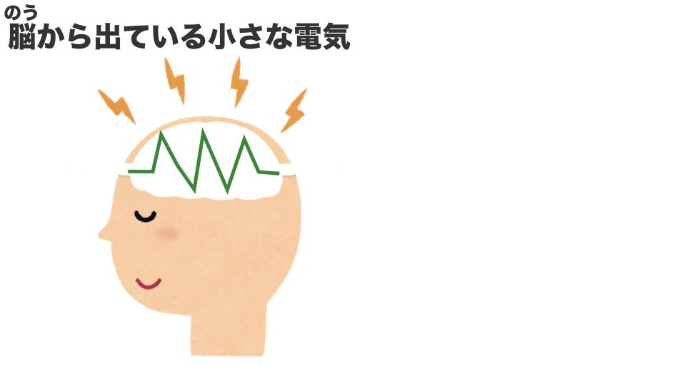
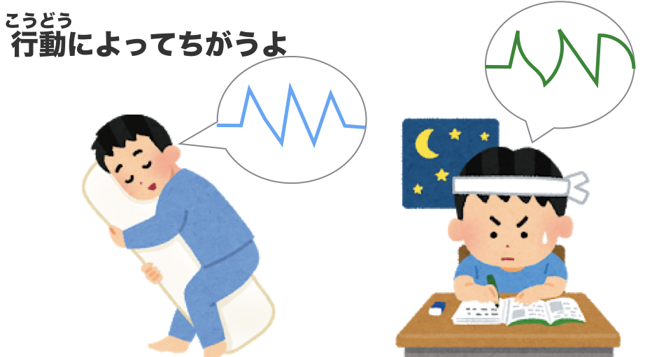
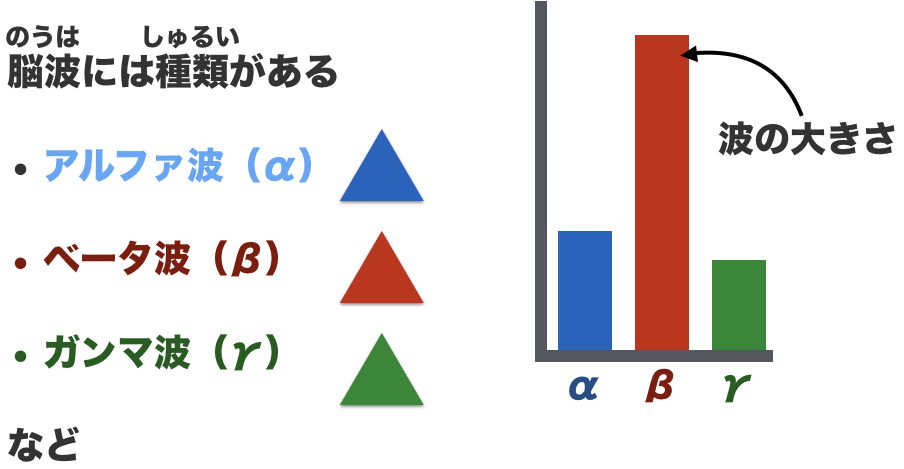
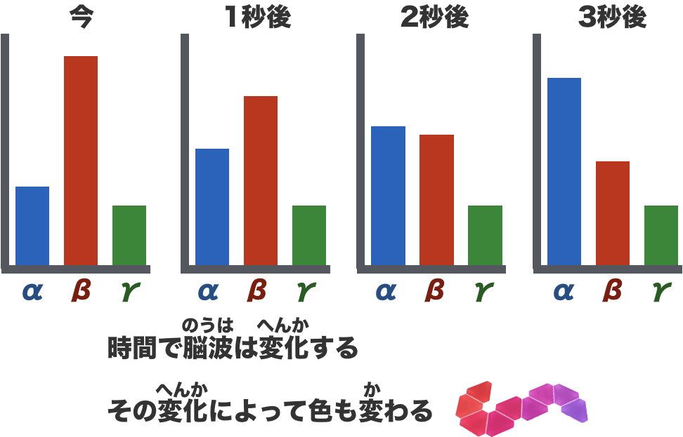
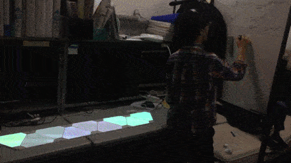

## 脳波を可視化してみた

### 概要
- 脳波を色を使って可視化してみた。
- 脳波を採取するのには、Mindwaveを用いた
 http://amzn.asia/d/bzFf1Az

 - 可視化には、Nanoleaf Auroraを用いた
http://amzn.asia/d/9I3mvhV

具体的には行動によって変わる時系列としての脳波を、光の系列で表現した。

### 脳波と表現の説明
#### 脳波とは

以上の性質を用いて、行動によって脳波が変わるのを今回は確認した。

脳波は時間的に変化する電圧の値である。しかし今回は、その時系列を周波数解析してある値を用いた。α波(8-13Hzの強度)、β波(14~25Hz)、γ波(26~70Hz)である。(ここのHz数は諸説あってわりと適当に書いてます。)
リラックスしているとα波が出るなどと言われるので、こうしたほうがいくらか意味のあるデータがとれそうである。

説明のために以下のように描くことにしよう。

このとき、脳波の時系列の変化は以下のように表される。

この例では、赤っぽい状態から青っぽい状態に遷移してほしい。むしろ、そうなるように可視化側でプログラミングをした。

### 結果
こんな感じで、動いた

起きているときは緑色や灰色が出ていて、閉眼すると青色や紫色が確認できる

### 難しかった点
#### Python環境の不一致
脳波計のライブラリはPython2系のものしかなく、可視化のAuroraのライブラリはPython3系のものしかなかった。
そのため、同一のファイルで完結させることができなかった。そこでソケット通信を用いて、Python2系で取得した脳波の値を、Python3系の可視化のプログラムへ転送する処理を行った。そこのすり合わせが非常にめんどくさい点であった。

#### 測るたびに変わる脳波
また脳波も曲者であった。人によって傾向が全然違ければ、同一人物でも脳波計を装着し直すたびに傾向が変わってしまう。しかもこの傾向の変動は脳波の振る舞いと比べて、非常に大きかったため扱いが難しかった。そこで、装着するたびに、キャリブレーションのようなものを行う必要があった。この解決策までに至る過程と、この作業を行うプログラムを書くのが~~面倒~~大変だった。

### ソースコード
｢同じようなことをやるひとがいた場合、この苦労を味あわせたくない｣と一緒に作業した人が言っていたので、Githubへのリンクをおいておく。
あまりきれいなコードではないが、参考になるひとがいることを祈る。

https://github.com/ozumin/unilab_eeg

