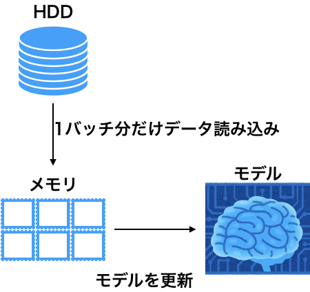
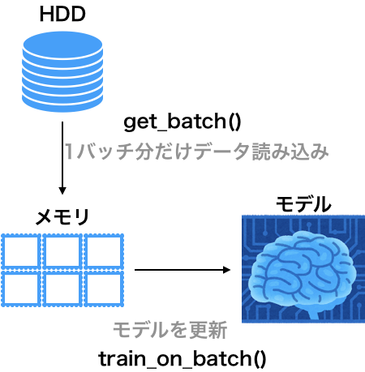
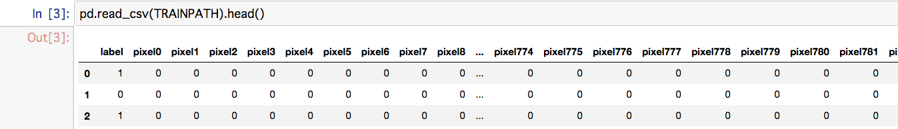
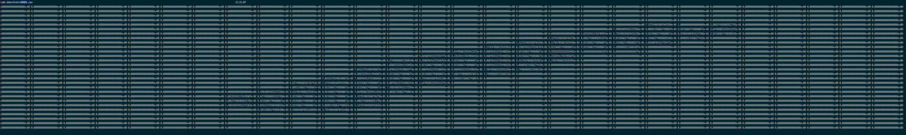

## メモリに乗り切れないデータをkerasで学習する

### はじめに
こんにちは。何が起きたかから言うと、DeepLearningしようとしたらデータが270GB近くあってメモリに乗らなかった。そこで、練習がてら、batchごとにHDDからデータを読み出して、batch学習するコードを書いた。

kerasやpythonをある程度知っている前提で書き進めていく。

### 何を使うか
公式ドキュメントで検索すると"メモリに載らない大きさのデータを扱うには？"
https://keras.io/ja/getting-started/faq/#_8

とある。これによると方法は2つあるらしい。

#### 方法1
```model.train_on_batch(x, y)```を使う。

このブログではこちらを試した。

#### 方法2
```model.fit_generator(data_generator, samples_per_epoch, epochs)```を使う。

この方法はこちらの記事に解説が書いてあった。http://tech.wonderpla.net/entry/2017/10/24/110000

#### 両者の違い(私感)
```train_on_batch```を使う方は、直感的に簡単に扱えるのが良い。```fit_generator```を使う方は、高機能なのが良い。データをその場で加工するときとかに使うと思う。(公式ドキュメントでもData augmentつかってたし)

このブログ書いといて、あれだが、慣れたら後者のほうがスマートに書ける気がする。高機能だし、むしろ後者を使いたい。

### やることの概要
イメージの図はこんな感じ



この2つの矢印に相当する関数が必要。ひとまず以下のように名前をつける。



モデルを更新する部分はkerasが```train_on_batch()```というものを提供してくれているので、自分で書く必要があるの、get_batch()だけとなる。

### データの説明
HDDからどうやってメモリに乗せるかを決めるには、データ構造がわからないといけない。今回実験に用いたデータはMNISTである。
生のデータだとこんな感じ。

もちろんそのままだとメモリに載ってしまうのでデータを加工して一旦HDDに保存した。1サンプルに付き28×28の画像データに整形して、その数字の並びのまま.csvにして保存した。(ついでに255で割って0-1正規化もした)

catしてみるとこんな感じ。



めちゃくちゃ横に伸びてるけど微妙に1になってるのがわかる。

階層構造は以下のようになっている。(簡単のため一部省略してます)

```
.
├── data
│   ├── target.csv # train/の中の画像のラベルが記述されている
│   └── train
│       ├── 00001.csv
│       ├── 00002.csv
│       ├── 00003.csv
│       └── *.csv #42000画像
└── train_on_batch.py #処理の本体
```

とりあえずdata/train/からbatch_size分のcsvを読み込んでくるんだなとだけ思っていおいてください

### モデルの構築(飛ばしてOK)


今回は上図を参考にLeNetを構築した。ただし、一部活性化関数をreluにしていたり、初期値をHeの初期値に設定している。

```Python
def lenet(input_shape, num_classes):
    """
    http://tecmemo.wpblog.jp/wp-content/uploads/2017/03/dl_lenet-01.png この表を参考に一部活性化関数を変更してLenetを定義
    """
    model = Sequential()

    # フィルターを6枚用意, 小窓のサイズ5×5, paddingによって入力と出力の画像サイズは同じ
    model.add(Conv2D(
        6, kernel_size=5, padding="same",
        input_shape=input_shape, activation="relu",
        init="he_uniform"
    ))
    # 2, 2でマックスプーリング
    model.add(MaxPooling2D(pool_size=(2, 2)))
    # 再度畳み込み、深い層ほどフィルターを増やすのはテクニック
    model.add(Conv2D(16, kernel_size=5, padding="same",
                     activation="relu", init="he_uniform"))
    model.add(MaxPooling2D(pool_size=(2, 2)))
    # Flatten()はマトリックスを1次元ベクトルに変換する層
    # FCにつなぐために必要
    model.add(Flatten())
    model.add(Dense(120, activation="relu", init="he_normal"))
    model.add(Dense(64, activation="relu", init="he_normal"))
    model.add(Dense(num_classes, init="he_normal"))
    model.add(Activation("softmax"))
    model.summary()
    return model
```

### HDDからバッチを読み出す
前準備として、ファイル名だけはすべて読み込みこむ。また後々のために、trainとtestを分割しておく。
```Python
# acquire the .csv name
TRAINS = list(Path("./data/train/").glob("*.csv"))
y = pd.read_csv("./data/target.csv", header=None).iloc[:, 1].values
# split test
X_train, X_test, y_train, y_test = train_test_split(
    TRAINS, y, test_size=0.1, random_state=42)
# onehot
Y_train, Y_test = keras.utils.to_categorical(
    y_train, 10), keras.utils.to_categorical(y_test, 10)
```

準備ができた。本題のバッチを読み出す関数を書く。

```Python
def get_batch(batch_size):
    """
    batchを取得する関数
    """
    global X_train, Y_train
    SIZE = len(X_train)
    # n_batchs
    n_batchs = SIZE//batch_size
    # for でyield
    i = 0
    while (i < n_batchs):
        print("doing", i, "/", n_batchs)
        Y_batch = Y_train[(i * n_batchs):(i * n_batchs + batch_size)]
        
        #あるbatchのfilenameの配列を持っておく
        X_batch_name = X_train[(i * n_batchs):(i * n_batchs + batch_size)]

        # filenameにしたがってバッチのtensorを構築
        X_batch = np.array([np.loadtxt(file)
                            for file in X_batch_name]).reshape(batch_size, 28, 28, 1)
        # これで(batch_size, 28, 28, 1)のtrainのテンソルが作られる
        i += 1
        yield X_batch, Y_batch
```

forで逐次的にbatchを取得したかったのでreturnではなくyieldを用いています。

### 訓練
for X_batch, Y_batch in get_batch(1000):
でバッチを取得しながら、model.train_on_batch(X_batch, Y_batch)を回していきます。
batchのサイズは1000で行っています。
また5epochだけ回して見ることにします。
```Python
model = lenet((28, 28, 1), 10)
model.compile(loss="categorical_crossentropy",
              optimizer=Adam(),
              metrics=["accuracy"])
N_EPOCHS = 5
for epoch in range(N_EPOCHS):
    print("=" * 50)
    print(epoch, "/", N_EPOCHS)
    acc = []
    
    # batch_size=1000でHDDからバッチを取得する
    for X_batch, Y_batch in get_batch(1000):
        model.train_on_batch(X_batch, Y_batch)
        score = model.evaluate(X_batch, Y_batch)
        print("batch accuracy:", score[1])
        acc.append(score[1])
    print("Train accuracy", np.mean(acc))
    score = model.evaluate(X_test, Y_test)
    print("Test loss:", score[0])
    print("Test accuracy:", score[1])
```

### 結果

モデルの構成から表示されるようになっている。
```
_________________________________________________________________
Layer (type)                 Output Shape              Param #
=================================================================
conv2d_1 (Conv2D)            (None, 28, 28, 6)         156
_________________________________________________________________
max_pooling2d_1 (MaxPooling2 (None, 14, 14, 6)         0
_________________________________________________________________
conv2d_2 (Conv2D)            (None, 14, 14, 16)        2416
_________________________________________________________________
max_pooling2d_2 (MaxPooling2 (None, 7, 7, 16)          0
_________________________________________________________________
flatten_1 (Flatten)          (None, 784)               0
_________________________________________________________________
dense_1 (Dense)              (None, 120)               94200
_________________________________________________________________
dense_2 (Dense)              (None, 64)                7744
_________________________________________________________________
dense_3 (Dense)              (None, 10)                650
_________________________________________________________________
activation_1 (Activation)    (None, 10)                0
=================================================================
Total params: 105,166
Trainable params: 105,166
Non-trainable params: 0
_________________________________________________________________
```
最初は着実に学習が進んでbatchに対する正解率も上がっていく。

```
doing 0 / 37
1000/1000 [==============================] - 0s 381us/step
batch accuracy: 0.07
doing 1 / 37
1000/1000 [==============================] - 0s 263us/step
batch accuracy: 0.156
doing 2 / 37
1000/1000 [==============================] - 0s 269us/step
batch accuracy: 0.18
doing 3 / 37
1000/1000 [==============================] - 0s 280us/step
batch accuracy: 0.228
doing 4 / 37
1000/1000 [==============================] - 0s 294us/step
batch accuracy: 0.321
doing 5 / 37
1000/1000 [==============================] - 0s 269us/step
batch accuracy: 0.436
doing 6 / 37
1
```
中略、1epoch目の結果は以下のようになった。
```
doing 36 / 37
1000/1000 [==============================] - 0s 298us/step
batch accuracy: 0.927
Train accuracy 0.7192162162162162
4200/4200 [==============================] - 1s 275us/step
Test loss: 0.3723116356134415
Test accuracy: 0.8942857142857142
```

結局,5epoch終了時には
```
Train accuracy 0.9993783783783785
Test accuracy: 0.9454761904761905
```

となった。trainと比較すると過学習気味かと思ったが、途中のepochでtestのaccuracyは上昇し続けていたのでなんとも...。MNISTで94%はちょっと残念。LeNetのFCをもう一層減らしてCNNのfilter数を増やせばもっと良い結果が出るかもしれない。
今回の目的はHDDからbatchを読み出して、訓練することなので目的は達成された。

### まとめ

* ```model.train_on_batch(x, y)```を使うと楽にbatchで訓練できる
* ただし逐一バッチを読み出す関数は自分で書かなければいけない(今回ならget_batch())
* ~~自分はこの方法より```fit_generator```をマスターしたいと思った~~~
* もちろんいちいちHDDから読み出しているのでメモリにすべて乗っているときと比べてめちゃくちゃ時間がかかる。

### 追記
モデルを以下のように変更し、batch_sizeを512に変更したら精度がよくなった。
```Python
def lenet(input_shape, num_classes):
    """
    http://tecmemo.wpblog.jp/wp-content/uploads/2017/03/dl_lenet-01.png この表を参考に一部活性化関数を変更してLenetを定義
    """
    model = Sequential()

    # フィルターを6枚用意, 小窓のサイズ5×5, paddingによって入力と出力の画像サイズは同じ
    model.add(Conv2D(
        20, kernel_size=5, padding="same",
        input_shape=input_shape, activation="relu",
    ))
    # 2, 2でマックスプーリング
    model.add(MaxPooling2D(pool_size=(2, 2)))
    # 再度畳み込み、深い層ほどフィルターを増やすのはテクニック
    model.add(Conv2D(
        50, kernel_size=5, padding="same",
        activation="relu", ))
    model.add(MaxPooling2D(pool_size=(2, 2)))
    # Flatten()はマトリックスを1次元ベクトルに変換する層
    # FCにつなぐために必要
    model.add(Flatten())
    # model.add(Dense(120, activation="relu", init="he_normal"))
    model.add(Dense(500, activation="relu", init="he_normal"))
    model.add(Dense(num_classes, init="he_normal"))
    model.add(Activation("softmax"))
    model.summary()
    return model
```
5epoch回したときの精度
```
Train accuracy 0.9990100599315068
Test accuracy: 0.9769047619047619
```

