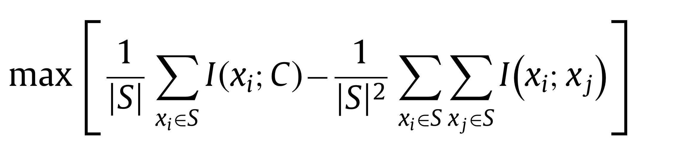
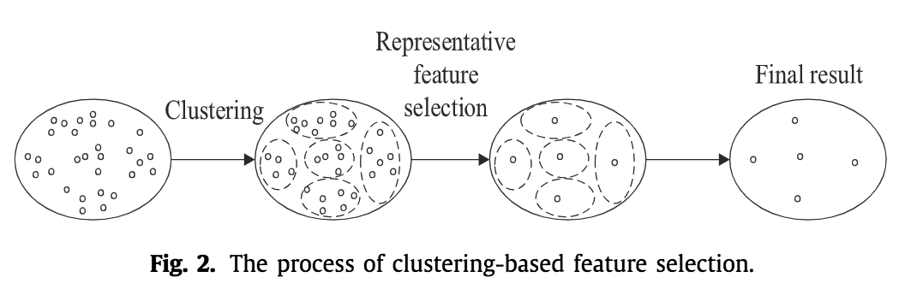
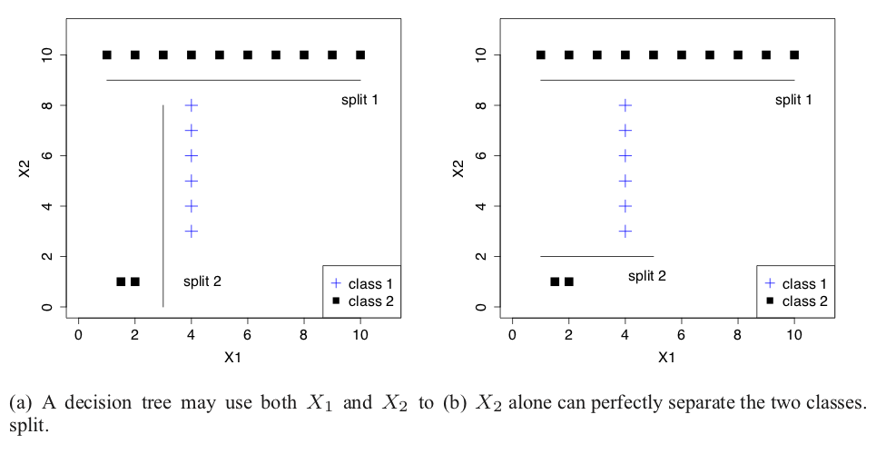

### 特徴量選択とは
特徴量選択(Feature Selection, 変数選択とも)はデータサイエンスにおいて非常に重要である。

例えば、製造業において欠陥品を判別するタスクを考えてみよう。
このタスクは本当に欠陥品を判別するだけがゴールなのだろうか。
本当に知りたいのは欠陥品がどうして生じるか、という点だろう。
例えば、欠陥品と関係のあるセンサーや工程と提示できたら専門家たちはそこを改良し欠陥品をそもそも生み出さずに済むことができる。
これが本当のゴールである。

ここで重要なのが特徴量選択である。

また、良い特徴量選択は以下の恩恵が期待できる。

- 学習時間を減らせる
- モデルの解釈性が向上する
- モデルの精度が向上する
- 過学習を減らせる

以前に当ブログでも特徴量選択のまとめのような記事を書いた。

https://aotamasaki.hatenablog.com/entry/2018/04/18/201127

これはかなり初心者向けの内容になってしまったが今回は、もっと踏み込んだ内容にしようと思う。
具体的には、特徴量選択の手法の全体像を紹介してから、需要が大きいとされる教師ありの特徴量選択について代表的な手法をいくつか紹介する。
また、最後に最新の特徴量選択の動向も紹介する。

今回紹介する半分以上の内容は、こちらのサーベイ論文にあるので興味がある方はどうぞ。

https://www.researchgate.net/publication/323661651_Feature_selection_in_machine_learning_A_new_perspective

本記事の想定読者は大学学部レベルの機械学習、確率統計、情報理論をかじったことのある方であるが、初学者にも伝わる部分があるように努力した。

#### 特徴量選択の難しさ
例えば、100特徴量から最適な特徴量の部分集合を見つけろ、という問題は、[tex:2^{100 } - 1]通り試すことになる。
1通りあたり1秒で学習が終わるとしても、全通り試すには宇宙誕生から今までをあと[tex:2^{41}] (2200億)回繰り返さなければいけない計算になる（宇宙の年齢を[tex:2^{59}]秒ほどとした）。
最適な特徴量の部分集合を選ぶというのは実質不可能に近い。
この状況の中で、いかに最適な組み合わせに近いものを選択できるか、というのが特徴量選択の難しさである。

#### 特徴量選択の手法の大別
ここでは特徴量選択の手法を9種に分類する。これは以下の2つの事項に注目した結果である。
- 教師データの有無(3種)
- 特徴量を選択するのにどんな方法を使うか(3種)

まず機械学習と同様に教師データの有無で三種に分類できる。
- 教師データの有無(3種)
  - supervised(教師ありの特徴量選択)
  - unsupervised(教師なしの特徴量選択)
  - semi-supervised(半教師ありの特徴量選択)

以上のそれぞれについて、さらに3つの戦略が考えられる。
- 特徴量を選択するのにどんな方法を使うか(3種)
  - filter method
  - wrapper method
  - embedding method

これらがどういうものかについては本記事で述べるので仮に知らなくても構わない。

大きくは以上の分類で目的の特徴量選択方法を探すことができると思うが、場合によってはいかに示すような分類方法もある。

- 特徴量選択の評価指標はなにか
  - filter methodの場合これも考慮したほうがよいだろう
  - 相関係数、ユークリッド距離、エントロピー、情報量基準等のなにを用いて特徴量選択をしているのかということ
- 特徴量の部分集合の探索戦略はなにか
  - wrapper methodの場合これも考慮したほうがよいだろう
  - 一つずつ特徴量を追加していくのか、削除していくのか、それとも他のやりかたで探索していくか
  - 具体例も踏まえながら本記事で後述する
- 出力の形式はどうか
  - ランキング形式と部分集合形式がある。
  - 目的によっては重要な分類である。

本記事では、需要が大きそうな教師ありの特徴量選択について見ていく。

### 教師ありの特徴量選択
以降、分類問題であると仮定する。
各節では、基本となるアイデアを述べてからツール等を紹介する。

#### filter method
filter methodとは、特徴量とクラスラベルの関係性だけを考慮して特徴量の部分集合を選択する方法である。
後述するwrapper methodと比べて、任意のモデルを訓練したとき性能は劣るが、選択に要する時間が短い。

以下filter methodにおける3つの戦略を紹介する。

##### 単変量とクラスラベルの関連性を上げる
一番ナイーブでいちばん有名な方法がこれだろう。

知っている方も多いので詳細は省く。
わからない方向けに手前味噌だがこちらの"Filter Method"の章を御覧いただきたい。

https://aotamasaki.hatenablog.com/entry/2018/04/18/201127#Filter-Method

実装に関してはscikit-learnにも実装されているので、すぐに試せるだろう。ただしscikit-learnでは検定をしてくれないので、そこに注意が必要だろう。

https://scikit-learn.org/stable/modules/feature_selection.html#univariate-feature-selection

##### 関係性を上げて冗長性を下げる
以下ではネット上であまり紹介されてこなかったようなfilter methodを紹介する。

上述した単変量とクラスラベルの関連性だけを見ていると、冗長な特徴量が選択されるだろう。
冗長な特徴量とは例えば互いに多重共線性を持ったような特徴量のことである。
多重共線性から悪影響を受けるようなモデルだと、これは望ましくない。
そこで、クラスラベルとの関連性を上げつつ、冗長な特徴量は選ばないような手法も考えられてきた。

このとき、MRMRという評価指標が使われることが多い。

ここで[tex:S]は特徴量の全体集合、[tex:x_i]は[tex:S]に含まれる特徴量、[tex:C]はクラスラベル、[tex:I(\cdot)]は相互情報量である。

第一項は特徴量とクラスの関連性が大きいほど大きくなり、第二項は特徴量間の冗長性が小さくなればなるほど大きな値(-がついているため)となる。

この指標を用いた手法を2つ紹介する。

mRMR

https://github.com/fbrundu/pymrmr

JMI (MRMRの評価指標をさらに改良した手法)
https://github.com/jundongl/scikit-feature/blob/master/skfeature/example/test_JMI.py

JMIに関しては解説のブログポストがある。

https://thuijskens.github.io/2017/10/07/feature-selection/

##### 関係性を上げて多様性を上げる
事前に謝罪しておくと、この考えの特徴量選択の実装があまりないようで、私が調べた限りは全然見つからなかった。
ご存知の方がいたら教えていただきたい。

ここでは考え方だけ図を用いて説明する。

多様な情報を持った特徴量の部分集合を残しておけば、いろんなモデルで効く特徴量は残るだろうという考えである。
これはクラスタリングを用いて特徴量選択をされることが多い。

手順としては以下の図に示す。

一番左は、特徴量の空間に浮かぶ特徴量を点で示している。
一点一点がある特徴量というイメージである。
また点間の距離はKullback-Leibler divergenceやJensen–Shannon divergence等で定義されることが多い。
これらは確率分布間の距離を示すような量という認識である。

次に左から二番目に円はクラスタリングを示している。点間の距離を定義したら階層的でも非階層的でもクラスタリングをすることができる。

その後左から三番目の円では、特徴量を示す点が減っていることが確認できるだろう。
しかもクラスタから一つずつ選択されていることがわかるだろう。
あるクラスタを代表する一つの特徴量を選択するときは、クラスタの中で一番クラスラベルと関係が大きいものが選ばれる。

こうして最終的に、多様で且つクラスラベルと関係性の大きい特徴量が選択されるわけである。

これを用いたものとして MRMD という手法の実装が見つかった。ただしまさかのJava実装。

http://lab.malab.cn/soft/MRMD/index_en.html

#### wrapper method
wrapper methodとは、特徴量の部分集合の作成とモデルの訓練を繰り返し行い、判別性能がよくなるような特徴量の部分集合を得る方法である。
一般的にfilter methodとよりよい性能を出す特徴量を得られるが選択に要する時間が長い。
これらの欠点を補うため、計算量が少ないfilter methodで特徴量を軽くふるい落してからwrapper methodを適応するケースも多い。

wrapper methodではどうやって特徴量の部分集合をより良くしていくかという探索戦略が重要となる。

##### Forward SelectionとBackward Elimination
最もナイーブな方法としてはこれらが挙げられるだろう。
Forward Selectionは特徴量を一個ずつ追加してみて一番判別性能が改善した特徴量を選ぼうというもの。
Backward Eliminationは逆に一個ずつ削除してみて一番判別が下がらなかった特徴量を除こうというもの。

Forward Selectionは特に選んだ特徴量がtrain setに過学習をしやすいので注意されたい。

前者も後者もmlxtendを用いることで実装ができる。

http://rasbt.github.io/mlxtend/user_guide/feature_selection/SequentialFeatureSelector/

後者に関してはscikit-learnにも存在する。
https://scikit-learn.org/stable/modules/generated/sklearn.feature_selection.RFE.html#sklearn.feature_selection.RFE

特徴量選択に関する論文ではSVM-RFEという、名前の通りサポートベクターマシンをモデルとしてBackward Eliminationで特徴量選択をするという手法が人気のようである。
ただ、2019年になってSVMは時代遅れではないのかと私的に感じるところではある。データ量が少ないなら全然構わないが。
また計算量が[tex:O(\max(n,m)n^2)]なので特徴量が多くなったときに計算時間が膨大となる(mはサンプル数、nは特徴量数)。

##### 遺伝的アルゴリズムと粒子群最適化
遺伝的アルゴリズムや粒子群最適化を用いて特徴量を選択するというのが研究の界隈では人気の探索戦略だ。

遺伝的アルゴリズムや粒子群最適化がなにかここでは説明しない。ネットには説明がいくらでも落ちているのでそちらを見てほしい。

この手法はかなりの計算量を覚悟しておいたほうが良いだろう。

実装もかなりあるが、こちらを紹介させていただこう。

https://github.com/scoliann/GeneticAlgorithmFeatureSelection

##### その他のwrapper method

以前当ブログで紹介して好評を頂いたBorutaもモデルを複数回構築するという点でwrapper methodに属する。

https://aotamasaki.hatenablog.com/entry/2019/01/05/195813

こちらの手法はランダムフォレストの特徴量重要度と検定を用いることで特徴量選択を行うというfilter methodにも近い考えである。
ただし、この手法は多重共線性を持つような冗長な特徴量も選んでしまうため注意が必要である。

xgboostを用いたBorutaの親戚も存在する。
https://github.com/chasedehan/BoostARoota

#### embedding method
embedding methodとは、モデルを学習すると同時に、使う特徴量も自動的に決定してしまおうという方法である。
一般的にwrapper methodよりは選択にかかる時間が短く、モデルの学習とともに特徴量も自動で選択されるので手続きの煩雑さが軽減される。

##### L1正則化
一番ナイーブな方法はL1正則化(もしくはRidge)をモデルに組み込んでしまうことである。
しかし基本的に線形モデルに限定されてしまう難点がある。

scikit-learnではpenaltyにl1を指定すれば良い。

例としてロジスティック回帰のドキュメントを載せておく。
https://scikit-learn.org/stable/modules/generated/sklearn.linear_model.LogisticRegression.html

##### Regularized tree
Houtao DengとGeorge Rungerが提案したRegularized Trees(tree regularization framework)を用いたモデルもembedding methodに分類される。
https://arxiv.org/pdf/1201.1587.pdf

彼らの提案するtree regularization frameworkとは木を成長させるときに制約をかけることで、冗長な特徴量を取り込まないようにする手法の枠組みである。
木を成長させるときに制約をかけるため応用先が広い。

下図は、余分な特徴量を取り込む場合と取り込まない場合を視覚的に示している。
左も右も2クラスを分割できている。
左はX2だけを用いて分割している。これはX1も使う右の分割ではX1という冗長な特徴量を取り込んでいること示している。

以上の問題点を解決するために、彼らは決定木を分割する際に以下の指標を採用した。

[tex:gain(\cdot)]とは、木を分割する際の指標でこいつが一番大きくなる特徴量で木を分割する。
[tex:X_j]とは任意の特徴量で、[tex:F]とは今まで決定木を分割する際に用いた特徴量[tex:X]の集合である。
[tex:\lambda]はハイパーパラメータで[tex:0 \sim 1]で調節される。

大まかな解釈は式の中に書き込んだが、一言でいうと「今まで使ったことのない特徴量はよっぽど大きな[tex:gain]をもたらさない限り使わないようにしよう」というアイデアである。

[tex:gain(\cdot)]には、一般的な決定木同様、ジニー係数や条件付き相互情報量等が使われる。

このtree regularization frameworkを採用したランダムフォレスト(RRF)がRのパッケージで存在する。

https://github.com/softwaredeng/RRF

https://cran.r-project.org/web/packages/RRF/RRF.pdf

### 特徴量選択の新展開
ここでは、さらなる研究が求められている特徴量選択の分野について紹介する。
とはいっても、[サーベイ論文](https://www.researchgate.net/publication/323661651_Feature_selection_in_machine_learning_A_new_perspective)の内容をまとめただけなのだが。

#### 超高次元データと特徴量選択のアンサンブル
例えば[tex:10^13]も特徴量のあるようなデータだと、既存の特徴量の手法は効力をなさないだろう。
こういった超高次元における特徴量選択を解決する手法はあまり提案されていない。
また超高次元データに対して特徴量選択をする場合は現実的な計算時間で終わるアルゴリズムであることも重要である。

ナイーブな解決策として、特徴量の部分集合を何個も作り選択した結果をアンサンブルするという手法も存在する。
特徴量を減らせば既存のアルゴリズムが効力を発揮するので、ひとまずこうして選んでから統合しようという考えである。
しかし、冗長な特徴量も選択されがちになることが直感的にわかるだろう。

#### 不均衡データにおける特徴量
現実ではクラスインバランスであるデータがほとんどだろう。
これが難しいところは、ただ単に正解率のaccuracyを評価指標にしてはいけない点だろう。

不均衡データ対策は進んでいる。

https://qiita.com/koshian2/items/20af1548125c5c32dda9

https://www.ncbi.nlm.nih.gov/pubmed/22408190

しかし、不均衡データにおける特徴量選択はあまり行われていない。
不均衡データにおける特徴量選択では安定性(stability)が重要である。少数クラスが何個か抜けたら選択される特徴量もガラッと変化する、というのは良くないのである。

#### オンライン特徴量選択
オンライン学習が存在するなら、当然特徴量選択もオンライン化したいよね！ということである。
これに関してはライブラリもあるぐらい手法は存在するのだが、まだ以下のような点が課題にある。

- 特徴量選択の安定性
- 冗長性の解析
- 時間効率

特に時間効率は重要である。実時間で処理が終わらなければオンライン化する意味があまりない。

ライブラリはこちら。なお、MATLABとOctave実装

https://github.com/kuiy/LOFS

#### 深層学習を用いた特徴量選択
深層学習は自動的に特徴量選択と特徴量抽出をしてくれる。
そのため、特徴量選択とは無縁だと思われるだろうがそうではない。
たとえば、特徴量選択の概念を隠れ層のノード選択に適応すれば、深層学習のモデルがもっと単純になる。
すると、モデルの推論速度が向上したり、頑健性が向上したりする。

https://ieeexplore.ieee.org/document/7822750

また、無関係な特徴量は重みが0に近づくというNNの特性を利用して特徴量選択を行おうという試みもある。

https://ieeexplore.ieee.org/document/7272047

