# QRNN ニューラルネットを用いた分位点回帰

### 概要
- 条件付き分布[tex:p(y|x)]の分位点を推定するNeural Networkを紹介する
- そのアイデアは既存のNeuralNetに対して損失関数を変えるというシンプルなもの
- 人工データを用いてちゃんと推定できていそうか確認した

本記事ではQRNNを紹介する前に、問題意識や分位点とはなにかを説明しなければならない。そうでなければQRNNのありがたみがわからないからである。分布推定や分位点がなにかわかっている方は、読み飛ばしてほしい。

### 分布推定の重要性
#### 点推定の問題
例えば、様々なお菓子の価格と需要の関係を調べて、回帰分析をしたとしよう。その結果以下の関係が得られた。

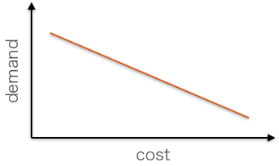

これを見て、「なるほど値段を高くすると売れなくなりそうだな」と決めつけビジネスの意思決定を行うのは早計である。

実際にお菓子の価格と需要の関係をプロットしてみよう。すると、値段が高くても需要があるお菓子も存在することがわかる。

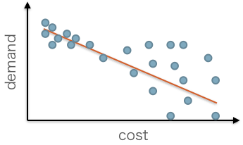

この事実が分かる場合、「値段が高くても売れるお菓子にはどういった共通点があるだろうか、それを調べて高くて売れるものを作ろう」と正しい意思決定をすることができる。

今までの例はまさに点推定の欠点を表している。機械学習では多くの場合、平均値の点を推定している。入力の説明変数を[tex:x]、目的変数を[tex:y]としたとき、実際に出力される推定値[tex:\hat{y}]は、

$$\hat{y} = \bm{E}[p(y|x)]$$

となっていることが多い。[tex:\bm{E}]は平均値、[tex:p]は確率密度関数を示す。

点推定では平均値しかわからないので、分布の形はおろか分散もわからないのである。
回帰分析で下図のように分布[tex:p(y|x)]も推定できたら、「高くても売れるものがある」という意味のある分析になる。

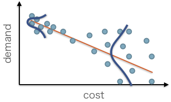

#### 点推定から分布推定へ
点推定では得られる情報が少ないことがわかったが、どうやって分布を推定すればいいのかが問題だ。
なんらかの分布を仮定しそのパラメーターを最尤推定する方法、ベイズ的にやる方法(よく知らない)、などあるが、ここでは分位点を用いた方法を紹介する。分布を推定する代わりに分位点を推定する。

### 分位点とは
分位点とは、wikipediaによると

>実数[tex:\tau \in [ 0,1 ]]に対し、τ分位数 (τ-quantile)[tex:Q_{\tau}]は、分布を[tex:\tau : 1 - \tau]に分割する値である。

とある。また、[Alex, 2011]では、

[tex:min_{Q_\tau} ~ \left(\int _ { - \infty } ^ { Q _ { \tau } } f ( x ) d x = \tau \right)]

と定義している。積分の項は累積分布関数にほかならない。

分かりづらいので、2つ具体例を示しておこう。

例えば正規分布の場合、累積分布関数と0.5分位点(0.5-quantile)の関係は下図の通りである。

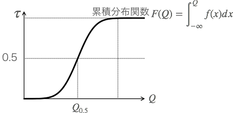

具体的に点が与えられた場合は、下図のような対応関係となる。

12個点があったとき、3つめが0.25分位点(0.25-quantile)、6つめが0.5分位点(0.5-quantile)といった具合である。

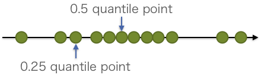

実際に[tex:p(y|x)]の分位点を線形回帰してみると、こんな感じになる。これは[Qiita](https://qiita.com/kenmatsu4/items/03739db76aa010b7c6fe)から引っ張ってきたやつ。

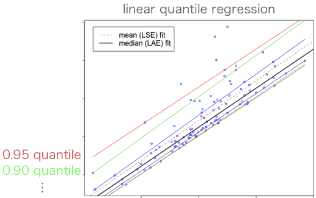

これが与えられたときに、各分位点の幅から、[tex:p(y|x)]は指数分布っぽいことがすぐわかるだろう。

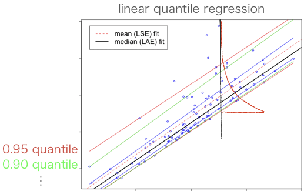

### QRNN:Quantile Regression Neural Network
本記事のメインディッシュである。(ちなみに略称が同じものとしてQuasi Recurrent Neural Networkがあるが全くの別物。)
上述した例では線形に[tex:p(y|x)]の分位点を推定していたが、これは非線形に[tex:p(y|x)]の分位点を推定することができる。NNの非線形関数近似能力バンザイ。

アイデアは非常にシンプル。
NeuralNetを学習する際に、損失関数を下記の数式に変形するだけ。この損失関数でなぜ分位点を推定できるのかの証明は記事の終盤で行う。

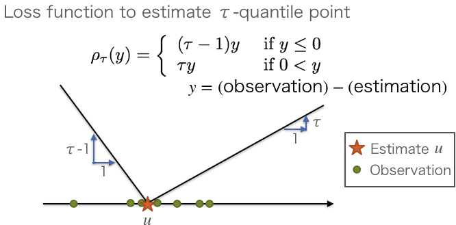

この損失関数のなかのτはτ分位点のτである。例えば、0.3分位点を推定したいのなら損失関数のτに0.3を代入すれば良い。

例えば、0.3分位点と0.7分位点を出力するようにしたいなら、下図のようにすればよい。出力を2つ用意しておき、それぞれに損失関数を割り当てるのである。

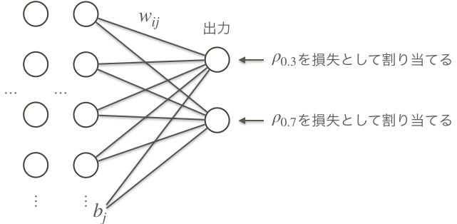

すると上の方の出力は0.3分位点を推定するようになり、下の方も0.7分位点を推定するようになる。

### 人工データ実験
#### 実験設定
人工データを用いて、理論値通りの分位点が推定できているか確かめてみる。
用いた人工データはこちら。訓練に使う入力もこちらを用いた(500サンプル)

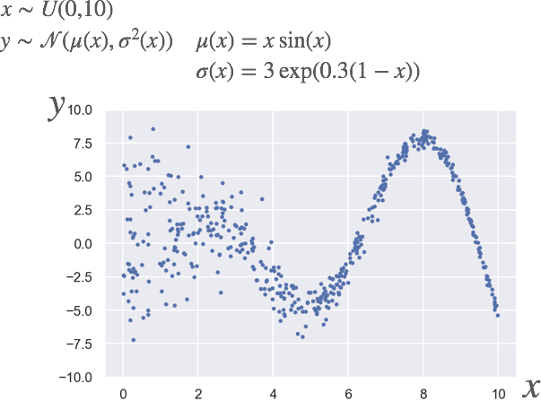

そして、[tex:p(y|x)]の分位点の理論値はこちら。あんまり書き込みすぎるとごちゃごちゃするので、0.15,0.5,0.85分位点にのみ注目した。

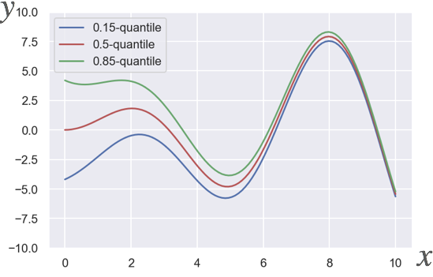

また、モデルはシンプルなもので下図のようになっている。

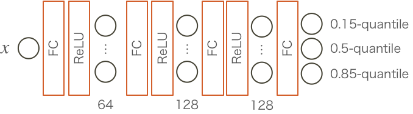

#### 実験結果
学習中、損失関数はこんな感じに下がっていった。
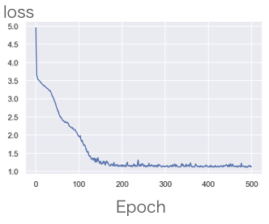

はたして学習の結果出力の3ノードは分位点を学習できたのだろうか。可視化してみる。

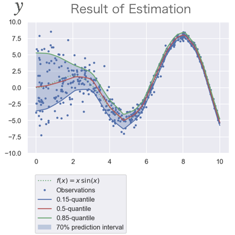

パット見できてそう。理論値と比較してみる。

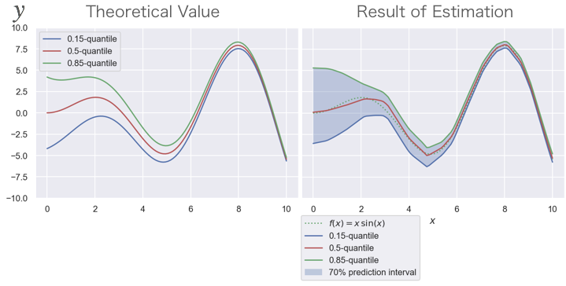

おお、なかなかうまくいってそうだ。
実験的にQRNNが正しく分位点を推定することを確かめることができた。

ちなみに訓練するサンプル数を変えてみたところ、サンプル数が少ない場合は0.15分位点から0.85分位点の幅が狭めに推定される傾向にあった。

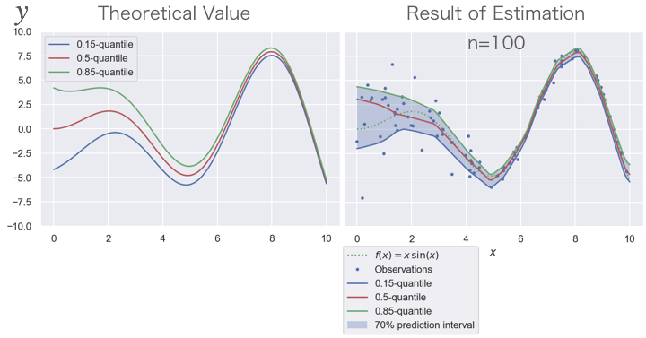

### 用いた損失関数で分位点を推定できる証明的なもの
今回用いた損失関数を最小化することは、分位点の定義の式(minは外した)を満たすことになる。

[tex:Y]は確率変数、[tex:F_Y]は[tex:Y]の累積分布関数、
[tex:u]はネットワークの推定値である。
また、[tex:Y]の確率密度関数を[tex:f_Y]とする。

この式を一つずつ分解して見ていこう。

まず矢印の左側から見ていこう。
損失関数は計算する際、以下のような手続きになっている。

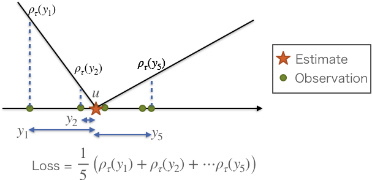

これは

[tex:\frac{1}{5}\left(\rho_\tau (y_1) + \rho_\tau (y_2) + \cdots \rho_\tau (y_5) \right)\simeq {\rm E}\left[ \rho _ { \tau } ( Y - u ) \right]]

とできる。
そして、損失関数を最小化するということは、式で書くと

[tex:min \ E _{u}\left[ \rho _ { \tau } ( Y - u ) \right]

といった具合にかけるのである。

これが満たされるとき、推定される[tex:u]は分位点の定義を満たす。
変形は以下の通りである。

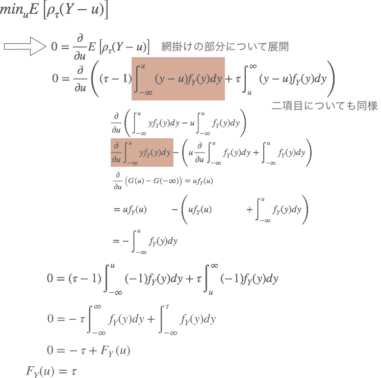

これによって、推定した[tex:u]が指定した[tex:\tau]の分位点の定義を満たすことが示された。

### まとめ
- 点推定では推定結果から得られる情報が少ない。
- 分位点回帰は分布推定の方法の一つ
- QRNNはNeural Networkを用いた分位点回帰の方法
- 人工データ実験では正しく理論値通りの分位点が推定されていそうだった。

### 参考
#### モデルのソースコード
https://medium.com/the-artificial-impostor/quantile-regression-part-2-6fdbc26b2629
#### その他のサイト

#### QRNNに関する論文

多分提案？
[A Quantile Regression Neural Network Approach to Estimating the Conditional Density of Multiperiod Returns](http://users.ox.ac.uk/~mast0315/QuRegNeuralNet.pdf)

R実装
[Quantile regression neural networks: Implementation in R and application to precipitation downscaling](https://www.sciencedirect.com/science/article/pii/S009830041000292X)

分位点をそれぞれ独立に推定しているため、2つの分位点の順番が入れ替わってしまうことがある。それを解決した論文。
[Non-crossing nonlinear regression quantiles by monotone composite quantile regression neural network, with application to rainfall extremes](https://link.springer.com/article/10.1007/s00477-018-1573-6)

