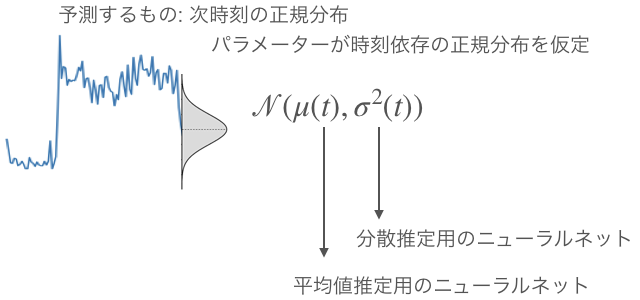
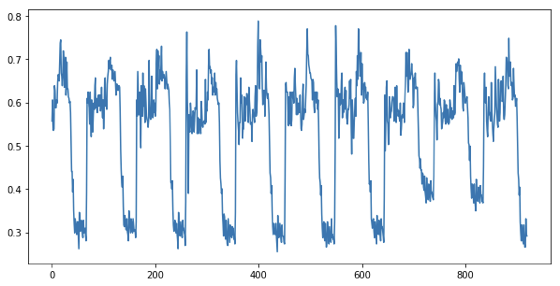
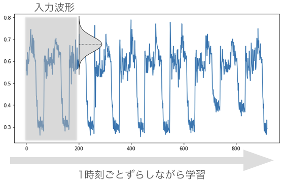
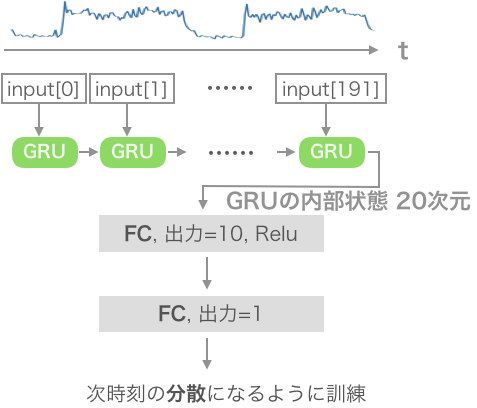
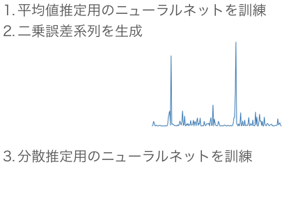
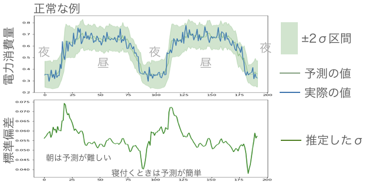
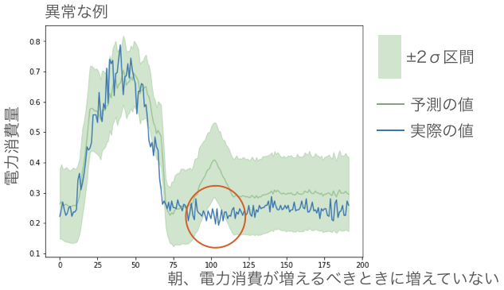
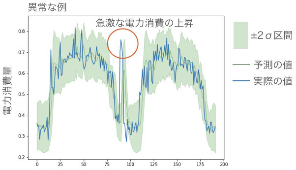
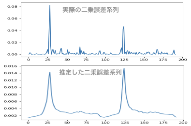

## 時系列データで予測区間付き回帰を行う keras

### 概要
- 時系列(電力使用量)のデータについて、1時刻先を推定する回帰問題を扱った。
- 点推定ではなく正規分布を仮定した分布を推定した。


### 問題意識
例えば異常検知を考える。予測した値と実測した値が大きく異なったら、なんらかの異常が生じていると判断できるだろう。しかし、その違いがどれぐらい大きければ異常なのか、異常度はどれぐらいなのかを判断するのは難しい。そこで確率分布が必要となる。値を予測する代わりに、確率分布を推定すれば、実測した値を確立で評価できる。興味があるのは点ではなく分布である。ニューラルネットワークでは点推定が前提であることが多いが、今回は分布を推定した。

### アイデアの概要
正規分布を仮定する。普通の正規分布と異なる点は、パラメータが時間に依存する点である。ではこの各時刻のパラメーターを推定するニューラルネットワークをそれぞれ構築すればいいのでは？というアイデア。



### データの説明
こちらから取得した。

https://archive.ics.uci.edu/ml/datasets/ElectricityLoadDiagrams20112014

これは電力使用量のデータで15分ごとに記録されている。

あるユーザーのデータだけに注目して、入力とした。時系列の長さは192点分(2日に相当)、ある時刻における次元は1である。

数日を抜き出してみるとこんな感じで周期的に上下していることがわかる。




学習時及び推論時は下図のように、灰色の矩形を入力、1時刻後の分布(のパラメーター)を出力するようにした。(テスト用に時系列の最後の1割は学習に用いなかった)




### モデルの説明


前述したアイデアを達成するために2つのネットワークを用意した。

平均値推定用のネットワークと分散推定用のネットワークである。どちらもRNNの一種であるGRUを用いていて、最後の内部状態を取り出してFCにつないでいる。




しかし、ここで問題が発生する。**次時刻の分散など教師データには存在しない。**ただ、平均値が推定できているのであれば、それとの誤差はなんらかの規則性をもっているであろうと仮定した。

そこで分散の代わりに二乗誤差系列を推定することで、**次時刻の想定される二乗誤差を分散の代わり**に用いる。学習のアプローチとしては以下のような感じである。



ここで注意していただきたいのは、二乗誤差系列を入力には使わないということ。あくまで、電力使用量の系列を入力として次時刻の二乗誤差を推定する。

こうすることで、推論時には、電力使用量の系列だけを用いればいいので処理が楽である。

シンプルなモデルなのでのソースコードもこんな感じ
```python
def ret_model(est="mu"):
    """
    GRU
    FC
    FC
    mu もしくは var
    """
    
    
    # hyper parameter
    LATENT = 20
    FC=10
    
    # ネットワークの定義
    inputs = Input(shape=(NUM_timesteps, NUM_input_dim))
    # (, NUM_timesteps, NUM_input_dim)
    gru=GRU(LATENT)(inputs)
    # (, LATENT)
    fc=Dense(FC,activation="relu")(gru)
    # (, FC)

    #最終層は推定するものによって変える
    if est is not "mu":
        output=Dense(NUM_output_dim,activation = "sigmoid")(fc) #varは絶対に0を下回らないのでsigmoidを噛ませる
    else:
        output=Dense(NUM_output_dim)(fc)
    
    model = Model(inputs,output)
    
    model.summary()
    
    return model
```

### 結果
入力波形を1時刻ずつずらしながら、常に1時刻先の正規分布を推定した。テストデータで推論した結果を何枚か示す。



正常の例の結果である。2σ区間に相当する緑色の範囲に実際の青い値はほぼ収まっている。次に異常な例を見てみよう。なお、異常は勝手ながら独断で決めた。




多分、夜のうちにお出かけしたのかな？翌日の朝、期待される電力増加がないために、青い実測値が連続して、2σ区間をはみ出ている。




今度は、寝る前に急に電力を使っている。いつものブレの範囲を大きく上回るこの上昇は、2σ区間から大きくはみ出てしまった。負の対数尤度を取ったらめっちゃ異常度高そう。

### まとめ
- 時系列の1時刻後の分布を推定した
- パラメーターが時間に依存する正規分布を仮定した
- 分散を推定する代わりに、二乗誤差系列を用いて次時刻の誤差を推定した
- 電力需要のデータを用いて実験。それらしき結果を得た。

なかなかうまく行っているように見えるが、二乗系列の推定はなかなか難しかったようで、比較すると微妙な結果。



誤差が大きくなるタイミングはあっているが、大きさがかなり小さめに見積もられている...
やはり電力需要はデータが難しい...

今回用いたコードもgithubにあげてあります

https://github.com/masakiaota/blog/blob/master/regression_with_gaussian/train_and_save.py

https://github.com/masakiaota/blog/blob/master/regression_with_gaussian/result.ipynb