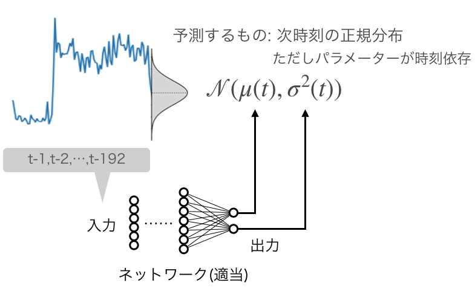
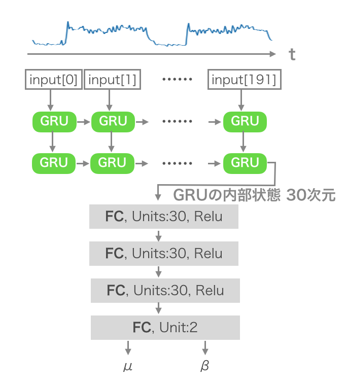
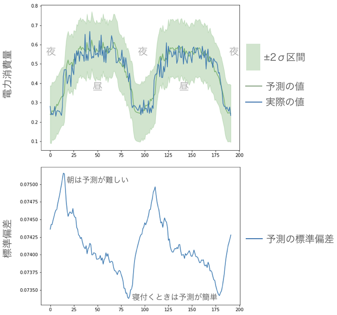
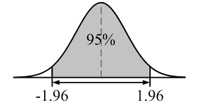
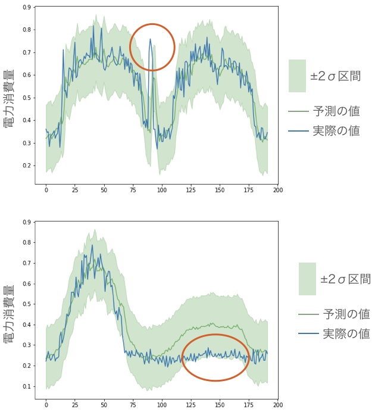

RNNを用いた正規分布の回帰 keras実装
===
### 概要
- 時系列の1時刻後の分布を推定した
- パラメーターが時間に依存する正規分布を仮定した
- ニューラルネットが正規分布のパラメーターを学習できるように適切な損失関数を導入した

### 問題意識
ニューラルネットの出力は点推定になっていることがおおい。
例えば、一時刻先の電力使用量を予測して、14.5[kW]使いますっといった出力が点推定である。
しかし、点推定では重要な情報が抜け落ちる可能性がある。

たとえば、予測された電力使用量と実際の電力使用量を比較して異常な状態を検知したい問題を考えてみる。
直感的には、予測と実測値が離れていれば異常と言える。
しかし、どれぐらい離れていたら異常なのか、異常度はどれぐらいなのか等を判断するのは難しい。

そこで確率分布が必要となる。
値を予測する代わりに確率分布を推定できたら、実測した値を確率や尤度で異常かどうか評価できる。

つまり、興味があるのは点ではなく分布である。
今回はニューラルネットを用いつつも、分布を出力しようという試みである。

### データと今回の目的


#### データ
こちらから取得した。

https://archive.ics.uci.edu/ml/datasets/ElectricityLoadDiagrams20112014

これは電力使用量のデータで15分ごとに記録されている。

数日を抜き出してみるとこんな感じで周期的に上下していることがわかる。


#### 目的
あるユーザーの一時刻先の電力使用量の分布を推定したい。

入力は過去から現在までの電力使用量192点分(2日に相当)。

出力は一時刻先の電力使用量の分布である。


### 仮定
一時刻先の電力使用量の分布として正規分布を仮定した。
また、正規分布のパラメーターは時刻に依存するものとした。
このとき、ニューラルネットの出力は正規分布のパラメータであれば、正規分布を回帰できる。




### モデル
RNNとしてGRUを採用し、ハイパーパラメータは適当に決めた以下のようなモデルを作成した。



ただし、分散の代わりに精度パラメーターを用いている。

[tex:\beta=\frac{1}{\alpha^2}]

である。

```python
def ret_model():
    """
    GRU
    GRU
    FC
    FC
    ↓  ↓
    mu beta
    
    というモデルを返す
    """    
    
    # hyper parameter
    LATENT = 30
    FC=30
    
    # ネットワークの定義
    inputs = Input(shape=(NUM_timesteps, NUM_input_dim))
    # (, NUM_timesteps, NUM_input_dim)
    gru=GRU(LATENT,return_sequences=True)(inputs)
    # (, NUM_timesteps, LATENT)
    gru=GRU(LATENT)(gru)
    # (, LATENT)
    fc=Dense(FC,activation='relu')(gru)
    fc=Dense(FC,activation='relu')(fc)
    fc=Dense(FC,activation='relu')(fc)
    # (, FC)
    outputs=Dense(2)(fc)
    # (,2) #1つ目がmuで2つ目がbeta(精度パラメーターとする)
    
    model = Model(inputs,outputs)
    return model
```

学習時及び推論時は下図のように、灰色の矩形を入力、1時刻後の分布(のパラメーター)を出力するようにした。(テスト用に時系列の最後の1割は学習に用いなかった)


### 損失関数
ニューラルネットが[tex:\mu]と[tex:\beta]をコーディングできるように学習させるには、適切な損失関数を設定しなければいけない。

詳細は後述するが、正規分布の負の対数尤度を取れば、損失関数は以下のようになる。

[tex:\text{loss} = -\log(\beta) + (y-\mu)^2\beta]

これは自分で実装する必要がある。

```python
def loss(y_true,y_pred):
    mu,beta=K.reshape(y_pred[:,0],[-1]),K.reshape(y_pred[:,1],[-1])
    y_true = K.reshape(y_true,[-1])
    return K.mean(beta*K.square(mu-y_true)-K.log(beta), axis=-1)
```

こうすれば、ニューラルネットは[tex:\mu]と[tex:\beta]を出力できるように学習してくれるはずだ。

### 結果
入力波形を1時刻ずつずらしながら、常に1時刻先の正規分布を推定した。
テストデータで推論した結果を何枚か示す。

推論結果の多くは下図のようになった。



緑色の区間は約95％の予測区間を示す。



次に、予測区間から外れている日に注目してみよう。



すると、電力消費が急増したり(1枚目)、いつも電力が使われる時間帯に使われなかったりする日(2枚目)であることがわかる。

### 損失関数の導出

[tex:\text{loss} = -\log(\beta) + (y-\mu)^2\beta]

は正規分布の負の対数尤度を計算すれば導出できる。

正規分布
[tex:
N(y; \mu, \sigma^2)=\dfrac {1}{\sqrt{2\pi\sigma^2}}\exp\biggl\{ -\dfrac {(y-\mu)^2}{2\sigma^2}\biggr\}
]

負の対数尤度を取って
[tex:
-\log(N(y; \mu, \sigma^2))= \frac{1}{2}\log(2\pi \sigma^2)  + \frac{(y-\mu)^2}{2\sigma^2}
]

[tex:
-\log(N(y; \mu, \sigma^2))= \frac{1}{2}\log(2\pi) + \frac{1}{2}\log(\sigma^2) + \frac{1}{2}\frac{(y-\mu)^2}{\sigma^2}
]

精度パラメーター[tex:\beta]を導入

[tex:
\beta = \frac{1}{\sigma^2}
]

[tex:
-\log(N(y; \mu, 1/\beta))= \frac{1}{2}\log(2\pi) + \frac{1}{2}\log(1/\beta) + \frac{1}{2}(y-\mu)^2\beta
]

[tex:
-\log(N(y; \mu, 1/\beta))= \frac{1}{2}\log(2\pi) - \frac{1}{2}\log(\beta) + \frac{1}{2}(y-\mu)^2\beta
]

損失関数に定数項や定数倍は不要

[tex:
\text{loss} = -\log(\beta) + (y-\mu)^2\beta
]

おわり！

### まとめ
- 時系列の1時刻後の分布を推定した
- パラメーターが時間に依存する正規分布を仮定した
- ニューラルネットが正規分布のパラメーターを学習できるように適切な損失関数を導入した
- 2σ区間を予測区間に設定し、電力需要のデータを用いて実験。それらしき結果を得た

今回の実験で用いたNotebook

https://github.com/masakiaota/blog/blob/master/regression_with_gaussian/retry/regression_with_gaussian.ipynb

### あとがき
前にも似たような記事を書きました。
ただし、平均と分散を推定するのに、別々のニューラルネットを個々に学習させました。また分散は二乗誤差系列を導入することで推定しました。最尤推定のようなことは行っていません。

https://aotamasaki.hatenablog.com/entry/2018/11/04/101400

損失関数を工夫して平均と分散を同時に推定しようと思考錯誤はしていたのですが、学習が安定せずに断念したという経緯があったのです。特に損失関数の分母に来る分散の扱いには困っていました。

しかし、今朝、記事に的確なコメントがついていました。

>平均μと同時に分散σも推定するモデルを不当分散(heteroscedastic)モデルと呼ぶそうですよ。
>学習時の損失関数には対数尤度が使えます。
>(中略)
>分散σでなく精度βを使用するのは最適化対象のパラメータが分母にくると学習の安定性を損なうからです。

これを読んだ瞬間ピンと来ました。
そして、その勢いでこの記事を書き上げた次第です。
コメントをくださったshuheiさん、ありがとうございます。


