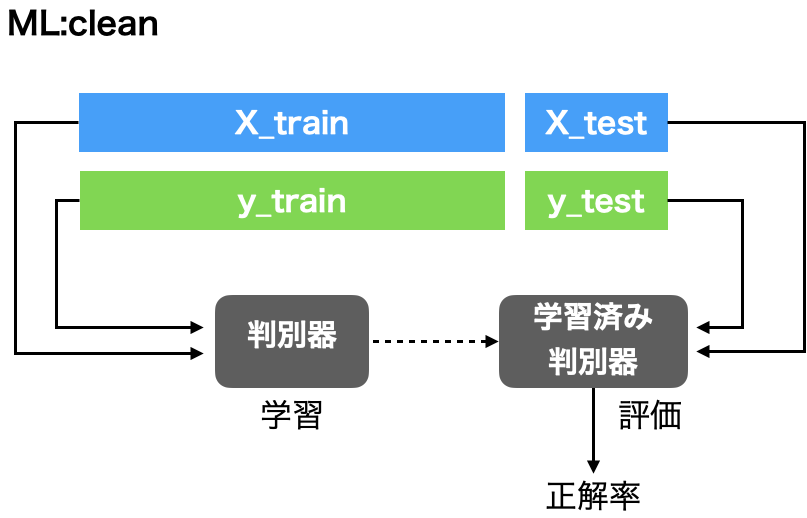
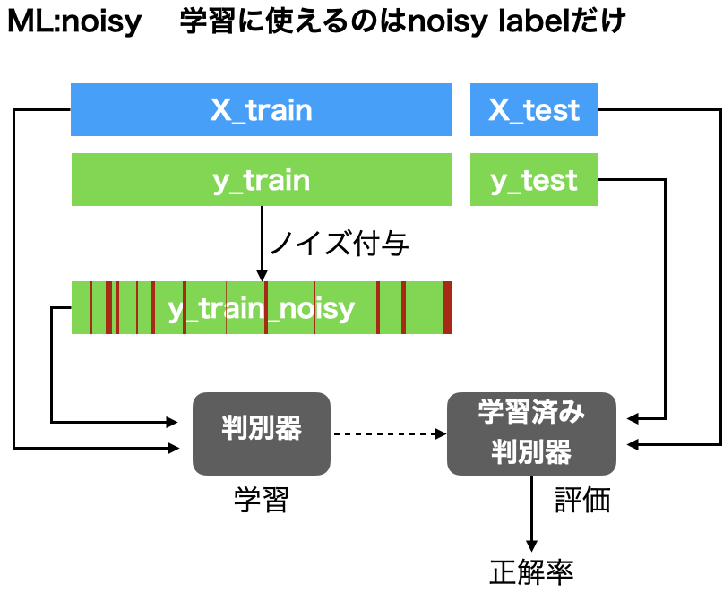
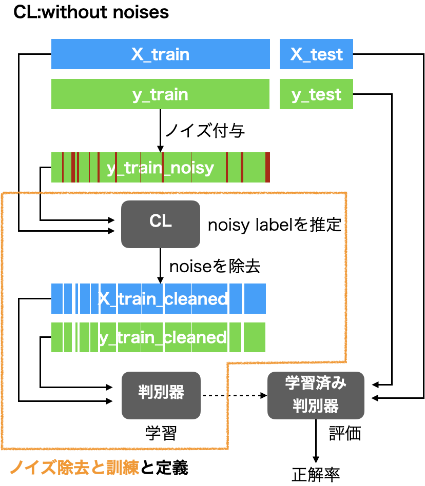
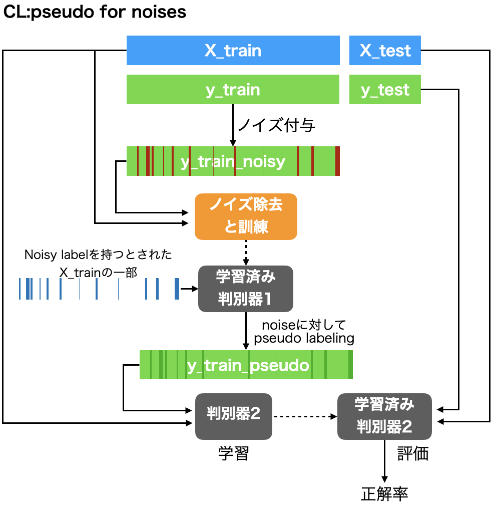
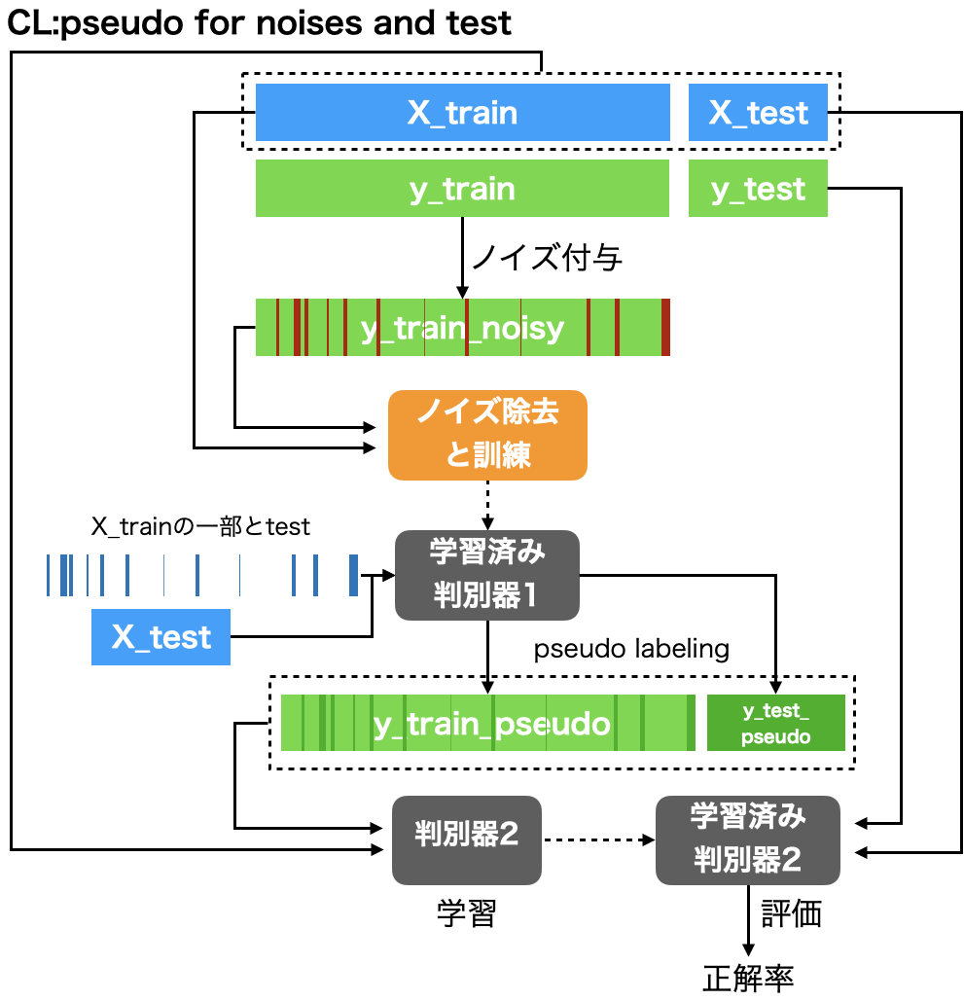

Confident Learningは誤った教師から学習するか？ </br>~ tf-idfのデータセットでノイズ生成から評価まで ~
===

### 概要
現実の判別問題において教師が完璧であることは珍しい。ラベリング作業において、知識不足や勘違いなどで引き起こされるヒューマンエラーはデータセットを汚染する。

このような間違った教師のことを、noisy label(corrupted label や polluted labelとも)という。誤った教師を用いると学習はうまく行かず判別性能は下がってしまう。近年ではこれに対処しようという研究が増えている。

ICML2020に Confident Learning: Estimating Uncertainty in Dataset Labels という論文が投稿された。しかも、よく整備された実装`cleanlab`まで提供されていた。

今回はRCV1-v2という文章をtf-idf(特徴量)にしたデータセットを用いて、Confident Learning (CL)が効果を発揮するのか、実験を行った。またcleanlabを用いた実装を公開する。

結論としては、CLを用いると確かにnoisy labelなデータセットでも判別性能がよくなった。更にpseudo-labelingと組み合わせるともっと良くなるという結果が得られた。

### 目次
[TOC]

### Confident Learning
ICML2020に投稿されたデータ中のnoisy labelを検出する枠組み。

https://arxiv.org/abs/1911.00068

特徴としては以下のようなことが挙げられる。

- どのような判別器も使用可
- 他クラス分類対応
- ハイパーパラメータがない (これは嬉しい。testも汚染されている状況ではチューニングなど無理なので。)
- 実装が公開済み


細かい仕組みについては、元論文か自分の解説ブログを参照してほしい。が、とりあえずCLを使うとデータ中のnoisy labelが検出できるんだな と把握しておけば問題ない。

https://aotamasaki.hatenablog.com/entry/confident_learning

実装に関しては著者が公開済みで`pip install cleanlab`することができる。

https://github.com/cgnorthcutt/cleanlab

### 実験計画
今回主に知りたいのは以下である。

- 真のきれいなラベルで学習させたときの性能 (理想的な性能)
- noisy labelを用いて学習させたときの性能 (baselineとなる性能)
- そしてnoisy labelを用いてConfident Learningを適応したときの性能

CLは他のsemi-supervised learningのテクニックとも組み合わせて使えるので、pseudo-labelingとも組み合わせて計5つの実験を行った。

1. ML:clean
2. ML:noisy
3. CL:without noises
4. CL:pseudo for noises
5. CL:pseudo for noises and test

これらについて、実験手順をイラストで説明する。

#### 1. ML:clean

きれいなデータで学習するいつものやつ。
これは理想的な性能を示すための実験である。

データとか判別器はあとで説明するので、適当なものを今は思い浮かべてほしい。ただし図に示しているyは正しい(真の)ラベルである。



#### 2. ML:noisy

現実のデータセットの多くはnoisy labelである。それを再現するために人工的にノイズを`y_train`に付与した。また`y_train`は現実ではわからないため、`y_train_noisy`を用いて学習することになる。

このとき性能がどこまで落ちるのか。それを示すための実験である(いわゆるbaseline)。


#### 3. CL:without noises

もっとも基本的なCL。シンプルにnoiseと推定したサンプルを抜いて再学習する。

これでnoisy labelの悪影響は軽減されるだろう。しかしサンプル数は減ってしまいそうである。



「ノイズ除去と訓練」と定義したところは以降使い回す。覚えておいてほしい。

#### 4. CL:pseudo for noises
noiseと推定されたサンプルに対して、抜くのではなくラベルなしと扱っても良いではないか？そうすればX_trainの分布を崩さずに学習できる。

という発想のもと、ラベルに問題がありそうなサンプルに疑似ラベリングを施した。



#### 5. CL:pseudo for noises and test
上記の拡張。X_testも学習しちゃって良くない？という発想(y_testを使わなければカンニングにならない)。

さらにサンプル数が増えて学習がうまくいくことに期待。



### データセットと実験設定
興味がなければ読み飛ばしてもらっても構わない。
#### データセット
RCV1 v2データセットを用いた。

これはreutersの文章のデータセットである。scikit-learnではこれをtf-idfにしたものを提供している。

本来multi labelのデータセットだが、大分類の4クラスだけ残しsingle labelに加工した。その結果データの規模は以下のようになった。

- sampleの数 685071
- featureの数 47236 (ただしほとんどの要素が0)
- それぞれのクラスの真のvalue counts [299612  54695 163135 167629]

これを選んだ理由としては、

- ラベルがチェック済みであり、noiseがほぼ存在しないと思われる。そのため評価に適していると感じたから。 詳しくは[RCV1: A New Benchmark Collection for Text Categorization Research](http://www.jmlr.org/papers/v5/lewis04a.html)を参照。
- 論文や[cleanlabのサンプル](https://github.com/cgnorthcutt/cleanlab#cleanlab-generality-view-performance-across-4-distributions-and-9-classifiers)では特徴量が密なデータセットで有効性を検証していたが、要素の97％が0であるような疎なデータセットではどうなるか気になっていたため。

#### noise 生成
noiseの生成に用いた分布は乱数から生成した。以下の通り。noise rateは27%、ラベルがあっているのは73%ということなる。
```
p(given=i|true=j) =
[[0.68936167 0.         0.         0.        ]
 [0.2387445  0.85410683 0.21184431 0.05112328]
 [0.         0.14589317 0.78815569 0.28050091]
 [0.07189383 0.         0.         0.66837581]]
```

#### 判別器と評価
- 判別器はLogistic Regression
  - 比較的軽量なため
- パラメータチューンなしの一発勝負
  - 真のラベルがわからない現実ではモデル選択は非常に困難なため
- 4 fold-CVで評価

### 実験結果

以下の表は行に手法、列に各out of fold(test)の場合の正解率を示している。

性能を比較する際には下4行に注目すべきだ。性能が一番良い手法を太字で示してある。
最右列は平均と不偏分散を示している。

| method\                           | test1      | test2      | test3      | test4      | mean  (std)         |
| --------------------------------- | ---------- | ---------- | ---------- | ---------- | ------------------- |
| ML:clean  (ideal performance)     | 0.9738     | 0.9745     | 0.9745     | 0.9748     | 0.9744 (0.0004)     |
|                                   |            |            |            |            |                     |
| ML:noisy   (baseline performance) | 0.9529     | 0.9529     | 0.9543     | 0.9542     | 0.9536 (0.0007)     |
| CL:wituout noises                 | 0.9594     | 0.9594     | 0.9602     | 0.9599     | 0.9598 (0.0004)     |
| CL:pseudo for noises              | 0.9618     | **0.9624** | **0.9628** | **0.9633** | **0.9626** (0.0006) |
| CL:pseudo for noises and test     | **0.9620** | 0.9622     | 0.9627     | 0.9631     | **0.9625** (0.0005) |

これをみるとCLを用いたほうが、学習がうまくいくことが確認できる。またPseudo-labelingと組み合わせてさらに性能が改善していることが確認できる。

一方今回のデータにおいて、X_testへのpseudo labelingの有無は性能に影響を与えなかった。(X_trainだけで分布をサポートするサンプル数には十分足りたということか？)


ちなみにデータセット内のnoisy labelをどれぐらい当てられたかと言うと正解率としては94%ぐらいである。

| 評価指標\ | performance |
| --------- | ----------- |
| accuracy  | 0.94        |
| precision | 0.91        |
| recall    | 0.87        |
| f1-score  | 0.89        |


### cleanlabの一部機能の解説

#### 学習に関して

`LearningWithNoisyLabels`はcleanlabの目玉機能だ。

```python
model=LogisticRegression(multi_class='auto')
clf=LearningWithNoisyLabels(clf=model)
clf.fit(X_train,y_train_noisy)
```
これだけで、CL:without noisesに示した黄色枠の処理を行ってくれる。

どのサンプルがnoiseと推定されたかは`clf.noise_mask`を見れば良い。


#### データ生成に関して
noisy labelの性能を図るために、今回のように自分でノイズを生成したい人たちがる(研究者とか)。それを手助けしてくれる関数も存在する。

今回用いたノイズ行列p(given=i|true=j)は以下のコードで生成できる。注意点としてはpyという真のyについてvalue countsした配列を果たさなければ行けない点だろう。
```python
generate_noise_matrix_from_trace(
    4, 3, min_trace_prob=0.6, frac_zero_noise_rates=0.5, py=py, seed=seed)
```

上記のノイズ行列は乱数でなくても自分で設定しても構わない。それができたら今度は実際にラベルを汚染させる作業である。これの機能も以下を叩くだけである。

```python
generate_noisy_labels(y_train, noise_matrix)
```

#### 今回の実験の実装

今回の実験のコードをおいておく。サーバーで回して3時間ぐらいかかったのでノパソで回すのは非推奨...。

https://github.com/masakiaota/blog/blob/master/router_with_confident_learning/src/experiments.py

cross validationなしの簡単な実験は以下のnotebookにまとめている。一つ一つなにをやっているかはnotebookを見たほうがわかりやすいだろう。

https://github.com/masakiaota/blog/tree/master/router_with_confident_learning/notebooks

(reuterがrouterに間違ってたりするのはご愛嬌)

### まとめ

- ICML2020 Confident Learning の効果を、人工的にノイズを作ることで検証した。
- RCV1-v2という高次元かつ疎なデータを用いた。
- 5つの実験を計画し結果は以下になった。

| method\                           | mean  (std)         |
| --------------------------------- | ------------------- |
| ML:clean  (ideal performance)     | 0.9744 (0.0004)     |
|                                   |                     |
| ML:noisy   (baseline performance) | 0.9536 (0.0007)     |
| CL:wituout noises                 | 0.9598 (0.0004)     |
| CL:pseudo for noises              | **0.9626** (0.0006) |
| CL:pseudo for noises and test     | **0.9625** (0.0005) |

- CLで単純にnoiseを取り除くだけでも効果があった。
- Pseudo-labelingと組み合わせることで、更に性能が向上した。このように、CLはと他の手法は組み合わせやすく、これにより性能がさらに向上する可能性を秘めている。

### 参考
論文

https://arxiv.org/abs/1911.00068

論文著者ブログ

https://l7.curtisnorthcutt.com/confident-learning

https://l7.curtisnorthcutt.com/cleanlab-python-package

自分の論文解説

https://aotamasaki.hatenablog.com/entry/confident_learning

RCV1-v2データセットに関して

http://www.jmlr.org/papers/v5/lewis04a.html