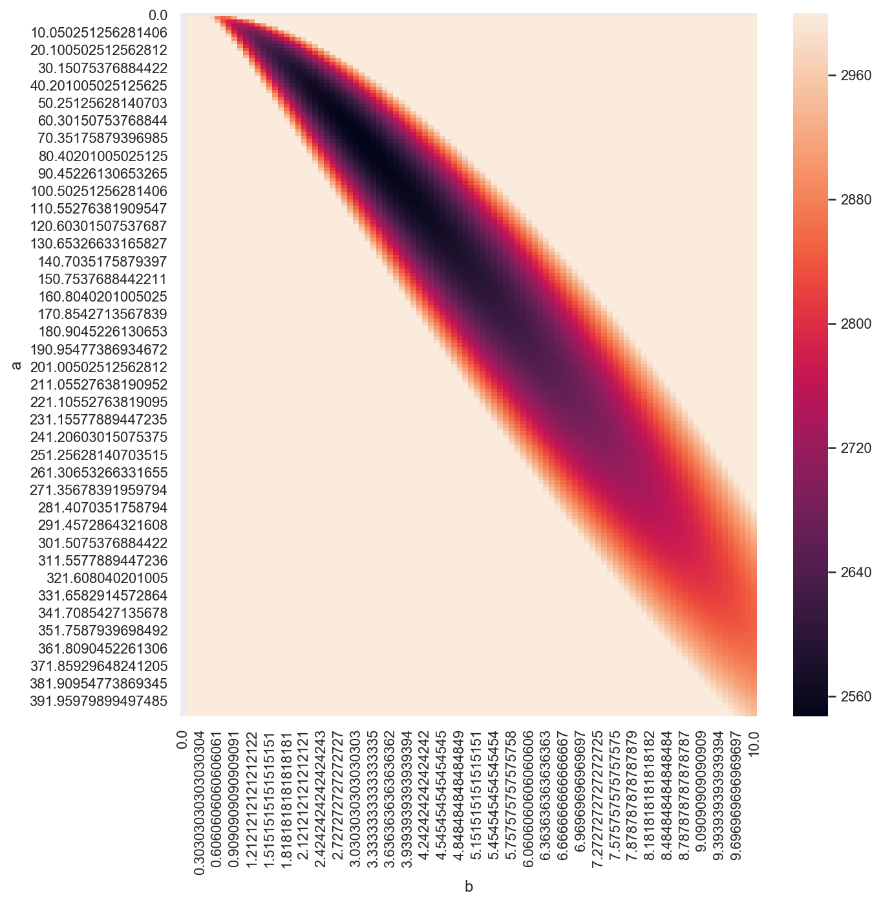
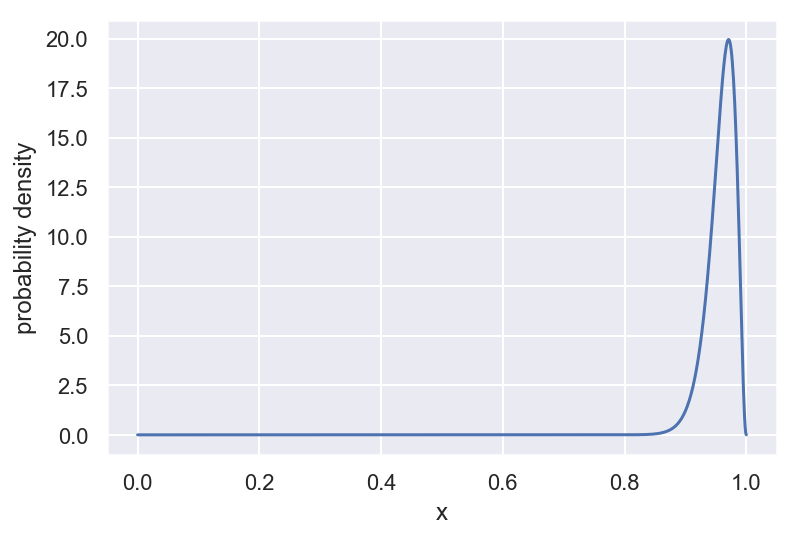
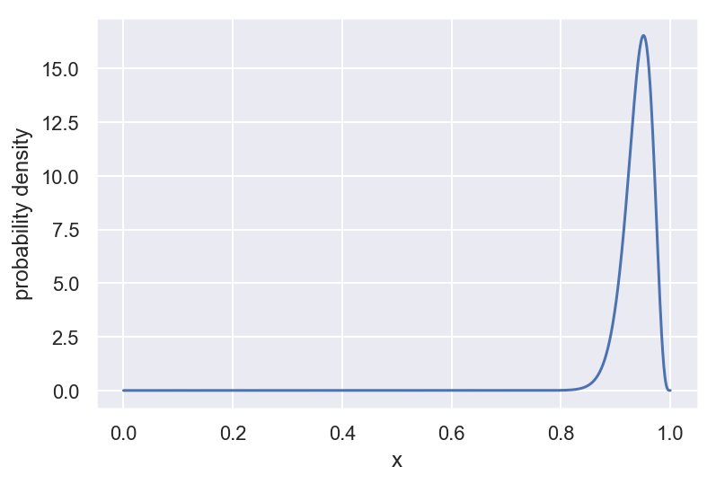
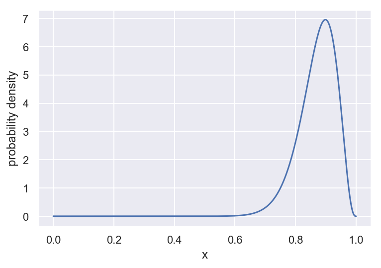
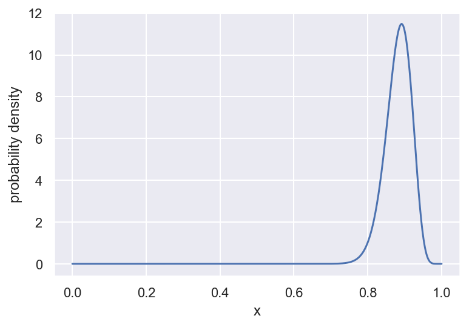
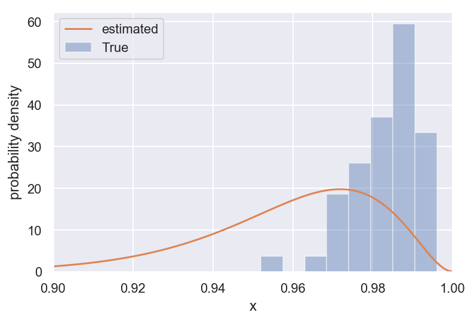

### 記事の流れ
- 短く分析の概要
- 音ゲにおけるデータの説明（ざっくり） と分析のモチベーション
  - scoreが正規化されていること
  - 音ゲは覚えゲではなく手が動くようになるとか譜面が認識できるようになる成長要素があるがあること
  - 他、非音ゲマーが勘違いしていそうなことをここで訂正しておきたい
- 手元にあるデータの概要
- 定式化
  - ノーテーション
  - 式変形
- 実装
  - （notebookへのリンクを貼っちゃうか、折り畳めるようにする）
- 分析結果
- 考察

### 概要
本記事では音楽ゲーム(以下音ゲ)において、曲をプレイすると得られるスコアを確率変数として、その分布を推定することを試みた。
音ゲのスコアは慣習的に最大値のみが保存されるような仕組みになっている。
そのため、曲をプレイすると得られるスコアは一覧として得られない。
得られるデータと言えば、その曲を何回プレイして最高のスコアはいくつだったかだけである。
そこで、本記事では、その最大値から背景にあるスコアの分布を推定することを試みた。

本記事をすらすらと読むためには、大学学部レベルの確率統計を履修している必要である。

### 分析のモチベーション
[SOUND VOLTEX](https://p.eagate.573.jp/game/sdvx/v/p/howto/index.html)(以下SDVX)という音ゲをご存知だろうか？多くの方は知らないと思うので、データの概要やモチベーション等については伝わるように丁寧目に説明する。

SDVXに限らず、音ゲでは100円入れると最大3曲プレイできるようになっている。
そう、最大3曲である。例えば、1曲目でプレイした曲のスコアが低かったり、クリアゲージを満たしていたいと(太鼓の達人のように)、次の曲には進めない。100円で多くの曲をプレイするには、なるべくクリアできる曲を選曲しないと行けない。

ところでSDVXは曲の追加が非常に頻繁に行われる音ゲある。新曲については何曲目にプレイすべきか非常に慎重にならざるを得ない。というのも、もし確率的に難しい曲だった場合1曲目でゲームオーバーになってしまうリスクがあるからだ。新曲には難易度以外の事前知識はない。

もし、このリスクを定量的に評価できたとしたら、新曲をプレイするかしないかの意思決定をサポートすることができる。
クリアできるか否かはスコアと高い相関があるため、今回はスコアについて分析する。

つまり、この分析において目的は以下のようになる。

#### 目的
あるレベルの曲について一回プレイする場合、得られるスコアの分布を知りたい。


### SDVXにおけるデータ
コナミに540円収めると、自分のプレイデータを買うことができるので、手っ取り早くそれを利用した。

たとえば、レベル20の曲に限定すると得られるデータは以下のようになっている。

<div>
<style scoped>
    .dataframe tbody tr th:only-of-type {
        vertical-align: middle;
    }

    .dataframe tbody tr th {
        vertical-align: top;
    }

    .dataframe thead th {
        text-align: right;
    }
</style>
<table border="1" class="dataframe">
  <thead>
    <tr style="text-align: right;">
      <th></th>
      <th>楽曲名</th>
      <th>難易度</th>
      <th>楽曲レベル</th>
      <th>クリアランク</th>
      <th>スコアグレード</th>
      <th>ハイスコア</th>
      <th>プレー回数</th>
      <th>クリア回数</th>
      <th>ULTIMATE CHAIN</th>
      <th>PERFECT</th>
    </tr>
  </thead>
  <tbody>
    <tr>
      <th>109</th>
      <td>*Feels Seasickness...*</td>
      <td>MAXIMUM</td>
      <td>20</td>
      <td>COMPLETE</td>
      <td>AA</td>
      <td>0.941634</td>
      <td>14</td>
      <td>2</td>
      <td>0</td>
      <td>0</td>
    </tr>
    <tr>
      <th>223</th>
      <td>Xronièr</td>
      <td>MAXIMUM</td>
      <td>20</td>
      <td>COMPLETE</td>
      <td>AA</td>
      <td>0.945362</td>
      <td>16</td>
      <td>1</td>
      <td>0</td>
      <td>0</td>
    </tr>
    <tr>
      <th>358</th>
      <td>I</td>
      <td>MAXIMUM</td>
      <td>20</td>
      <td>COMPLETE</td>
      <td>AA+</td>
      <td>0.957317</td>
      <td>22</td>
      <td>1</td>
      <td>0</td>
      <td>0</td>
    </tr>
    <tr>
      <th>537</th>
      <td>FIN4LE ～終止線の彼方へ～</td>
      <td>MAXIMUM</td>
      <td>20</td>
      <td>PLAYED</td>
      <td>A+</td>
      <td>0.915466</td>
      <td>5</td>
      <td>0</td>
      <td>0</td>
      <td>0</td>
    </tr>
    <tr>
      <th>540</th>
      <td>WHITEOUT</td>
      <td>MAXIMUM</td>
      <td>20</td>
      <td>PLAYED</td>
      <td>AA</td>
      <td>0.930971</td>
      <td>8</td>
      <td>0</td>
      <td>0</td>
      <td>0</td>
    </tr>
    <tr>
      <th>635</th>
      <td>iLLness LiLin</td>
      <td>MAXIMUM</td>
      <td>20</td>
      <td>PLAYED</td>
      <td>A+</td>
      <td>0.916706</td>
      <td>25</td>
      <td>0</td>
      <td>0</td>
      <td>0</td>
    </tr>
    <tr>
      <th>669</th>
      <td>HE4VEN ～天国へようこそ～</td>
      <td>MAXIMUM</td>
      <td>20</td>
      <td>COMPLETE</td>
      <td>AA</td>
      <td>0.941262</td>
      <td>32</td>
      <td>2</td>
      <td>0</td>
      <td>0</td>
    </tr>
    <tr>
      <th>910</th>
      <td>Lachryma《Re:Queen’M》</td>
      <td>GRAVITY</td>
      <td>20</td>
      <td>PLAYED</td>
      <td>AA</td>
      <td>0.940950</td>
      <td>15</td>
      <td>0</td>
      <td>0</td>
      <td>0</td>
    </tr>
  </tbody>
</table>
</div>

注目してほしいのは、ハイスコア（ベストスコア）とプレイ回数が記録されている点だ。
自分のプレイした履歴のようなデータは残念ながら存在しない。
またスコアは0〜1000万点の範囲であるが、今回は分析の都合上0〜1に正規化を行っている。

では新たにレベル20に曲が追加されたときに、それをプレイするとどれぐらいのスコアが得られるのだろうか？このデータからそれを推定するのである。


本分析ではレベル17,18,19,20について、分布を推定した。

### 分析上の仮定
やや、強い仮定もあるがモデリングの都合上許してほしい。

- 同じレベル帯の曲は同じ難易度である。(同じレベルならスコアの分布は曲にかかわらず全て同じ分布)
- 同じレベルなら、プレイごとに得られるスコアは独立同分布である。
  - よくある音ゲに対する勘違いとして、「プレイヤーは譜面を覚えてスコアを伸ばすんでしょ？」（つまり得点は試行の順番に相関がある）というものがある。これは誤りであることが多い。
  - 多くのプレイヤー（自分も含めて）は、譜面に対するパターン認識のスピード向上したり、脳の命令どおりに手が動けるようになったりすることで、スコアを伸ばしている。覚えるということはすくない。（ちなみに、初見でプレイしたスコアに勝てないという現象を頻発する。）
- データの取得期間中のプレイヤーのスキルは上昇してないものとする。
  - これは現実を無視したモデリングだが、スキルの上昇幅は少ないものとして今回の分析では無視して考える。

以下、特定のレベル帯の曲について議論することにする。

### ノーテーションと目的
曲が1〜Nまであるとする。曲を一回プレイしてスコアを得ることを1回の試行とする。

$n_i$...曲$i$をプレイした回数


$X_{(i,j)}$...曲$i$をプレイした中でj回目に出たスコア。

過去の全ての試行を確率変数として表すと以下のようになる。

|  曲   |              過去の全ての試行               |
| :---: | :-----------------------------------------: |
|   1   | $X_{(1,1)}$,$X_{(1,2)}$,...,$X_{(1,n_{1})}$ |
|   2   | $X_{(2,1)}$,$X_{(2,2)}$,...,$X_{(2,n_{2})}$ |
|  ...  |                     ...                     |
|   N   | $X_{(N,1)}$,$X_{(N,2)}$,...,$X_{(N,n_{N})}$ |

これらは全て独立同分布に従うと仮定する。またその分布に従う確率変数を$X$と代表して書くことにする。
 
$X$...ある曲を一回プレイしたときに得られるスコアの確率変数。

$f^{(X)}(x)$...推定したい$X$の従う確率分布。

今手元にあるデータは

|  曲   |                   ベストスコア                   | プレイ回数 |
| :---: | :----------------------------------------------: | :--------: |
|   1   | max($X_{(1,1)}$,$X_{(1,2)}$,...,$X_{(1,n_{1})}$) |   $n_1$    |
|   2   | max($X_{(2,1)}$,$X_{(2,2)}$,...,$X_{(2,n_{2})}$) |   $n_2$    |
|  ...  |                       ...                        |    ...     |
|   N   | max($X_{(N,1)}$,$X_{(N,2)}$,...,$X_{(N,n_{N})}$) |   $n_N$    |


ベストスコアは確率変数の最大値なのでこれも確率変数である。
$$M_{n_i}=max(X_{(i,1)},X_{(i,2)},...,X_{(i,n_{i})})$$
と定義すると、表は以下のようにスッキリとした見た目になる。

|  曲   | ベストスコア | プレイ回数 |
| :---: | :----------: | :--------: |
|   1   |  $M_{n_i}$   |   $n_1$    |
|   2   |  $M_{n_2}$   |   $n_2$    |
|  ...  |     ...      |    ...     |
|   N   |  $M_{n_N}$   |   $n_N$    |


$M_n$...n回試行したときの最大値の確率変数。

$f^{(M_n)}(m)$...$M_n$の従う確率密度関数。


ここで、問題の目的を書き得ると以下のようになる。

#### 知っている
- 曲$i$を$n_i$回プレイしたときの最大のスコア$m_i$
- $f^{(M_n)}(m)$の経験分布

#### 知りたい
- 曲を一回プレイしたときに獲得するスコアXの分布$f^{(X)}(x)$

### 推定のための定式化
$f^{(X)}(x)$を$f^{(M_n)}(m)$から推定したい。ここで$f^{(X)}(x)$はパラメーター$\boldsymbol\theta$によって表現できるものとする。
そのため$f^{(X)}(x ; \boldsymbol\theta)$と書くことにする。$f^{(X)}(x ; \boldsymbol\theta)$を求めるとはこのパラメーター$\boldsymbol\theta$を求めることである。
$\boldsymbol\theta$を求めるために以下の手続きを取る。


1. $f^{(X)}(x; \boldsymbol\theta)$を使って,最大値の分布$f^{(M_n)}(m ; \boldsymbol\theta)$を構築する。(ここで示した$\boldsymbol\theta$は$f^{(X)}(x ; \boldsymbol\theta)$のパラメーターに共通)
2. $f^{(M_n)}(m ; \boldsymbol\theta)$の負の対数尤度関数を構築する。
3. 2を損失関数とみなし、最小となるパラメーター$\boldsymbol\theta$を探す。ここでは$X$に分布を仮定して具体的な計算式にまで落とし込む。


これらについて一つ一つ式変形をしていこう。


#### 1について
確率密度関数$f(\cdot)$に対して累積密度関数を$F(\cdot)$と書くことにする。$P(\cdot)$を$\cdot$に記載された条件を満たす確率と定義する。このとき、最大値の分布を考えてみる。
最大値の分布は以下の式から議論をスタートしよう。

$$P(M_n < m)  = \left(P(X < m)\right)^n $$

これは、｢最大値の確率変数$M$が$m$より小さい確率は、全ての$X$が$m$より小さい確率と一致する｣という内容を記述する式である。これを累積分布関数に書き換えれば、

$$ F^{(M_n)}(m) = \left(F^{(X)}(m)\right)^n $$

となる。

したがって、$f^{(M_n)}(m)$は以下のように表せる。

$$ f^{(M_n)}(m) = \frac{d}{dm}F^{(M_n)}(m) $$

$$ f^{(M_n)}(m) = \frac{d}{dm}\left(F^{(X)}(m)\right)^n $$

$$ f^{(M_n)}(m) = n \left(F^{(X)}(m)\right)^{n-1}\frac{d}{dm}\left(F^{(X)}(m)\right) $$

$$ f^{(M_n)}(m) = n \left(F^{(X)}(m)\right)^{n-1}f^{(X)}(m)  $$

式の形を少し整理して、パラメーター$\boldsymbol\theta$を自明に書くと以下になる。

$$ f^{(M_n)}(m ; \boldsymbol\theta) = n f^{(X)}(m;\boldsymbol\theta) \left(F^{(X)}(m;\boldsymbol\theta)\right)^{n-1} $$

#### 2について
N個の曲について、プレイした回数とベストスコアはわかっている。これについて負の対数尤度関数を構築することを考える。

$$\text{負の対数尤度} = -\ln\left(\prod_i^N f^{(M_{n_i})}(m_i ; \boldsymbol\theta)\right)$$

となる。1の結果を代入し形を整えると以下のようになる。

$$\text{負の対数尤度} = -\sum_i^N \ln\left( f^{(M_{n_i})}(m_i ; \boldsymbol\theta)\right)$$

$$\text{負の対数尤度} = -\sum_i^N \ln\left( n_i f^{(X)}(m_i;\boldsymbol\theta) \left(F^{(X)}(m_i;\boldsymbol\theta)\right)^{n_i-1} \right)$$

$$\text{負の対数尤度} = -\sum_i^N \left[ \ln n_i + \ln f^{(X)}(m_i;\boldsymbol\theta) + (n_i-1)\ln \left(F^{(X)}(m_i;\boldsymbol\theta)\right) \right]$$


#### 3について
2で求めた負の対数尤度をもとに、$\boldsymbol\theta$についての損失関数を定義すると、
$$loss(\boldsymbol\theta)=-\sum_i^N \left[ \ln f^{(X)}(m_i;\boldsymbol\theta) + (n_i-1)\ln \left(F^{(X)}(m_i;\boldsymbol\theta)\right) \right]$$
となる。

これは見ての通り、$X$についての分布$f^{(X)}(m_i;\boldsymbol\theta)$を仮定しないと損失が計算できない形式になっている。

そこで、今回は$f^{(X)}(m_i;\boldsymbol\theta)$にベータ分布を仮定した。これは、5年間プレイしてきての経験から来る仮定である。

つまり
$$f^{(X)}(x;\boldsymbol\theta)=\frac{x^{a-1}(1-x)^{b-1}}{B(a,b)}(=Beta(x; a,b))$$
である。ただし、$B(\cdot)$はベータ関数で、
$$B(a,b)=\int_0^1 x^{a-1}(1-x)^{b-1} dx$$
である。

これを先の損失関数に代入すると、
$$loss(a,b)=-\sum_i^N \left[ \ln \frac{m_i^{a-1}(1-m_i)^{b-1}}{B(a,b)} + (n_i-1)\ln \int_0^{m_i} \frac{m_i^{a-1}(1-m_i)^{b-1}}{B(a,b)} dm_i \right]$$


$$loss(a,b)=-\sum_i^N \left[ -\ln B(a,b) + \ln (m_i^{a-1}(1-m_i)^{b-1}) + (n_i-1)\ln \int_0^{m_i} \frac{m_i^{a-1}(1-m_i)^{b-1}}{B(a,b)} dm_i \right]$$

$$loss(a,b)=-\sum_i^N \left[ -\ln B(a,b) + (a-1)\ln m_i + (b-1)\ln(1-m_i) + (n_i-1)\ln \int_0^{m_i} \frac{m_i^{a-1}(1-m_i)^{b-1}}{B(a,b)} dm_i \right]$$

シグマの中の第4項目の積分は正則化された不完全ベータ関数と言われるものである。表記を簡単にするために、
$$I_x(a,b) = \int_0^{x} \frac{x^{a-1}(1-x)^{b-1}}{B(a,b)} dx$$
とおくと、損失関数は結局

$$loss(a,b)=-\sum_i^N \left[ -\ln B(a,b) + (a-1)\ln m_i + (b-1)\ln(1-m_i) + (n_i-1)\ln I_{m_i}(a,b) \right]$$

$$loss(a,b)=\sum_i^N \left[ \ln B(a,b) - (a-1)\ln m_i - (b-1)\ln(1-m_i) - (n_i-1)\ln I_{m_i}(a,b) \right]$$

となる。

ゴールは、
$$a,b = \arg \min_{a,b} loss(a,b)$$
を求めることである。

これを解いて、a,bを推定するためにプログラムを組んだ。

### 実装
重要そうな関数だけ示す。すべての実装や使い方を知りたい方は、[jupyter notebook](リンク書こうね)の方を見てほしい。

```python
import numpy as np
from scipy.special import betaln, betainc
from scipy.optimize import minimize

def loss(a,b,ns:np.array,ms:np.array):
    firstitem=ns+betaln(a,b)
    seconditem=-(a-1)*np.log(ms)
    thirditem=-(b-1)*np.log(1-ms)
    fourthitem=-(ns-1)*np.log(betainc(a,b,ms))
    
    tmp_arr=firstitem+seconditem+thirditem+fourthitem
    
    return tmp_arr.sum()

def arg_min(ns:np.array,ms:np.array):
    def objective(ab):
        a,b=ab
        return loss(a,b,ns, ms)
    a,b=minimize(objective,(1,1)).x
    return a,b
```

ちなみに損失関数の可視化をするとこんな感じになる。(レベル17の場合)



### 推定結果
あるレベル帯の曲を一回プレイしたときの分布は以下のようになった。

#### レベル17

```
(a,b)=(73.3, 3.17)
```




#### レベル18
```
(a,b)=(78.6, 5.01)
```



#### レベル19
```
(a,b)=(25.6, 3.77)
```



#### レベル20
```
(a,b)=(72.0, 9.63)
```



### 考察
#### 実際の実力と比較して
レベル17の曲においてランダムに選曲を行いスコアを記録した。そしてそのヒストグラムと推定されたベータ分布を重ねて書いたのが下図である。


これを見ると、推定されたスコアの分布は自分の実力で出せるスコアよりも低めであることが確認できる。

他のレベル帯についても同様に感じた。

なぜ全体的に低いスコアが推定されたのか。
大きな理由は2つ考えられる。
1. データには自分が現在の自分よりも下手だったデータが全て含まれている。そのため、自分の現在の実力よりも低めに推定された。
2. 自分は一回良いスコア(例えば0．99)が得られたらあまりプレイしなくなるため、スコアが出にくい曲のプレイ回数が多くなる傾向がある。そのため、自分の実力よりも低めに推定された。


#### レベルの難易度が反映されているか
もし、スコアが正しく推定されているのならば、曲の難易度が大きくなるに連れ、スコアの期待値は減少するはずである。


| レベル | スコアの期待値 |
| :----: | :------------: |
|   17   |     0.959      |
|   18   |     0.940      |
|   19   |     0.872      |
|   20   |     0.882      |

これをみると19と20のスコアの期待値がそうはなっていない。
しかしながら、2つのレベルの期待値の大小を比べたときに、全体として正しい関係性になっているパターンが多い

| レベルの組み合わせ | 関係性 |
| :----------------: | :----: |
|       17,18        |   正   |
|       17,19        |   正   |
|       17,20        |   正   |
|       18,19        |   正   |
|       18,20        |   正   |
|       19,20        | **誤** |

なぜこのような結果になったのか。理由はレベル20の曲の追加時期に関係する。

このSDVXというゲームは難易度のインフレーションを起こしており、レベル20のある1曲(Lachryma《Re:Queen’M》)を除いて、他の8曲は、2017/02/17以降に追加されたため、自分の現在の実力と比較的近い実力でプレイしている。一方でレベル19は自分がSDVXをプレイし始めた当初からある程度曲数が揃っていて、下手なときにもプレイしてしまっている。

そういうわけで、レベル20の方がレベル19よりもスコアが出ると推定されてしまったのである。

