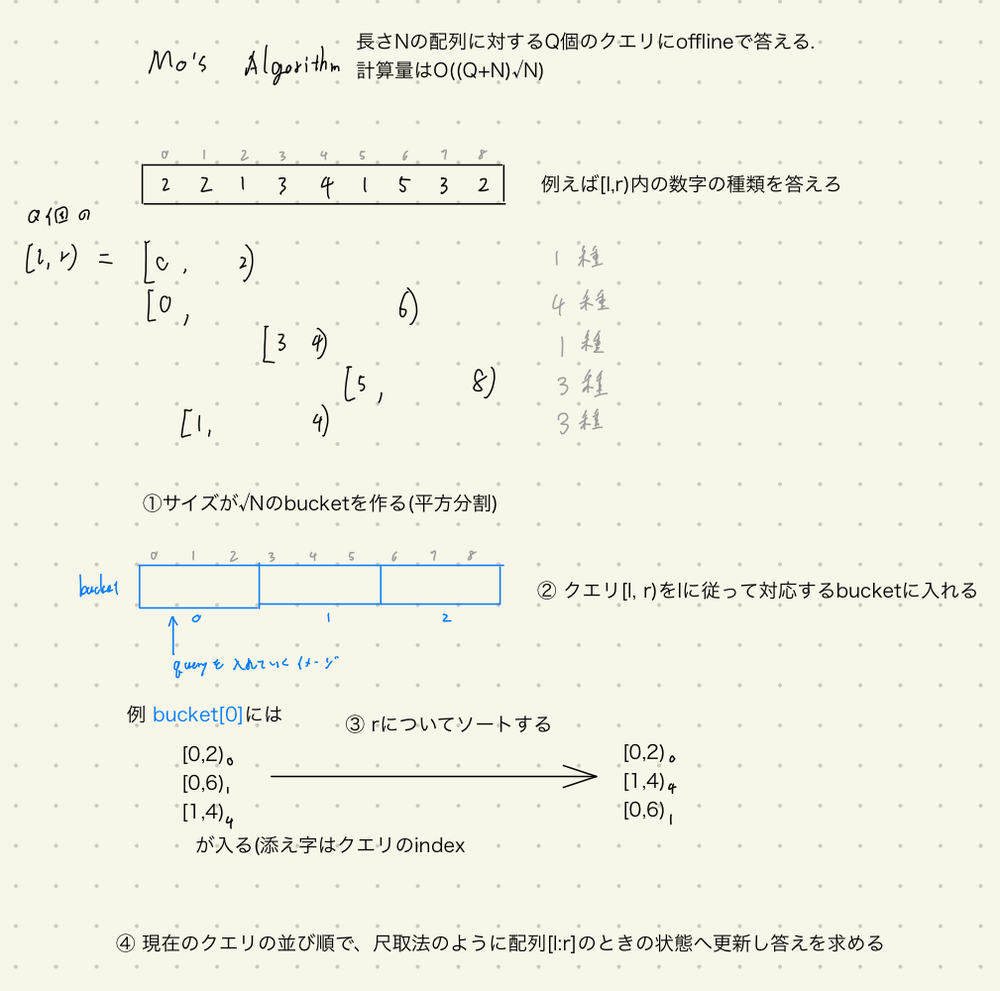

Mo's algorithm のPython実装 (コピペ用)
===

### この記事はなに？
Mo's algorithmについてPythonでの実装が検索に引っかからなかったので、(自分のメモも含めて)ここに実装をおいておく。

コンテストに向けてコピペで済むように心がけた。


### Mo's algorithmとは?
このブログにたどり着いてる時点で多くを語る必要はないと思うので以下の画像一枚で。



詳細な解説は偉大な先駆者たちのブログを参照していただきたい。

計算量の議論とC++の実装、具体的な問題な豊富です。
https://ei1333.hateblo.jp/entry/2017/09/11/211011

幾何学な視点からアルゴリズムについて考察しています。また応用のアルゴリズムを提案しています。
https://snuke.hatenablog.com/entry/2016/07/01/000000

### 例題
AtCoder Beginners Contest 174 F - Range Set Query

https://atcoder.jp/contests/abc174/tasks/abc174_f

問題文
```
N個の色の付いた玉が左右一列に並んでおり、左から i 番目の玉の色は c_i です。

クエリが Q 個与えられます。
i 番目のクエリでは、左から l_i 番目から r_i 番目までにある玉の色の種類数を答えてください。
```

[l,r)→[l,r+1)のように扱う区間が一つ伸長した場合を考える。

状態の変数に`cnt`と`n_unique`を考える。
`cnt`はkeyに色, valueに出現回数を持つ辞書である。`n_unique`は種類数である。

[l,r)→[l,r+1)のとき, `cnt`の更新は`cnt[C[i]]+=1`である。またこの更新によって`cnt[C[i]]`が0→1に変化したなら`n_unique+=1`となる。

[l,r)→[l,r-1)のときやその他の伸長短縮操作についてもほぼ同じなので省略。

これらを考慮して上記で図解したMo's algorithmを書くと以下のようになる。

```python
# mo's algorithm
# offline queryをlについて平方分割、rについてしゃくとり法したもの
import sys
sys.setrecursionlimit(1 << 25)
read = sys.stdin.readline

from collections import defaultdict
from operator import itemgetter

class Mo:
    def __init__(self, ls):
        # データは突っ込んで置きたい
        from math import sqrt, ceil
        self.ls = ls
        self.n = len(ls)
        self.b = ceil(sqrt(self.n))  # bukectのサイズ及び個数

    def _init_states(self):
        ########################################
        # self.states = None  # その時点における状態(自分で定義しろ) #2つでもいい
        self.n_unique = 0
        self.cnt = defaultdict(lambda: 0)
        ########################################

        # [l,r)の半開区間で考える
        self.l = 0
        self.r = 0

        # queryを格納する用
        self.bucket = [list() for _ in range((self.b + 1))]

    def _add(self, i):
        # i番目の要素を含めて考えるときへstatesを更新
        if self.cnt[self.ls[i]] == 0:
            self.n_unique += 1
        self.cnt[self.ls[i]] += 1

    def _delete(self, i):
        # i番目の要素を削除して考えるときへstatesを更新
        self.cnt[self.ls[i]] -= 1
        if self.cnt[self.ls[i]] == 0:
            self.n_unique -= 1

    def _one_process(self, l, r):
        # クエリ[l,r)に対してstatesを更新する
        for i in range(self.r, r):  # rまで伸長
            self._add(i)
        for i in range(self.r - 1, r - 1, -1):  # rまで短縮
            self._delete(i)
        for i in range(self.l, l):  # lまで短縮
            self._delete(i)
        for i in range(self.l - 1, l - 1, -1):  # lまで伸長
            self._add(i)

        self.l = l
        self.r = r

    def process(self, queries):
        self._init_states()

        for i, (l, r) in enumerate(queries):  # queryをbucketに格納
            self.bucket[l // self.b].append((l, r, i))

        for i in range(len(self.bucket)):
            self.bucket[i].sort(key=itemgetter(1))

        ret = [-1] * len(queries)
        for b in self.bucket:
            for l, r, i in b:  # クエリに答えていく
                self._one_process(l, r)
                ########################################
                # クエリに答える作業をここで書く
                ret[i] = self.n_unique
                ########################################
        return ret

def ints(): return list(map(int, read().split()))

N, Q = ints()
C = ints()
queries = []
for _ in range(Q):
    l, r = ints()
    queries.append((l - 1, r))

mo = Mo(C)
ans = mo.process(queries)
print(*ans, sep='\n')
```
ただこの問題に関しては制約がN,Q<=5*10^5と大きいので、TLEになってしまう。(10^5ぐらいならギリ通るか...?)

### 使い方とコピペ用
基本的には`mo=Mo(list)`でインスタンスを作ってから、queryを`mo.process(queries)`に投げてくれれば各クエリに対応する答えが返ってくるはずである。

その他メソッドの機能や使い方はコメントアウトを参照してほしい。

下記では処理を一般化しているため、状態の変数やそれを更新する`_add()`,`_delete`は自分で定義する必要がある。(上の例を見れば大概の場合で大丈夫だろう)
また、何を聞かれているかも問題によって異なるので`process`にも自分で定義する部分がある。


```python
from operator import itemgetter


class Mo:
    def __init__(self, ls):
        from math import sqrt, ceil
        self.ls = ls.copy()
        self.n = len(ls)
        self.b = ceil(sqrt(self.n))  # bukectのサイズ及び個数

    def _init_states(self):
        ########################################
        # self.states = None  # その時点における状態(自分で定義しろ) #いくつでもいい

        ########################################

        # [l,r)の半開区間で考える
        self.l = 0
        self.r = 0

        # queryを格納する用
        self.bucket = [list() for _ in range((self.b + 1))]

    def _add(self, i):
        # i番目の要素を含めて考えるときへstatesを更新
        ########################################
        pass
        ########################################

    def _delete(self, i):
        # i番目の要素を除いて考えるときへstatesを更新
        ########################################
        pass
        ########################################

    def _one_process(self, l, r):
        # クエリ[l,r)に対してstatesを更新する
        for i in range(self.r, r):  # rまで伸長
            self._add(i)
        for i in range(self.r - 1, r - 1, -1):  # rまで短縮
            self._delete(i)
        for i in range(self.l, l):  # lまで短縮
            self._delete(i)
        for i in range(self.l - 1, l - 1, -1):  # lまで伸長
            self._add(i)

        self.l = l
        self.r = r

    def process(self, queries):
        self._init_states()

        for i, (l, r) in enumerate(queries):  # queryをbucketに格納
            self.bucket[l // self.b].append((l, r, i))

        for i in range(len(self.bucket)):
            self.bucket[i].sort(key=itemgetter(1))

        ret = [-1] * len(queries)
        for b in self.bucket:
            for l, r, i in b:  # クエリに答えていく
                self._one_process(l, r)
                ########################################
                # クエリに答える作業をここで書く
                # ans=
                ret[i] = ans
                ########################################
        return ret
```

おしまい