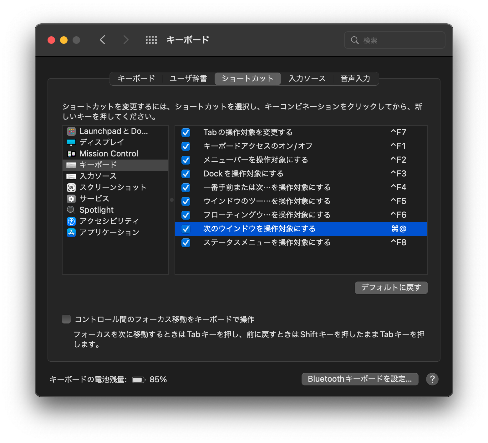

Visual Studio Code 等のアプリで command + [ (open bracket) がmacOSに吸われるニッチなバグの解決
===

### 状況
Macを初期化して再セットアップしたら、VSCodeで `command + [ (open bracket, left bracketとも)` が効かなくなった。
これはプログラミングしているときのindentでこのショートカットを多用しているのでめちゃくちゃ困る。しかも`shift + command + [`のようなショートカットもすべて効かなくて困った。
しかもよくよく確かめるとElectron製のアプリ全般で効かなくなってる。これは最悪である(一部は反応するけど意図した挙動でないことになった)。

もし、これを読んでいるあなたもお困りならば次に進もう。
自分の知る限り一番シンプルな解決策をここで提供する。

このバグが起こりうる環境等については後で述べる。

### 直し方
以下のショートカットをなにか別のものに変えた後、**OSを再起動**する。

```
システム環境設定->キーボード->ショートカット->キーボード->次のウインドウを操作対象にする
```

デフォルトでは以下のようになっているはずなので、`⌘@`から適当なもの(例えば`⌘\``)に変える。(無効化しても良いかも。未検証。)




### 先人たちの記録と解決しない事象

おそらく一番最初に言及されたのはこのissueである。ただしこのIssueで解決策は提供されなかった。

https://github.com/microsoft/vscode/issues/114075

(Issueを開いた方のTweet。わかりみが深い)
<blockquote class="twitter-tweet"><p lang="ja" dir="ltr">Big Sur にしてから VSCode の cmd + shift + &quot;[&quot; ショートカットが効かなくなってタブ移動ができなくてしんどい。Twitter では M1 Mac だと起きるという情報を少し見つけたけれど、自分はまだ Intel Mac なんだよな。</p>&mdash; fujikky (@fujikky) <a href="https://twitter.com/fujikky/status/1347555543792062464?ref_src=twsrc%5Etfw">January 8, 2021</a></blockquote> <script async src="https://platform.twitter.com/widgets.js" charset="utf-8"></script>

断っておくと、これは macOS のバグである可能性が高く、VSCodeに問題はない。

ほかにも同じ内容のIssueが投稿されている。

https://github.com/microsoft/vscode/issues/136934

しかしこのIssueでも解決策は提供されない。ただしいくつかヒントがあった。
1. VSCodeだけでなくElectron製のアプリには、`command`だけ届いて`[`は届いてないこと。
2. macをフォーマットしてOSを再インストールしても、発生すること(つまりOSが悪さをしている)。ただしインストール時に運要素があり発生しない人もいる。


つぎに現実的な解決策を提供しているブログ。
http://blog.sakurachiro.com/2021/10/m1-macbook-air-square-brackets-do-not-respond/

このブログでは、`fn + command + [`で何故か`command + [`が認識されることを発見している。これを読んだ時点で、筆者はkarabinerの設定ファイルを書き一応は使えるようになったが、jsonをごちゃごちゃ書くことになるので万人におすすめできる方法ではない。


最後に解決のいとぐちとなったブログ。
https://blog.summerwind.jp/posts/20211117/

このブログではシステム環境設定をすべてデフォルトにしたら直ったと解決策を述べている。しかし、筆者の環境では試したが直らなかった。

(ちなみにフォーマットOS再インストールのコンボを決めたあとなのに、`デフォルトに戻す`を押したら何故かキーボードショートカットが変わったんですが、デフォルトってどういう意味でしたっけ...Appleさん！！！しっかりして！！！)

そこでウンウン唸ってたら、`⌘ + @`というショートカットが目に入った。その瞬間、シワのない灰色の脳みそがフル回転を始めた。筆者は現在US配列を用いているが、もともとはJIS使いである。JISの`⌘ + @`はUSの`⌘ + [`とキーの位置が一緒なのだ。ここにOSのバグが入り込んでいたのである。


### 推測される原因

今回の事象は、特定条件下において、キーボード配列をOSがJISと勘違いするバグが有り、その結果、OSにショートカットが吸われるために発生したと考えられる。

特定条件下とは以下の2点だろう。

- 利用者が日本人
    - おそらく日本向けmacか、日本語でsetupするのがだめ
- US配列
    - OSがUS配列をJISと勘違いすることで起きる


厄介なのはセットアップ時にガチャ要素があり、あたりOSを引いた方は問題が生じないということだ。
ただOSのアップデートによってバグが発動することもある。観測したところBig Sur ~ Montereyまで幅広いversionでこのバグは発生しうる。またCPUがM1かIntelかも関係ない。


Apple Careという権利を~~乱用~~利用して電話相談で問い合わせたのだが、困ったことにAppleも把握してないようである。


### ついでに発見したバグ

Spotlightで`control + d`を押すと右の一文字を削除したあと、カーソルが最後まで移動しちゃうのどうにかならないっすかね、Appleさん！！！
右の1文字だけ削除したいのにどうして...
フォーマットしてOS再インストールしたMacでも発生したのでmacOSのバグとしか考えられない :cry: 


おわりです。


