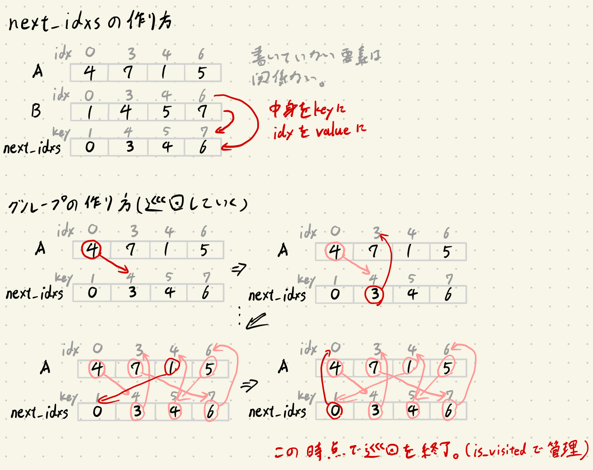

螺旋本をPythonで解く Part1
===

### はじめに
データサイエンティストがAutoML等によって駆逐されても、アルゴリズムをすばやく正確に実装できるエンジニアの需要は消えないと思うので競プロをやる。

[プログラミングコンテスト攻略のためのアルゴリズムとデータ構造](https://www.amazon.co.jp/プログラミングコンテスト攻略のためのアルゴリズムとデータ構造-渡部-有隆-ebook/dp/B00U5MVXZO)は通称螺旋本と呼ばれていて、蟻本、チーター本と並んで有名じゃないだろうか。

この本の問題は[AOJ](https://onlinejudge.u-aizu.ac.jp/courses/list)の問題と対応しており、ジャッジできる。
難易度としては蟻本よりも簡単だと思う(チーター本は持ってないのでわかりません)。

本記事は自分の理解のためにまとめたものであるが、pythonistで螺旋本をやろうとしている方の手助けになれたら嬉しい。

著作権保護のため本の解説をそのまま垂れ流すようなことはしないので、本を購入しましょう。
本記事では本には書かれていない行間を自分なりに補足したり、本の実装をpythonに適した実装に書き換えたりしている。


### 2章 アルゴリズムと計算量
#### P46 ALDS1_1_D: Maximum Profit 
```python
# https://onlinejudge.u-aizu.ac.jp/courses/lesson/1/ALDS1/1/ALDS1_1_D
# O(n**2)のプログラムを書かないように注意

n=int(input())
R=[int(input()) for _ in range(n)]

# dp的な考え方？
# 各時刻における損益の最大値は、前の時刻における損益の最大値と現時刻の最小値から計算可能
# 最小値にぶち当たるたびに、そこにひっつきながら収益がもっと上がるか見張る感じ
r_min = R[0]
ans = -10**9  # 成約に注意 #必ず損する場合でも最もマシなものを要求
for r in R[1:]:
    ans = max(ans, r-r_min)
    r_min = min(r, r_min)

print(ans)
```

### 3章 初等的整列
主にO(n**2)のソートについて紹介されていた。
ぶっちゃけ競技中にこんなソートは書かないと思うので省略。


### 4章 データ構造
#### P82 ALDS1_3_A: Stack
スタックはpythonではリストを用いて実装することができる。
```python
# https://onlinejudge.u-aizu.ac.jp/courses/lesson/1/ALDS1/all/ALDS1_3_A
# 逆オペランド表記の理解とスタックの練習

INPUT = list(input().split())
stack = []  # listを用いてスタックを実装する

for x in INPUT:
    if x.isdigit():
        stack.append(x)
    else:
        # 引き算の場合は順序が考慮されるので注意
        second_item = stack.pop()
        first_item = stack.pop()
        tmp = eval(first_item + x + second_item)
        stack.append(str(tmp))

print(int(stack.pop()))
```

#### P87 ALDS1_3_B: Queue
解説にはリングバッファなども書かれいて知識は身につくが、実装上は標準ライブラリを用いれば事足りる。
pythonでは`from collections import deque`で使える。
```python
n, q = list(map(int, input().split()))

# pythonに甘えたサボり実装
from collections import deque
que = deque([])
for _ in range(n):
    que.append((int(x) if x.isdigit() else x for x in input().split()))

tottime = 0
while que:
    name, lefttime = que.popleft()
    if lefttime <= q:
        tottime += lefttime
        print(name, tottime)
    else:
        lefttime -= q
        tottime += q
        que.append((name, lefttime))
```

#### P95 ALDS1_3_C: Doubly Linked List
多分dequeも挿入削除はO(1)のはず。これで代用可能なので、実装を省略する。

#### P114 ALDS1_3_D: Areas on the Cross-Section Diagram

```python
# https://onlinejudge.u-aizu.ac.jp/courses/lesson/1/ALDS1/3/ALDS1_3_D
# これは少し難しい
# stackをうまく利用して個々の湖の面積を出せるかが重要
# 条件を満たしたら面積mergeをするにはどうしたら良いのか考えよう。

chikei = input()
v_lakes = []  # 個々の湖の面積管理用のstack # (面積の始まりのidx, 面積)
idx_stack = []  # 地形のindex管理用のstack

for i, c in enumerate(chikei):
    if c is '\\': #エスケープのために\を重ねている
        idx_stack.append(i)
    elif c is '/' and idx_stack:
        j = idx_stack.pop()  # 今の/に対応する\の位置
        v = i-j
        # 可能であるならば面積merge
        # 今のjがv_lakesのj_preよりも小さかったら面積mergeができるということ
        # 実際に図を書いてみるとわかりやすいだろう.
        while v_lakes and j < v_lakes[-1][0]:
            # すべての面積をmerge
            v += v_lakes.pop()[1]
        v_lakes.append((j, v))

ans = [len(v_lakes)]
v = [v[1] for v in v_lakes]
ans.extend(v)

print(sum(v))
print(*ans)
```


### 5章 探索

#### P119 ALDS1_4_A: Linear Search
線形探索はpythonならforを書かなくても`in`で済む。
```python
# https://onlinejudge.u-aizu.ac.jp/courses/lesson/1/ALDS1/4/ALDS1_4_A
# やるだけ # 本では番兵を用いた実装だと定数倍早いとあるが、pythonではwhileが遅いのでおとなしくfor文を書く

n = input()
S = list(map(int, input().split()))
q = input()
T = list(map(int, input().split()))

cnt = 0
# for t in T:
#     for s in S:
#         if t == s:
#             cnt += 1
#             break
# こんなのを書かなくももっと簡単にかける

for t in T:
    if t in S:
        cnt += 1

print(cnt)
# list.index(hoge)とかlist.count(hoge)とかもよく使う。
```

#### 122 ALDS1_4_B: Binary Search
ここではライブラリを使ったが、このあとすぐにライブラリを使えない二分探索が出てくる。

```python
# https://onlinejudge.u-aizu.ac.jp/courses/lesson/1/ALDS1/4/ALDS1_4_B
# pythonでは便利な実装がすでにあるのでそれを使えるように
# 実装例はここにある https://docs.python.org/ja/3/library/bisect.html#searching-sorted-lists

from bisect import bisect_left
# 他にもbisect, bisect_leftがあったりするが、重複した値があったときに右側を返すか左側を返すかの違い
# bisectはrightと一緒

def find_exact_equal(a: list, x: int):
    i = bisect_left(a, x)
    if i != len(a) and a[i] == x:
        return 1  # 見つかったら1を返す。
    return 0  # 見つからなかったら0


n = input()
S = list(map(int, input().split()))
q = input()
T = list(map(int, input().split()))

cnt = 0
for t in T:
    cnt += find_exact_equal(S, t)

print(cnt)
```

#### P127 ALDS1_4_C: Dictionary
pythonのdictを使えばいいので省略。

#### P136 ALDs1_4_D: Allocation
この問題では最適なPを探索したいが、Pの候補となる数列がなければ、どの数字に近いのかの指標となるtargetもない。(強いて言えばtargetは関数の戻り値)
標準ライブラリのbisectは使えないため、自分で二分探索を実装する必要がある。


```python
# https://onlinejudge.u-aizu.ac.jp/courses/lesson/1/ALDS1/4/ALDS1_4_D
# 工夫すればO(n)ぐらいで解けるかもしれないが、nは最大で10**5。なのでO(nlogk)でもギリギリ間に合う(1.7*10**6回ぐらい)
# Pを与えたときにk台のトラックに詰める荷物の量を返す関数(O(n))を設計すれば二分探索でO(nlogk)で処理できる。
# イメージとしては単調増加関数を経由して二分探索する感じ

def n_nimotu_if_P(P, k, arr):  # Pに対する単調増加関数
    weight = 0
    n_trucks = 1  # 1台目から積んでいく
    for i, a in enumerate(arr):
        # iの荷物について積むかどうか決め、それに応じてトラックの数を増加させる
        if P < a:  # P<aの時点で即時終了 絶対その荷物は積めないので
            return i  # i個の荷物が詰める(i-1番目までの荷物が積める)
        if weight + a <= P:  # Pを超える手前までどんどん積んでいく
            weight += a
        else:
            n_trucks += 1  # Pを超えるなら次のtruckを用意
            weight = a  # 新たなトラックに積んでいる
        if n_trucks == k+1:  # k+1台目のtruckは存在しない。これまでに積んだ荷物の数を返す
            return i  # (i-1番目までのi個の荷物が積める)
    # truckに余裕があるなら全部詰める
    return len(arr)  # すべて運べるならlen(arr)を返すとする。

n, k = map(int, input().split())
luggages = []
for _ in range(n):
    luggages.append(int(input()))

# 探索する配列が未知のため、pythonのbisectは使えない状況。自分で実装
# n_nimotui_if_P()==n ならば 荷物を全部運んだ(もしくは余裕があるということ)。
# ==ならPを小さくし<ならばPを大きくしていく二分探索で解ける

left, right = 0, 10000 * n
i_break = 0
while right - left > 1:
    mid = (left+right)//2
    if n <= n_nimotu_if_P(mid, k, luggages):  # もし余裕があるならPを減らす
        right = mid  # ギリギリOKなのはrightに最終的に格納されているはず
    else:  # 余裕がなければ(n>n_nimotu_if_P())、Pを増やす
        left = mid

print(right)
```
### 6章 再帰・分割統治法
#### P142 ALDS1_5_A: Exhaustive Search

```python
# https://onlinejudge.u-aizu.ac.jp/courses/lesson/1/ALDS1/5/ALDS1_5_A
# 典型的なナップサック問題。動的計画法を使いたくなるが制約条件がゆるいので全探索でも十分間に合う。
# bit全探索も実装したくなるがここでは練習のために再帰関数で解く。

n = int(input())
A = list(map(int, input().split()))
q = int(input())
M = list(map(int, input().split()))

# i番目を以降の要素でmを作れるかどうかの関数solve(i,m)を再帰的に実装
# 例えば1 5 7 10 21が与えられたときsolve(4,21),solve(4,0)はTrue,solve(4,3)はFalseとすぐわかる
# ではsolve(3, x)はどうだろう。solve(3,31)はsolve(4,31)(つまり3番目の要素を選択しない)がTrueならTrueとなる。
# もしくはsolve(4,21)がTrueならsolve(3,31)もTrue (3番目の要素を選択したら実行可能).
# ここでは更に何も取らない選択も用意しておくと便利だろう。つまりsolve(5,0)ならばTrue
# つまり一般化すると、solve(i,m)はsolve(i+1,m)かsolve(i+1,m-A[i])がTrueならTrueでそれ以外はFalse
# またsolve(hoge,0)は必ず実行可能（再帰の終了条件）

from functools import lru_cache
# pythonだとTLEしてしまうためメモ化します
@lru_cache(maxsize=2**12)
def solve(i, m):
    # 終了条件 #dpテーブルの初期条件に相当
    if m == 0:
        return True
        # 数字をAでやりくりした結果切りよく0になるということは、その数字を実現可能だということ
        # 最大でi=len(A)、このときmは必ず0となるので無限ループは回避できる
    if i == n:
        # i==len(A)のときに前のifでm==0となればいいのだが、そうでないならば数字をAやりくりしても実現不可なのでFalseを返す
        return False
    return solve(i+1, m) or solve(i+1, m-A[i])

for m in M:
    if solve(0, m):
        print('yes')
    else:
        print('no')
```

#### P146 ALDS1_5_C: Koch Curve
ベクトルや回転行列などを知っていれば実装が面倒なだけで難しくない。
numpyが使えればもっと良かったのに。
```python
# https: // onlinejudge.u-aizu.ac.jp/courses/lesson/1/ALDS1/5/ALDS1_5_C
# 実装が面倒だけどやるだけ
# 一筆書きが面倒

n = int(input())
p1, p2 = (0, 0), (100, 0)
ans_ls = [p1, p2]

def koch(d, p1, p2):
    '''
    d...現在の深さ 0スタートにする
    p1,p2...端の座標。ここから途中の座標を計算しlistにappendする
    '''
    # 終了条件
    if d == n:
        return
    # 内分点の計算
    s = (2/3 * p1[0] + 1/3 * p2[0], 2/3 * p1[1] + 1/3 * p2[1])
    t = (1/3 * p1[0] + 2/3 * p2[0], 1/3 * p1[1] + 2/3 * p2[1])

    # 正三角形の頂点uの計算
    # (u-s)=R(1/3 pi) (t-s)が成り立つのでsを移行してuが計算できる。R()は回転行列で、加法定理から導出可能。
    R = [[1/2, -0.86602540378], [0.86602540378, 1/2]]
    u = (R[0][0] * (t[0] - s[0]) + R[0][1] * (t[1] - s[1]) + s[0],
         R[1][0] * (t[0] - s[0]) + R[1][1] * (t[1] - s[1]) + s[1])
    ans_ls.extend([s, u, t])  # 確定した点を追加

    # 再帰的に探索
    koch(d+1, p1, s)
    print(*s)
    koch(d+1, s, u)
    print(*u)
    koch(d+1, u, t)
    print(*t)
    koch(d+1, t, p2)

print(*p1)
koch(0, p1, p2)
print(*p2)
```

### 7章 高等的整列
#### P152 ALDS1_5_B: Merge Sort
ソートするだけなら実装しないと思うので、省略。しかしこのあと反転数を求める問題で実装することになるのであった。

#### P158 ALDS1_6_B: Partition
```python
# https: // onlinejudge.u-aizu.ac.jp/courses/lesson/1/ALDS1/6/ALDS1_6_B
# クイックソートを理解するために必要な問題。まあやるだけ
def partition(A, p, r):
    x = A[r]
    i = p-1
    for j in range(p, r):
        if A[j] <= x:
            i = i+1
            A[i], A[j] = A[j], A[i]
    A[i+1], A[r] = A[r], A[i+1]
    return i+1

input()
A = list(map(int, input().split()))

idx = partition(A, 0, len(A) - 1)
A[idx] = f'[{A[idx]}]'
print(*A)
```

#### P163 ALDS1_6_C: Quick Sort
上記のpartitionを再帰的に行うとできる。がこの問題も解くだけなら自分でsortを実装する必要はないので省略。

#### P168 ALDS1_6_A: Counting Sort
考え方が面白い。条件付きがつきまとうがO(nlogn)より高速。
```python
# https: // onlinejudge.u-aizu.ac.jp/courses/lesson/1/ALDS1/6/ALDS1_6_A
# 要素のmaxであるkさえわかっていればO(n+k)でソートできる高速なソート。天才かと思った。
# ソートしたい配列の数字をidxに対応させて、count 配列を作成. count配列を累積和。それがidxに対応しているというびっくり方法。
# ! 0 based-indexにするために、本とは少し違う実装

from itertools import accumulate
n = int(input())
A = list(map(int, input().split()))
k = max(A)

C = [0]*(k+1)
B = [-1]*n

# counting
for a in A:
    C[a] += 1

# 累積和をここで作る
C_acc = list(accumulate(C))

# sorting
for a in A[::-1]:  
    C_acc[a] -= 1  # 0based indexにしたいので先に-1しておく
    B[C_acc[a]] = a

print(*B)
```

#### P175 ALDS1_5_D: The Number of Inversions
解説は本に任せる。個人的にはmergeするときの探索せずとも反転数が求まるのところを理解するのに時間がかかった。が、紙に描いてみると納得した。
```python
# 長さ1の配列ならば反転数は0
# 2つの配列をソートしながらマージするときについでに反転数が求まるのが鍵で、これを実装に組み込む

INF = 10**9 + 1
def merge(A: list, left: int, mid: int, right: int) -> int:
    '''
    2つの配列をmergeする関数

    Aはこのプログラムで処理する配列。
    left, mid, rightはAのindex。
    '''
    cnt = 0  # mergeするときに何回反転するか
    n1 = mid-left  # 右の方の配列のlen (反転数を計算するときにこいつを使う)
    # n2 = right-mid  # 左の方の配列のlen ぶっちゃけいらない

    L = A[left:mid]  # python sliceはshallow copyらしい
    L.append(INF)  # 番兵
    R = A[mid:right]
    R.append(INF)  # 番兵

    i_l, i_r = 0, 0  # LとRのコントロール用idx
    for k in range(left, right):
        # L,Rの先頭を比較していって小さい方をAに打ち込む
        if L[i_l] <= R[i_r]:
            A[k] = L[i_l]
            i_l += 1
        else:
            A[k] = R[i_r]
            i_r += 1
            cnt += n1-i_l  # ここが重要 反転したときだけ反点数を足し込んでいく
    return cnt


def merge_sort(A: list, left: int, right: int):
    '''
    マージソートをしつつ、反転数を再帰的に計算する。

    ここではマージを再帰的に適応し反転数をどんどん上に伝播させていく仕組み
    '''
    if left + 1 >= right:  # 終了条件
        return 0

    mid = (left+right)//2
    v1 = merge_sort(A, left, mid)  # 右左にも再帰的にmerge_sortを適応
    v2 = merge_sort(A, mid, right)
    v3 = merge(A, left, mid, right)  # 右左整ったらmerge

    return v1+v2+v3


n = int(input())
A = list(map(int, input().split()))
print(merge_sort(A, 0, n))
```


#### P179 ALDS1_6_D: Minimum Cost Sort
より実業務の最適化に活かせそうな問題。
一方解こうとすると見通しが立たないぐらい難しい。

この問題を解くには3stepに分かれると思う。
1. ソート前後の最小手順はどうなるか？
2. 最小手順がわかったときに、どのようにコストを求めるか
3. どうやって実装するか

本では1,2について丁寧に説明されているが、3については実装を勝手に読め というスタンスである。
ここでは3を少し丁寧に説明する。

1,2がわかった時点で実装に必要なのは、どうやって置換のサイクルが生じるグループを作るかだ。(1,2の内容は本を読んでほしい)
作るのに必要な材料は4つ。ソート前の配列A, ソート後の配列B, 訪問管理の配列is_visited, そして配列の要素が与えられたときに次のindexを持つ辞書next_idxsである。

これをどう使うかというと、イメージとしてはこんな感じ。


```python
# https://onlinejudge.u-aizu.ac.jp/courses/lesson/1/ALDS1/6/ALDS1_6_D
# 本の解説がわかりやすい
# ここでは本には書いてないことの補足を意識しながらコメントを付けていく
WMAX = 10**4 + 1
n = int(input())
A = list(map(int, input().split()))
B = sorted(A)
is_visited = [False] * n  # 巡回管理用
next_idxs = {}  # Aの要素について、これのkeyを見れば、その数字がsort後にどの位置にあるのかわかるように対応させる
for i, b in enumerate(B):
    next_idxs[b] = i

m_A = min(A)  # globalで一番小さい要素

# ソート後の並び順から巡回可能なグループから答えを計算する
# グループ内の最小の要素をm, グループの和をS, グループ内の要素数をn2とする。
# 具体的には,m*(n2-2) + S もしくは m + S + (1+n2)*m_Aのうち小さい方
ans = 0
for i in range(n):
    if is_visited[i]:
        continue  # 巡回済みならば次へ
    cur = i  # 巡回制御用のidx #探索済みでないiが入るはず
    S = 0  # 合計管理用
    n2 = 0
    m = WMAX  # グループ内の最小値探索用
    while True:
        # まずはもろもろの値を更新
        is_visited[cur] = True
        S += A[cur]
        m = min(m, A[cur])
        n2 += 1
        # ここで次のidxを取得する
        cur = next_idxs[A[cur]]
        if is_visited[cur]:
            break  # もし一周したらおわり
    # ループ内で完結したほうがいいのか外から要素を変えいてきたほうがいいのか
    # 小さい方を採用して答えに足し込む
    ans += min(m*(n2-2)+S, m+S+(1+n2)*m_A)

print(ans)
```


### つづく
次は8章木から重み付きグラフまでやろうと思う。
多分part3まで続きます。


