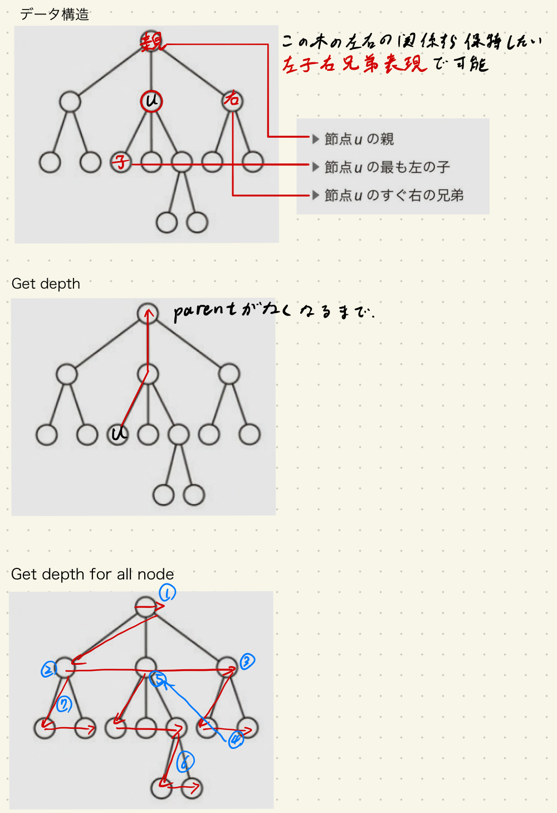
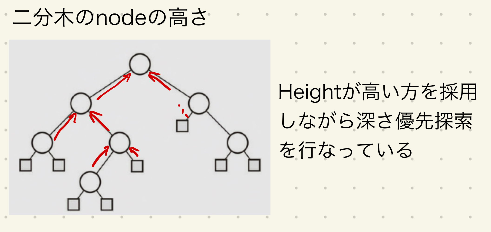
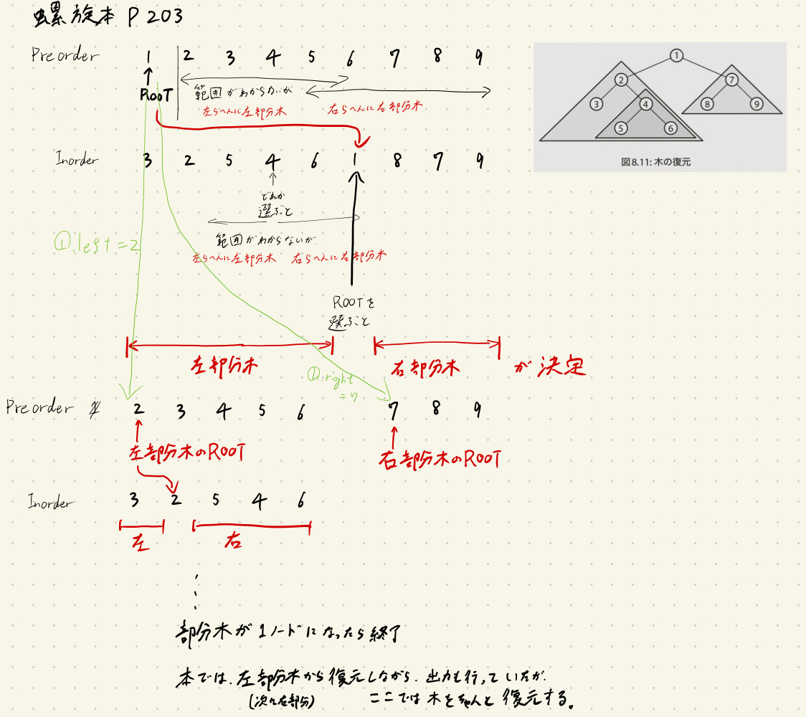
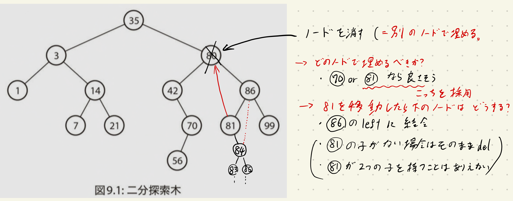
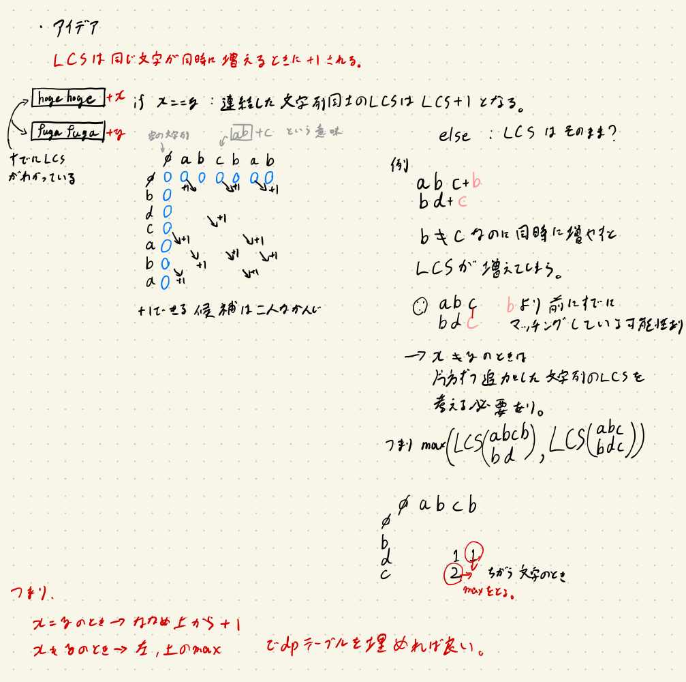
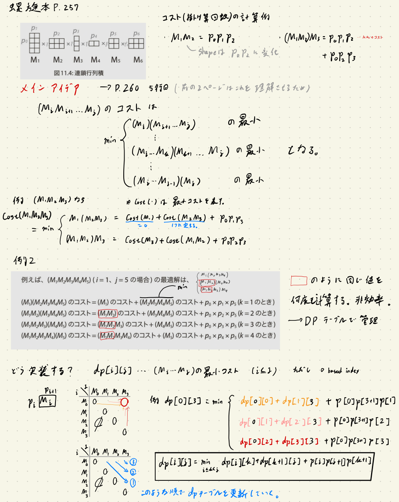

螺旋本をPythonで解く Part2
===

### はじめに
データサイエンティストがAutoML等によって駆逐されても、アルゴリズムをすばやく正確に実装できるエンジニアの需要は消えないと思うので競プロをやる。

[プログラミングコンテスト攻略のためのアルゴリズムとデータ構造](https://www.amazon.co.jp/プログラミングコンテスト攻略のためのアルゴリズムとデータ構造-渡部-有隆-ebook/dp/B00U5MVXZO)の8章から13章までの問題に対して、解答例と本では分かりづらいと感じた部分を解説していく。

この本の問題は[AOJ](https://onlinejudge.u-aizu.ac.jp/courses/list)の問題と対応しており、ジャッジできる。

この記事は前回の記事の続きである。

https://aotamasaki.hatenablog.com/entry/2019/10/11/螺旋本をPythonで解く_Part1


### 8章 木
この章のデータの持ち方って個人的にはキモいような気がしますが結構一般的なんですか？ 左子右兄弟表現とか。勉強するつもりでとりあえず本に従って実装します。
#### P188 ALDS1_7_A: Rooted Trees
本の説明を図に起こすとこんな感じ。



```python
# https://onlinejudge.u-aizu.ac.jp/courses/lesson/1/ALDS1/7/ALDS1_7_A
# 図参照
# 配列を3つ用意してもよいがここではクラスを定義する。
# 本ではNILを-1としていたがここではNoneとして実装する（どっちのほうがいいんだろう）

import sys
sys.setrecursionlimit(2**20)  # 再帰回数上限の向上 かなり多くしないとREになる


class Node:
    def __init__(self,
                 parent,
                 left,
                 right):
        self.parent = parent
        self.left = left  # 一番左の**子**ノードということに注意
        self.right = right


def get_depth(T: dict, u: int):
    '''
    Tは木の構造と見立てたdict
    uはTのノード
    '''
    d = 0
    while T[u].parent is not None:
        u = T[u].parent
        d += 1  # 親をたどりながらdを増やしていく。


D = {}  # 深さを保存しておく用のdict


def get_all_depth(T: dict, u: int, p: int):
    '''
    一度にすべてのノードの深さを取得する関数(再帰的に処理を行う)。
    一気に全体の深さを求めるならばこちらの方がオーダーが小さい。
    pは現在扱う深さ
    '''
    D[u] = p
    # ココらへんの動きは図を参照、ふさごとに深さ優先探索している感じ
    if T[u].right is not None:
        # 右の兄弟ノード(深さは同じ)から入れていく
        get_all_depth(T, T[u].right, p)
    if T[u].left is not None:
        # 兄弟を入れ終わったら次は下のふさへ
        get_all_depth(T, T[u].left, p+1)


def ret_children(T, u):
    chilren = []
    c = T[u].left
    while c is not None:
        chilren.append(c)
        c = T[c].right
    return chilren

# 答え出力用


def print_for_a_node(T: dict, node: int, D: dict):
    node_type = 'internal node' if T[node].left is not None else 'leaf'
    if T[node].parent is None:
        parent = -1
        node_type = 'root'
    else:
        parent = T[node].parent
    children = ret_children(T, node)

    print(
        f'node {node}: parent = {parent}, depth = {D[node]}, {node_type}, {children}')


# この問題は入力をNoneに適する形に整形するのも少し難しい
n = int(input())

T = {k: Node(None, None, None) for k in range(n)}  # pythonぽくないけど初期化
for _ in range(n):
    tmp = list(map(int, input().split()))
    if tmp[1] == 0:  # もし子ノードがなければ次へ
        continue
    T[tmp[0]].left = tmp[2]  # 一番左の子ノードは即座にわかる
    T[tmp[2]].parent = tmp[0]  # 子の親ノードも即座に与えられる
    prev_sibling = tmp[2]  # 前のノード番号を覚えておく用
    for sib in tmp[3:]:
        T[prev_sibling].right = sib
        T[sib].parent = tmp[0]  # 子から親を与えている
        prev_sibling = sib

for node in range(n):
    if T[node].parent is None:
        get_all_depth(T, node, 0)  # rootを入れなければいけないことに注意
        # Dに深さが入った
        break

for node in range(n):
    print_for_a_node(T, node, D)
```


#### P193 ALDS1_7_B: Binary Tree
rightとleftが指しているノードの相対的な位置が先程とは違うことに注意したい。
また出力には高さ情報も求められる。

高さを求める関数ではこのような処理を再帰的に行っている。



```python
# https://onlinejudge.u-aizu.ac.jp/courses/lesson/1/ALDS1/7/ALDS1_7_B

import sys
sys.setrecursionlimit(2**20)  # 再帰回数上限の向上 かなり多くしないとREになる

class Node:
    def __init__(self,
                 parent,
                 left,
                 right):
        self.parent = parent
        self.left = left  # 左の子ノード
        self.right = right  # 右の**子**


def get_all_height(T: dict, H: dict, u: int):
    '''
    深さ優先探索で各地点をめぐりながらHに高さ情報セットしていく
    '''
    h_left, h_right = 0, 0  # Noneによって代入されなかったとき用
    # 本では右から左の方に探索していったけど
    # キモいのでここでは左から右に探索していくことにする
    if T[u].left is not None:
        h_left = get_all_height(T, H, T[u].left) + 1
    if T[u].right is not None:
        h_right = get_all_height(T, H, T[u].right) + 1
    ret = max(h_left, h_right)
    H[u] = ret
    return ret


def get_all_depth(T, D: dict, u, p: int):
    '''
    まあHがわかってればdepthに変換可能なんだけど練習のために再帰関数で実装する。

    Dは深さを格納するための辞書
    pは現在の深さ
    '''
    D[u] = p
    if T[u].left is not None:
        get_all_depth(T, D, T[u].left, p+1)
    if T[u].right is not None:
        get_all_depth(T, D, T[u].right, p+1)


def ret_sibling(T, u):
    '''
    一度親を経由すれば良い
    ココらへんの実装が汚くなるからNILを-1にしておけば良かったなぁと後悔
    '''
    parent = T[u].parent
    if parent is None:
        return -1  # 根は兄弟なし
    ret = T[parent].left if T[parent].left != u else T[parent].right
    if ret is None:
        return -1
    return ret


def ret_degree(T, u):
    ret = 2
    if T[u].left is None:
        ret -= 1
    if T[u].right is None:
        ret -= 1
    return ret


# データを読み込む
n = int(input())
T = {key: Node(None, None, None) for key in range(n)}  # 初期化
for _ in range(n):
    tmp = list(map(int, input().split()))
    # 左から処理
    if tmp[1] != -1:
        T[tmp[0]].left = tmp[1]  # 子の代入
        T[tmp[1]].parent = tmp[0]  # 親の代入
    if tmp[2] != -1:
        T[tmp[0]].right = tmp[2]  # 子の代入
        T[tmp[2]].parent = tmp[0]  # 親の代入

# 根の探索
for k, v in T.items():
    if v.parent is None:
        ROOT = k
        break
else:
    raise ValueError("ROOTが存在しないなんておかしい")

# 深さと高さの探索
D = {}
get_all_depth(T, D, ROOT, 0)
H = {}
get_all_height(T, H, ROOT)


def print_for_a_node(u):
    if T[u].parent is None:
        parent = -1
    else:
        parent = T[u].parent

    sib = ret_sibling(T, u)
    deg = ret_degree(T, u)
    node_type = 'internal node' if deg != 0 else 'leaf'
    if parent == -1:
        node_type = 'root'

    print(
        f'node {u}: parent = {parent}, sibling = {sib}, degree = {deg}, depth = {D[u]}, height = {H[u]}, {node_type}')


for node in range(n):
    print_for_a_node(node)

```

#### P198 ALDS1_7_C: Tree Walk
P200に動きのイメージ図があるので参照されたい。
次の難問へ挑戦するための準備問題といったところ。

```python
# https://onlinejudge.u-aizu.ac.jp/courses/lesson/1/ALDS1/7/ALDS1_7_C

import sys
sys.setrecursionlimit(2**20)  # 再帰回数上限の向上 かなり多くしないとREになる


class Node:
    def __init__(self,
                 parent,
                 left,
                 right):
        self.parent = parent
        self.left = left  # 左の子ノード
        self.right = right  # 右の**子**


def pre_parse(T: dict, u: int, pre_ls: list):
    # 深さ優先探索特有の即時終了条件
    if u == None:
        return
    pre_ls.append(u)
    pre_parse(T, T[u].left, pre_ls)  # より左の方から深さ優先探索
    pre_parse(T, T[u].right, pre_ls)


def in_parse(T, u, in_ls):
    if u == None:
        return
    # 左→中→右っていうちょっと気持ち悪い順番
    in_parse(T, T[u].left, in_ls)
    in_ls.append(u)
    in_parse(T, T[u].right, in_ls)


def post_parse(T, u, post_ls):
    if u == None:
        return
    post_parse(T, T[u].left, post_ls)
    post_parse(T, T[u].right, post_ls)
    post_ls.append(u)


# データの読み込み
n = int(input())
T = {key: Node(None, None, None) for key in range(n)}
for _ in range(n):
    tmp = [x if x != -1 else None for x in map(int, input().split())]
    T[tmp[0]].left = tmp[1]
    T[tmp[0]].right = tmp[2]
    if tmp[1] is not None:
        T[tmp[1]].parent = tmp[0]
    if tmp[2] is not None:
        T[tmp[2]].parent = tmp[0]

# parentがないのが特徴のROOTを探す
for id, node in T.items():
    if node.parent is None:
        ROOT = id

# リストに答えを格納していく
pre_ls, in_ls, post_ls = [], [], []
pre_parse(T, ROOT, pre_ls)
in_parse(T, ROOT, in_ls)
post_parse(T, ROOT, post_ls)

print('Preorder')
print('', *pre_ls)
print('Inorder')
print('', *in_ls)
print('Postorder')
print('', *post_ls)
```


#### P203 ALDS1_7_D: Reconstruction of the Tree
解説ではたんぱくに説明されていて分かりづらい気がする。
この問題ではpreoderとinoderの性質を理解した上で、両方の情報を使ってどうやって二分木を再構築できそうか考えなければ行けない。

例えば、preoderでは先頭が必ずrootになるのでrootのノードがわかる。
rootのノードがわかった状態でinoderの順番を眺めてみると、必ず左部分木と右部分木を構成するノードの集合がわかる。
右部分木と左部分木がわかった状態でpreoderに戻って見てみると、部分木内のrootがまたわかる。これらを繰り返すと、木が再構成できそうだ。

以上の議論を図にするとこんな感じとなる。



### 9章 二分探索木
この章はヒープとかを理解するための伏線のようなもの。こんなのもあるんだなぁという気持ちで追っていこう。


#### P209 ALDS1_8_A: Binary Search Tree 1
次の問題のソースコードで動くので省略
#### P214 ALDS1_8_B: Binary Search Tree 2
次の問題のソースコードで動くので省略
#### P217 ALDS1_8_C: Binary Search Tree 3
二分探索木の挿入探索削除を実装する問題。挿入探索は簡単なのですぐ理解できるだろう。しかし、この削除の操作は少しややこしい。というのは二分探索木の接点ノードを取り外す場合はパスの付け替えが生じるからである。

削除について考察する。P220の説明でcase1,2は比較的わかりやすいが、case3はどういうことなのかやや言葉足らずである。case3のようなルールでつなぎ替える気持ちを言語化して以下の図に示した。



というわけで二分探索木の操作を行うプログラムは以下の通りである。

```python
# https://onlinejudge.u-aizu.ac.jp/courses/lesson/1/ALDS1/8/ALDS1_8_C
# 次への伏線みたいなもの
# ここらへんはもうひたすら実装するだけ
import sys
sys.setrecursionlimit(2**20)  # 再帰回数上限の向上 かなり多くしないとREになる


class Node:
    def __init__(self,
                 parent=None,
                 left=None,
                 right=None):
        self.parent = parent
        self.left = left  # 左の子ノード
        self.right = right  # 右の**子**


def pre_parse(T: dict, u: int, pre_ls: list):
    # 深さ優先探索特有の即時終了条件
    if u == None:
        return
    pre_ls.append(u)
    pre_parse(T, T[u].left, pre_ls)  # より左の方から深さ優先探索
    pre_parse(T, T[u].right, pre_ls)


def in_parse(T, u, in_ls):
    if u == None:
        return
    # 左→中→右っていうちょっと気持ち悪い順番
    in_parse(T, T[u].left, in_ls)
    in_ls.append(u)
    in_parse(T, T[u].right, in_ls)


def insert(T, ROOT, z):
    '''
    zは接点番号(そしてその接点番号が内容でもある)
    この接点番号を二分探索木の条件に従うように挿入する。
    '''
    # もしTが空だった場合(最初の一回しか発動されない)
    if ROOT == z:
        T[z] = Node()
    # もしTにいくつか入っていた場合
    else:
        T[z] = Node()  # 初期化
        x = ROOT
        while x is not None:  # 子がNoneになったらbreakする
            next_parent = x  # 次のループではxの親になる。whileから抜けたときに使用する
            if z < x:  # もし新たなノードが現在のノードよりも小さければ左に移動する
                x = T[x].left
            else:
                x = T[x].right
        T[z].parent = next_parent
        # 親の右と左どっちにつける？
        if z < next_parent:
            T[next_parent].left = z
        else:
            T[next_parent].right = z


def find(T, ROOT, k):
    '''
    Tからkを見つけ出す。見つからなかったらNoneを返す
    ひたすらkの大きさによって左右のパスをたどっていくだけ
    (いま辞書でノードを管理しているので、`k in T.keys()`で済むことではあるんだけど(オーダーは大きくなる)))
    '''
    x = ROOT  # 訪問中のノード
    while x is not None and x != k:
        if k < x:
            x = T[x].left
        else:
            x = T[x].right
    return x

#P219 program 9.3がイマイチ理解できなかったが、仕組みはわかったのでオレオレ実装です
def delete_node(T, z):
    # case1 指定したzが子を持たない場合
    parent = T[z].parent
    if (T[z].left is None) and (T[z].right is None):
        # そのノードを削除する
        if T[parent].left == z:
            T[parent].left = None
        elif T[parent].right == z:
            T[parent].right = None
        else:
            raise ValueError('something wrong in case 1')
        del T[z]
    # case2 指定したzが一つの子を保つ場合
    elif T[z].right is None:
        # 左だけある場合、左の子ノードを親につなぐ
        # 親の左右のどちらにつなぐかはzのつながり方に依存する
        z_is_left = True if T[parent].left == z else False
        child = T[z].left
        if z_is_left:
            T[parent].left = child
        else:
            T[parent].right = child
        T[child].parent = parent
        del T[z]
    elif T[z].left is None:
        # ROOTが片方の部分木しかない場合でROOTを削除しようとするコーナーケースに実は引っかかるはず(実は嘘解法)
        z_is_left = True if T[parent].left == z else False
        child = T[z].right
        if z_is_left:
            T[parent].left = child
        else:
            T[parent].right = child
        T[child].parent = parent
        del T[z]
    # case3 zが2つの子を保つ場合
    elif (T[z].left is not None) and (T[z].right is not None):
        # これに関しては本での解説に少し補足する
        left, right = T[z].left, T[z].right
        node_next_more = get_min_in_descendants(
            T, T[z].right)  # 指定したノードの子孫の中で一番小さいノードを返す #ここが問題だ node_next_moreがrightと一致するときにparentとかの代入がいろいろおかしくなる
        next_more_right = T[node_next_more].right
        next_more_parent = T[node_next_more].parent
        # zがROOTだったら
        if parent is None:
            if node_next_more == right:
                # node_next_more==rightとなるような場合
                T[right].parent = None
                T[right].left = left
                ROOT = right
                del T[z]
                return
            else:
                # node_next_moreがもっと下流にある場合
                # zの子と親との接続
                T[node_next_more].left = left
                T[node_next_more].right = right
                T[node_next_more].parent = None
                T[left].parent = node_next_more  # zの左側の接続
                T[right].parent = node_next_more  # zの右側の接続
                # node_next_moreの親 → node_next_more右子の接続 (node_next_moreの親からみると左に接続される)
                if next_more_right is not None:
                    T[next_more_right].parent = next_more_parent
                ROOT = node_next_more
                del T[z]
                return
        else:  # zが非ROOT
            # zが親からみてどっち側についているか
            z_is_left = True if T[parent].left == z else False
            if node_next_more == right:
                if z_is_left:
                    T[parent].left = right
                else:
                    T[parent].right = right
                T[right].parent = parent
                T[right].left = left
                del T[z]
                return
            else:  # 以下が多分もっとも一般的な場合 #写真で説明したのはこれを想定して説明している
                # zの親->next_moreとの接続
                if z_is_left:
                    T[parent].left = node_next_more
                else:
                    T[parent].right = node_next_more
                # next_more -> zの子との接続
                T[node_next_more].left = T[z].left
                T[node_next_more].right = T[z].right
                T[node_next_more].parent = parent
                T[left].parent = node_next_more  # zの左側の接続
                T[right].parent = node_next_more  # zの左側の接続
                # node_next_moreの親 → node_next_more右子の接続 (node_next_moreの親からみると左に接続される)
                T[next_more_parent].left = next_more_right
                if next_more_right is not None:
                    T[next_more_right].parent = next_more_parent

                del T[z]
                return


def get_min_in_descendants(T, z):
    x = z
    while T[x].left is not None:
        x = T[x].left
    return x


def print_result(T):
    pre_ls, in_ls = [], []
    in_parse(T, ROOT, in_ls)
    pre_parse(T, ROOT, pre_ls)
    print('', *in_ls)
    print('', *pre_ls)


    # データの読み込み
N = int(input())
T = {}
for i in range(N):
    tmp = input()
    if tmp.startswith('print'):  # なぜかtmp == 'print'ではerror
        print_result(T)
    elif tmp.startswith('insert'):
        z = int(tmp.split()[1])
        if i == 0:
            ROOT = z
        insert(T, ROOT, z)
    elif tmp.startswith('find'):
        z = int(tmp.split()[1])
        if find(T, ROOT, z) is None:
            print('no')
        else:
            print('yes')
    elif tmp.startswith('delete'):
        z = int(tmp.split()[1])
        delete_node(T, z)
```

### 10章 ヒープ
実用的な内容になってきた。
二分ヒープの完全二分木は、左子と右子のルールが先程の二分探索木と異なる。
二分探索木では左が親より小さくて、右が親より大きいというルールで構成されているが、二分ヒープでは右子も左子も親より小さいというシンプルなルールで二分木を構成する。

#### P234 ALDS1_9_A: Complete Binary Tree
```python
# https://onlinejudge.u-aizu.ac.jp/courses/lesson/1/ALDS1/9/ALDS1_9_A
# 与えられる配列はすでに完全二分木を表す二分ヒープ
# 配列を1オリジンとし、ノードのidxをiとしたとき、そのノードの親はi//2、2*i, 2*i+1。
# これを実装するだけ。(この関係性はP232の図10.2を見れば自明)

N = int(input())
heap = list(map(int, input().split()))

for i, a in enumerate(heap, start=1):  # 1オリジンにするためのstart=1
    print(f'node {i}: key = {a}, ', end='')
    # 親存在するときだけ出力する。
    if i//2 != 0:
        # heapは実際には0オリジンなので-1して調節する
        print(f'parent key = {heap[i//2 -1 ]}, ', end='')
    # 左子が存在するときだけ出力する
    if 2 * i <= N:
        print(f'left key = {heap[2*i - 1]}, ', end='')
    # 右子
    if 2 * i + 1 <= N:
        print(f'right key = {heap[2*i]}, ', end='')
    print()
```

#### P236 ALDS1_9_B: Maximum Heap
リストをheapifyするお話。標準ライブラリにあるのでそれを使ってしまうのが手っ取り早いか
```python
# https://onlinejudge.u-aizu.ac.jp/courses/lesson/1/ALDS1/9/ALDS1_9_B
# 詳しくはP233と238の図
# 勉強にはなるが解くだけならpythonのライブラリでok
from heapq import heapify, heappop, heappush, heappushpop
N = input()
H = [-x for x in map(int, input().split())]

heapify(H)
print('', *[-x for x in H])
```

#### P240 ALDS1_9_C: Priority Queue
これも標準ライブラリに頼ってしまった。動作はP242やP243を見ておくと良いかもしれない。
```python
# https://onlinejudge.u-aizu.ac.jp/courses/lesson/1/ALDS1/9/ALDS1_9_C
# これもライブラリを使えば一瞬
from heapq import heapify, heappop, heappush, heappushpop

heap = []
# データの入力
while True:
    tmp = input()
    if tmp.startswith('end'):
        break
    elif tmp.startswith('insert'):
        k = int(tmp.split()[1])
        heappush(heap, -k)
    elif tmp.startswith('extract'):
        print(-heappop(heap))
```

### 11章 動的計画法
この章に載っている問題はウォーミングアップ的な数問しかなく、17章にさらなる問題が載っている。
#### P249 ALDS1_10_A: Fibonacci Number
自分はメモ化派ではなくDPテーブル派なのでこういう書き方です(再帰関数バグらせたくないというお気持ち)
```python 
# https://onlinejudge.u-aizu.ac.jp/courses/lesson/1/ALDS1/10/ALDS1_10_A
# やるだけ

n = int(input())
# dpテーブルの用意
dp = [-1]*(n+1)
# dpの初期値
dp[0], dp[1] = 1, 1

for i in range(2, n+1):
    dp[i] = dp[i-1]+dp[i-2]
print(dp[-1])
```

#### P253: ALDS1_10_C: Longest Common Subsequence
更新の仕方をその場で思いつける自信はないので覚えて類門に太刀打ちできるようにしておこう。
しかしpythonでは定数倍が遅くてどうしてもTLEになってしまう。pypy3も使えないどうしたらいいのやら。



```python
# https://onlinejudge.u-aizu.ac.jp/courses/lesson/1/ALDS1/10/ALDS1_10_C
# どうあがいてもTLEのカルマから逃げられない。これは何？

from itertools import product

def get_LCS(S1: str, S2: str):
    # dpテーブルの用意
    dp = [[0]*(len(S1)+1) for _ in range(len(S2)+1)]  # (#S2+1,#S1+1)の配列を作る
    # 境界条件
    # dp[0,:]とdp[:,0]は0。これは初期化の時点ですでにできている
    # dpの更新 Z字を書くように更新していく
    for i, j in product(range(len(S2)), range(len(S1))):
        # iが行、jが列
        if S2[i] == S1[j]:
            dp[i+1][j+1] = dp[i][j]+1
        else:
            dp[i+1][j+1] = max(dp[i][j+1], dp[i+1][j])  # 左と右の大きい方から取る
    return dp[-1][-1]


N = int(input())
for _ in range(N):
    S1 = input()
    S2 = input()
    print(get_LCS(S1, S2))
```


#### P257 ALDS1_10_B: Matrix Chain Multiplication
めちゃくちゃ考察が厳しい。行列計算を全通りするのでは何度も同じ組み合わせを計算することになるのでそこの無駄を減らそうというお気持ち。

どうやって減らすかというと、下の図のやりかた。(本を読んだ上で見ると良いかもしれない)



```python
# https://onlinejudge.u-aizu.ac.jp/courses/lesson/1/ALDS1/10/ALDS1_10_B
# 普通に難しい
# アイデアは写真の解説を参照

# データの入力
N = int(input())

for i in range(N):
    if i == 0:
        P = list(map(int, input().split()))
        continue
    P.append(int(input().split()[1]))

# dpテーブルの用意 minを取るときはinf埋めしておくと処理が楽になるしバグが見つかりやすい
INF = 2**32-1
dp = [[INF]*N for _ in range(N)]

# dpテーブルの初期化
# 対角成分0
for ij in range(N):
    dp[ij][ij] = 0

# dpの更新 どう更新しているのか、なんでこう更新するのかは写真を参照
for l in range(1, N):  # lは対角成分からいくつ離れているか (なん個行列をかけるかという解釈も可)
    for i in range(N):
        j = i+l
        if j >= N:
            continue
        for k in range(i, j):  # 最小値探索
            dp[i][j] = min(dp[i][k] + dp[k+1][j] + P[i]
                           * P[j+1]*P[k+1], dp[i][j])
print(dp[0][-1])
```

### 12章 グラフ
深さ優先探索や幅優先探索を扱うが、自分は結構なれてしまってどこが分かりづらかったのか忘れてしまった。なので解説になってないかもしれない。

#### P269 ALDS1_11_A: Graph
```python
# https://onlinejudge.u-aizu.ac.jp/courses/lesson/1/ALDS1/11/ALDS1_11_A
# やるだけ
# 有向成分を読み込むたびにノード番号に対応する表に書き込んでいけばよい

N = int(input())
for _ in range(N):
    out_ls = [0]*N
    tmp = list(map(int, input().split()))
    # id = tmp[0]-1 #idは順番通り与えられるので実はこれもいらない
    if tmp[1] != 0:
        for adj in tmp[2:]:
            out_ls[adj-1] = 1

    print(*out_ls)
```

#### P273 ALDS1_11_B: Depth First Search
本では隣接行列を使っていたが、ここでは隣接リストを用いた実装になっている。
また、再帰関数を使っている。

```python
# https://onlinejudge.u-aizu.ac.jp/courses/lesson/1/ALDS1/11/ALDS1_11_B
# nodeが番号じゃなくてもいいようにdictにしちゃったけど実装が煩雑になってしまったかも

# データの読み込み
N = int(input())
DG = {}
node_ls = []
is_visited = {}
# 有向グラフをディクトで管理することにする
for _ in range(N):
    tmp = input().split()
    node_id = tmp[0]
    node_ls.append(node_id)
    is_visited[node_id] = False
    adj_num = int(tmp[1])
    if adj_num != 0:
        DG[node_id] = tmp[2:]
    else:
        DG[node_id] = []

d = {}  # 最初に訪問したときの発見時刻を記録する
f = {}  # 隣接リストを調べ終えた完了時刻を記録する
t = 1

def dfs(node):  # 必要なものは何？ 現在のノード
    # 終了条件
    global t
    if is_visited[node]:
        return  # 何もせずに上の関数に抜ける

    is_visited[node] = True
    # 発見時刻の書き込み
    d[node] = t
    t += 1  # 時刻を一つ進める
    # 再帰探索
    for no in DG[node]:
        dfs(no)
    f[node] = t
    t += 1  # 関数を終了するときにも+1する


for node in node_ls:  # 孤立しているノードもあるためこうして対処
    dfs(node)

for node in node_ls:
    print(node, d[node], f[node])
```


#### P282 ALDS1_11_C: Breadth First Search
先程と同様に隣接行列ではなく隣接リストで実装している。

```python
# https://onlinejudge.u-aizu.ac.jp/courses/lesson/1/ALDS1/11/ALDS1_11_C
# 実家のような安心感
# 与えられるノード番号についてはすべて0based indexに治す

from collections import deque

# データの入力
N = int(input())
DG = {}
for i in range(N):
    tmp = input().split()
    if int(tmp[1]) != 0:
        DG[i] = [int(x)-1 for x in tmp[2:]]
    else:
        DG[i] = []


result = {}
is_visited = {key: False for key in range(N)}
# bfs
# 初期queue
que = deque([(0, 0)])  # 必要なものはnodeidと原点からの距離
while que:
    nodeid, cost = que.popleft()  # 先入れ先出し
    result[nodeid] = cost
    is_visited[nodeid] = True  # この文は最初の1for目しか意味ないんだけどなんかうまい方法ないのか
    for nextnode in DG[nodeid]:
        if is_visited[nextnode]:
            pass
        else:  # 未訪問のものについては探索候補に入れる
            que.append((nextnode, cost + 1))
            is_visited[nextnode] = True  # 探索候補に入れた瞬間に訪問管理しないと重複を生じる場合がある

for i in range(N):
    if is_visited[i]:
        print(i + 1, result[i])
    else:
        print(i+1, -1)
```

#### P287 ALDS1_11_D: Connected Components
深さ優先探索で、同じ友達グループには同じ色をつけていく。そして最後に色を識別することで、友達グループかを判別する。

```python
# https://onlinejudge.u-aizu.ac.jp/courses/lesson/1/ALDS1/11/ALDS1_11_D

from collections import defaultdict
import sys
sys.setrecursionlimit(1 << 25)  # 再起上限引き上げ

G = defaultdict(lambda: [])

# load data
N, M = list(map(int, input().split()))
color = {key: None for key in range(N)}  # 色というかグループ #intで表す #Noneは未訪問を示す
# graphをdefault dictで保持することにする。
for _ in range(M):
    s, t = list(map(int, input().split()))
    G[s].append(t)
    G[t].append(s)

# 離接リストをもとに、たどり着ける友達関係をグループ化する #(union findが使える気もするけどここではDFSで領域を探索していく)

def dfs(node: int, co: int):
    # 終了条件 #すでに訪問済みなら訪問しない
    if color[node] is not None:
        return
    # 処理
    color[node] = co
    # 探索
    for n in G[node]:
        dfs(n, co)
    return

# すべてのnodeを開始点としてdfsで領域わけしてみる
c = 1
for node in G.keys():
    dfs(node, c)  # 訪問済みだったら色を塗り替えないというないようはdfs関数内の処理で吸収できる
    c += 1

# 問題に回答していく
Q = int(input())
for _ in range(Q):
    s, t = list(map(int, input().split()))
    if ((color[s] is not None) or (color[t] is not None)) and (color[s] == color[t]):
        # s,tも友達がいて、かつ同じグループだったら
        print('yes')
    else:
        print('no')
```

### 13章 重み付きグラフ
ココらへんからいよいよグラフに関するアルゴリズムどんどん登場し始める。

#### P296 ALDS1_12_A: Minimum Spanning Tree
primのアルゴリズムを実装する問題。本にはアルゴリズムだけ書いてあって、そのアルゴリズムによってMSTとなる証明が示されていないが、それに関してはこの解説がわかりやすいだろう。

http://www.deqnotes.net/acmicpc/prim/


AtCoderではこの実装をする必要はなくscipyに投げるだけで済む。(後述する)

```python
# https://onlinejudge.u-aizu.ac.jp/courses/lesson/1/ALDS1/12/ALDS1_12_A
# 記号は本に合わせる。
# 制約条件によりノードはたかだか100なのでオーダーを木にせずにナイーブに実装できる。本ではdを導入することにより計算量を少し削減している

INF = 10**5
# load data
N = int(input())
M = []  # 隣接行列
Color = []  # 訪問状態を記録 0:未訪問, 1:訪問経験あり, 2:訪問済み(用済み) #そうはこいつが2になっているノードはMST
D = []  # 本で言うd #こいつの役割はP299の図を追うとわかりやすい #MSTに隣接しているノードへのコストをノードのところに記録する
P = []  # 本で言うp # MSTにおける親を記録

for _ in range(N):
    Color.append(0)  # ノードはすべて未訪問
    D.append(INF)  # 無限で初期化しておく
    P.append(None)
    M.append([x if x != -1 else INF for x in map(int, input().split())])

# primのアルゴリズムを適応する
# ノード0からMSTを構築していく #まずはノード0をMSTに追加する
D[0] = 0
P[0] = None  # 親が存在しないことをNoneで示す

while True:  # MSTができるまで繰り返す ちなみにループの一周目は0をMSTに追加するところから始まる
    # MSTに隣接するノードへのpathの中で一番小さなコストを見つける、ついでにそのノード番号も
    min_cost = INF
    for i in range(N):
        if Color[i] != 2 and D[i] < min_cost:  # 訪問済みかつ最小値を更新したら
            min_cost = D[i]
            u = i  # uにはコストが一番小さい時のノードが追加される

    if min_cost == INF:
        break  # つながりがもうない

    Color[u] = 2  # つながるのに一番コストの小さい訪問済みに(MSTに追加)する

    # 以下のforではMSTの木の上書き、追加したノード周りで次のMST候補更新を行っている
    for v in range(N):
        if Color[v] != 2 and M[u][v] != INF:  # MSTに追加されていなくてかつ、uとつながっている
            if M[u][v] < D[v]:  # 新たに追加したノードuからvに行くほうがコストが小さいならばそれをメモする
                D[v] = M[u][v]
                P[v] = u  # vの親の候補としてuを代入しておく(だいぶ無駄では？)
                Color[v] = 1  # 一度見たことあるのはgrayにしておくが、ぶっちゃけ意味はない

# これにてPに木構造が入ったのでこれをもとにコストを計算すれば良い
# ぶっちゃけこの操作は上のwhileに組み込み可能なんだけどあえてね
ans = 0
for i, p in enumerate(P[1:], start=1):
    ans += M[i][p]

print(ans)
```


なお、AtCoderではscipyが使えるため、こんなに簡単に実装できる。(しかも高速)

```python
# https://onlinejudge.u-aizu.ac.jp/courses/lesson/1/ALDS1/12/ALDS1_12_A
# AtCoderではScipyが使えるので、自分で実装する必要はない https://note.nkmk.me/python-scipy-minimum-spanning-tree/
from scipy.sparse.csgraph import minimum_spanning_tree
# これは高速なクラスカル法を使っている(プリムのアルゴリズムでも工夫すれば同じオーダーになる)

INF = 10**5
# load data
N = int(input())
M = []  # 隣接行列

for _ in range(N):
    M.append([x if x != -1 else INF for x in map(int, input().split())])

# 隣接行列を入力すればオーケー
# MSTの隣接行列を疎行列として返してくる
# <class 'scipy.sparse.csr.csr_matrix'>
'''
  (0, 1)        2.0
  (0, 3)        1.0
  (3, 2)        1.0
  (4, 2)        1.0
'''

print(int(minimum_spanning_tree(M).sum()))
```


#### P302 ALDS1_12_B: Single Source Shortest Path 1
この問題に関しても本の解説よりもぶっちゃけこちらのサイトのほうがわかりやすい

http://www.deqnotes.net/acmicpc/dijkstra/

primのアルゴリズムと似ているが混同しないように気をつけよう。違う点に関してコメントアウトに記述した。

```python
# https://onlinejudge.u-aizu.ac.jp/courses/lesson/1/ALDS1/12/ALDS1_12_B
# プリムのアルゴリズムと似ているが、求めているものが異なる(MSTの経路は必ずしも任意の点と点をつなぐ最小経路とはならない)。
# 次手の候補となるリストDの更新の仕方がprimとは異なる

INF = 10**6 + 1

# load datas
N = int(input())
M = [[INF] * N for _ in range(N)]  # 隣接行列
for _ in range(N):
    tmp = list(map(int, input().split()))
    if tmp[1] != 0:
        node = tmp[0]
        for i, t in enumerate(tmp[2:]):
            if i % 2 == 0:
                idx = t
            else:
                M[node][idx] = t


def dijkstra(adj_mat: list, s: int):
    Color = [0] * N  # 0:未訪問 1:訪問経験あり 2:訪問済み(そこまでの最短経路は確定済み)
    D = [INF] * N  # 本のdと同じ 始点からの距離を記録する
    P = [None] * N  # 本のpと同じ 最短経路木における親を記録する

    # スタートとするノードについて初期化
    D[s] = 0  # スタートまでの距離は必ず0
    P[s] = None  # 親がない(ROOTである)ことを示す

    while True:
        # 最短経路候補の中で一番コストの少ないノードを選ぶ、あとその時のコストも
        min_cost = INF
        for i in range(N):
            if Color[i] != 2 and D[i] < min_cost:
                # 訪問済みでなく、最小コストを更新したら
                min_cost = D[i]
                u = i
        # uには次に確定するノードが入っている

        if min_cost == INF:
            # これ以上辺がない or すべて訪問済みなら
            break

        Color[u] = 2  # uは訪問済み これから最短経路木に突っ込む作業をする

        # 以下のforではsからの最短経路木にuを追加したときの更新、uまわりで次の最短経路になる候補の更新をしている
        for v in range(N):
            if Color[v] != 2 and adj_mat[u][v] != INF:
                # 訪問済みでなく、u→vへの経路が存在するならば
                if D[u] + adj_mat[u][v] < D[v]:  # ココがprimと異なる点である
                    # 今までのs→vへの距離の候補(D[v])よりも、
                    # 新しいuを用いた経路(D[u] + M[u][v]はs→u→vの距離を示す)のほうが小さければ更新する
                    D[v] = D[u] + adj_mat[u][v]  # u周りにおける最短経路の候補の更新
                    P[v] = u  # sからの最短経路木の更新
                    Color[v] = 1  # 訪問経験ありに更新(この処理に関しては意味はない)

    return D, P


D, P = dijkstra(M, 0)

for i in range(N):
    print(i, D[i])
```

上記は隣接行列を用いているが、メモリ効率のため隣接リストで実装すると以下のようになる。

```python
# https://onlinejudge.u-aizu.ac.jp/courses/lesson/1/ALDS1/12/ALDS1_12_B
# この問題の隣接行列を用いたver

INF = 10**6 + 1

# load datas
N = int(input())
adj = [[] for _ in range(N)]  # (node_id, 隣接要素, 隣接nodeidとコスト)の順で格納する
'''
例
[
(0について) [(1,1235), (4,65)]
(1について) [(20,6000)]
...
]
'''
for _ in range(N):
    tmp = list(map(int, input().split()))
    if tmp[1] != 0:
        node = tmp[0]
        for i in range(2, 2 + tmp[1] * 2, 2):
            adj[node].append((tmp[i], tmp[i + 1]))

# from pprint import pprint
# pprint(adj)

# これで隣接リストはできた

def dijkstra(adj: list, s: int):
    Color = [0] * N  # 0:未訪問 1:訪問経験あり 2:訪問済み(そこまでの最短経路は確定済み)
    D = [INF] * N  # 本のdと同じ 始点からの距離を記録する
    P = [None] * N  # 本のpと同じ 最短経路木における親を記録する

    # スタートとするノードについて初期化
    D[s] = 0  # スタートまでの距離は必ず0
    P[s] = None  # 親がない(ROOTである)ことを示す

    while True:
        # 最短経路候補の中で一番コストの少ないノードを選ぶ、あとその時のコストも
        min_cost = INF
        for i in range(N):
            if Color[i] != 2 and D[i] < min_cost:
                # 訪問済みでなく、最小コストを更新したら
                min_cost = D[i]
                u = i
        # uには次に確定するノードが入っている

        if min_cost == INF:
            # これ以上辺がない or すべて訪問済みなら
            break

        Color[u] = 2  # uは訪問済み これから最短経路木に突っ込む作業をする

        # 以下のforではsからの最短経路木にuを追加したときの更新、uまわりで次の最短経路になる候補の更新をしている
        # for v in range(N):
        #     if Color[v] != 2 and adj_mat[u][v] != INF:
        # 以上の二行は隣接リストを用いると以下のように書き換えられる
        for idx_adj_u, w_adj_u in adj[u]:
            if Color[idx_adj_u] != 2:
                # 訪問済みでなく、u→vへの経路が存在するならば
                if D[u] + w_adj_u < D[idx_adj_u]:  # ココがprimと異なる点である
                    # 今までのs→vへの距離の候補(D[v])よりも、
                    # 新しいuを用いた経路(D[u] + M[u][v]はs→u→vの距離を示す)のほうが小さければ更新する
                    D[idx_adj_u] = D[u] + w_adj_u  # u周りにおける最短経路の候補の更新
                    P[idx_adj_u] = u  # sからの最短経路木の更新
                    Color[idx_adj_u] = 1  # 訪問経験ありに更新(この処理に関しては意味はない)

    return D, P


D, P = dijkstra(adj, 0)

for i in range(N):
    print(i, D[i])
```

#### P309 ALDS1_12_C: Single Source Shortest Path 2
ノードの数が10000に増え、全問よりも制約が厳しくなった。
この問題では隣接行列を使うとメモリ不足、priority queueを用いないと時間超過という結果になる。

```python
# https://onlinejudge.u-aizu.ac.jp/courses/lesson/1/ALDS1/12/ALDS1_12_C
# 全問の隣接リスト形式に加えてpriority queueを適応することでダイクストラ法を更に高速化する
# u周辺のコストの最小値を探すところでpriority queueを使うことで最小値探索をO(n)からO(logn)まで減らす
# Dへのメモもしておくけど最小値を取り出すのはPQでやりたいというお気持ち

INF = 10**6 + 1
# あとで必要なのでクラスを準備しておく
from heapq import heapify, heappop, heappush, heappushpop


class PriorityQueue:
    def __init__(self, heap):
        '''
        heap ... list
        '''
        self.heap = heap
        heapify(self.heap)

    def push(self, item):
        heappush(self.heap, item)

    def pop(self):
        return heappop(self.heap)

    def pushpop(self, item):
        return heappushpop(self.heap, item)

    def __call__(self):
        return self.heap

    def __len__(self):
        return len(self.heap)


def dijkstra(adj: list, s: int):
    Color = [0] * N  # 0:未訪問 1:訪問経験あり 2:訪問済み(そこまでの最短経路は確定済み)
    D = [INF] * N  # 本のdと同じ 始点からの距離を記録する
    P = [None] * N  # 本のpと同じ 最短経路木における親を記録する

    # スタートとするノードについて初期化
    D[s] = 0  # スタートまでの距離は必ず0
    P[s] = None  # 親がない(ROOTである)ことを示す
    PQ = PriorityQueue([(0, s)])  # (コスト, ノード番号)で格納 こうするとPQでソートするときに扱いやすい

    # while True:
    while PQ:  # PQに候補がある限り続ける
        # min_cost = INF
        # for i in range(N):
        #     if Color[i] != 2 and D[i] < min_cost:
        #         min_cost = D[i]
        #         u = i
        min_cost, u = PQ.pop()  # 上記の処理はこのように簡略化できる

        Color[u] = 2  # uは訪問済み これから最短経路木に突っ込む作業をする

        if D[u] < min_cost:
            # もし今扱っているmin_costがメモしているやつよりも大きいなら何もしないで次へ(メモしている方を扱えばいいので)
            continue

        # 以下のforではsからの最短経路木にuを追加したときの更新、uまわりで次の最短経路になる候補の更新をしている
        for idx_adj_u, w_adj_u in adj[u]:
            if Color[idx_adj_u] != 2:
                # 訪問済みでなく、u→vへの経路が存在するならば
                if D[u] + w_adj_u < D[idx_adj_u]:
                    D[idx_adj_u] = D[u] + w_adj_u  # u周りにおける最短経路の候補の更新
                    P[idx_adj_u] = u
                    PQ.push((D[idx_adj_u], idx_adj_u))  # ここで候補に追加していっている
                    Color[idx_adj_u] = 1

    return D, P


# load datas
N = int(input())
adj = [[] for _ in range(N)]  # (node_id, 隣接要素, 隣接nodeidとコスト)の順で格納する
'''
例
[
(0について) [(1,1235), (4,65)]
(1について) [(20,6000)]
...
]
'''
for _ in range(N):
    tmp = list(map(int, input().split()))
    if tmp[1] != 0:
        node = tmp[0]
        for i in range(2, 2 + tmp[1] * 2, 2):
            adj[node].append((tmp[i], tmp[i + 1]))

D, P = dijkstra(adj, 0)

for i in range(N):
    print(i, D[i])

```

案の定dijkstra法もscipyに実装されていて、AtCoderでは以下のよう短いコードで済む

```python
# https://onlinejudge.u-aizu.ac.jp/courses/lesson/1/ALDS1/12/ALDS1_12_C
# これに関してもAtCoderではすでにある実装が使える https://note.nkmk.me/python-scipy-shortest-path/
# じゅっぴーさんの記事 https://juppy.hatenablog.com/entry/2019/06/04/scipy%E3%81%AEFloyd-Warshall%E3%81%A8Dijkstra%E3%81%AE%E3%81%99%E3%81%99%E3%82%81_Python_%E7%AB%B6%E6%8A%80%E3%83%97%E3%83%AD%E3%82%B0%E3%83%A9%E3%83%9F%E3%83%B3%E3%82%B0_Atcoder_1
# 1つ目の記事にあるようにdijkstraでなくshortest_path関数に引数を入れるのが実用的な使い方か

INF = 10**6+1

from scipy.sparse.csgraph import dijkstra
from scipy.sparse import csr_matrix, lil_matrix
# scipy.sparse.csgraphでは基本的に隣接行列の入力を想定している
# 機械学習ではcsrが基本的だがlil_matrixのほうがデータを打ち込むのが早いらしい

# load datas
N = int(input())
adj_mat = lil_matrix((N, N))
# print(adj_mat.shape)
# print(adj_mat)

for _ in range(N):
    tmp = list(map(int, input().split()))
    if tmp[1] != 0:
        node = tmp[0]
        for i in range(2, 2 + tmp[1] * 2, 2):
            adj_mat[node, tmp[i]] = tmp[i + 1]

D = dijkstra(adj_mat)[0]
# 行ごとにその行を始点としたときの各ノードへの最短経路が計算されるのでそれを取り出すだけ

for i in range(N):
    print(i, int(D[i]))
```


### つづく
次は14章高度なデータ構造から16章計算幾何学までやろうと思う。
Part3で終わらずPart4まで続きそう。

