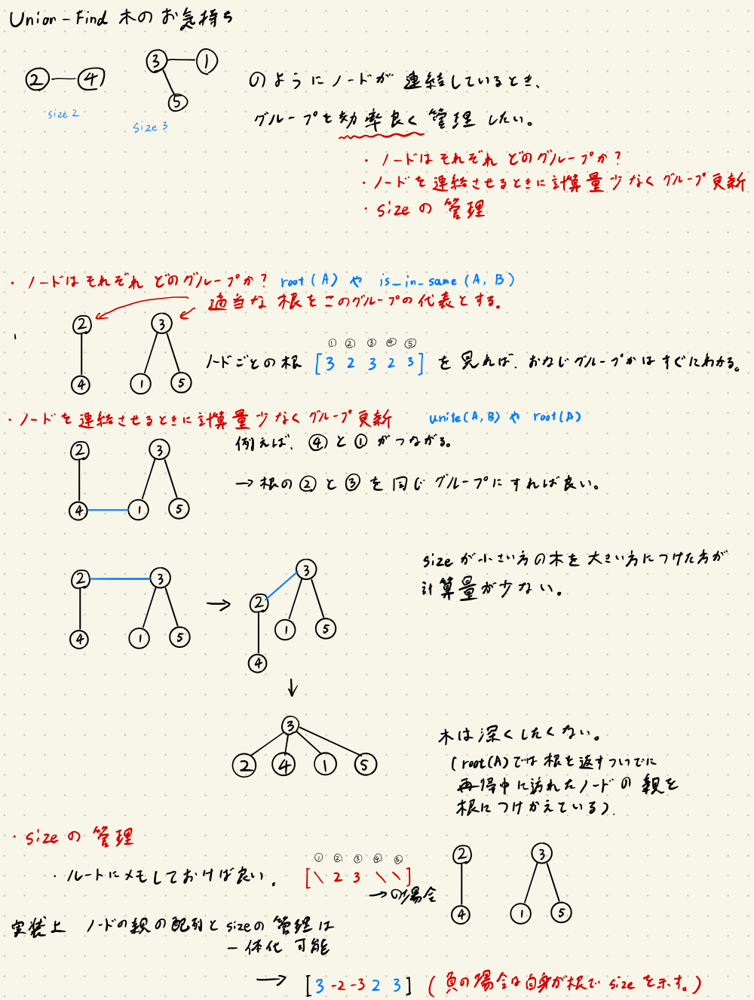
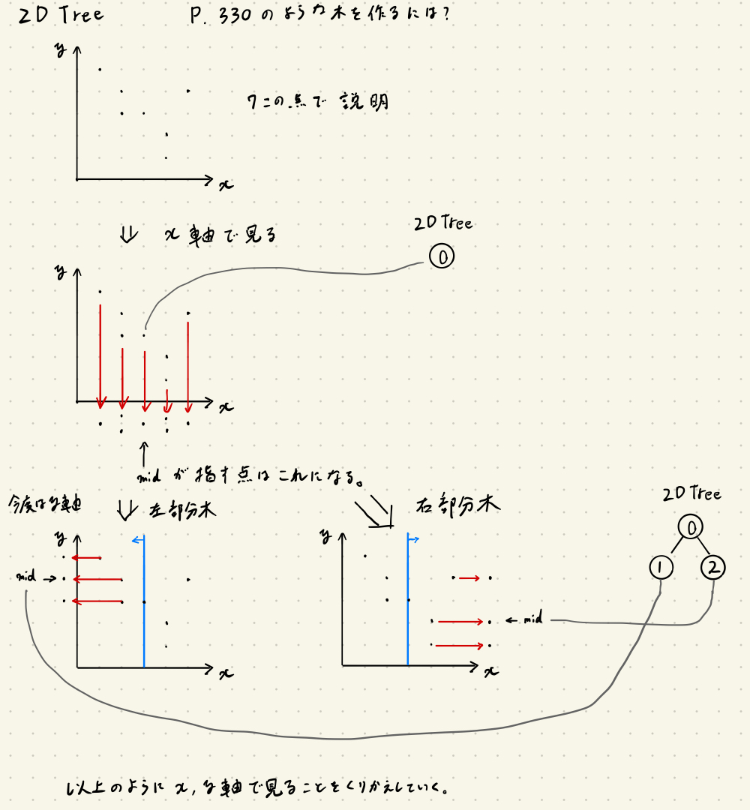
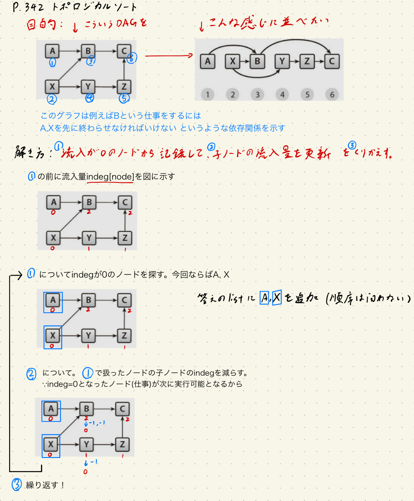
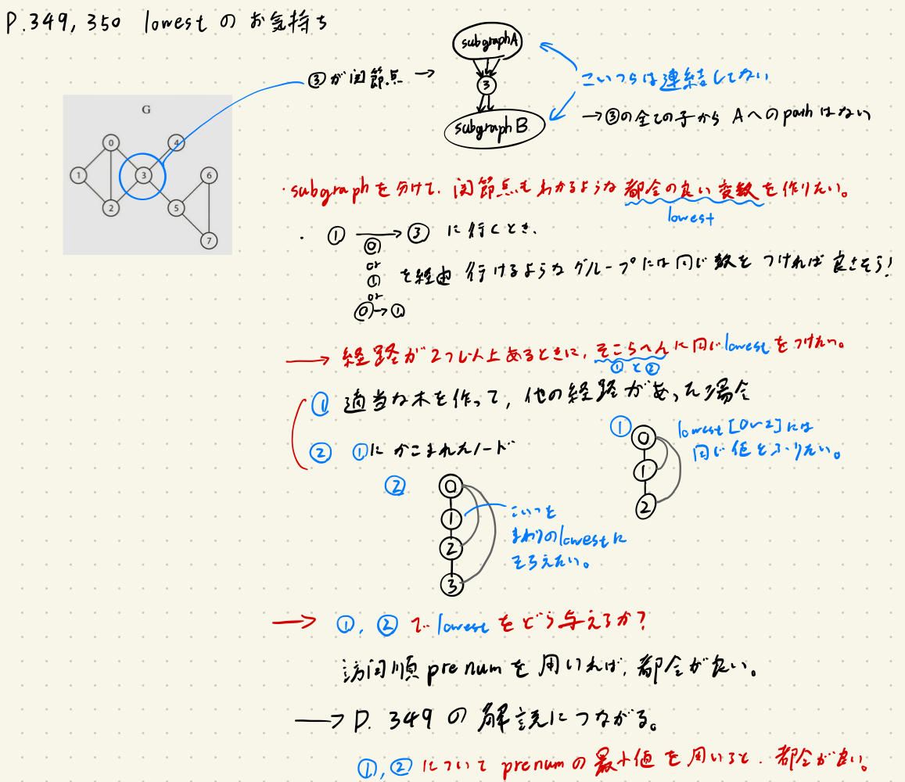
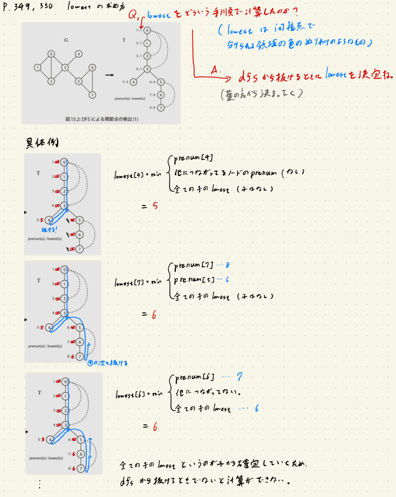
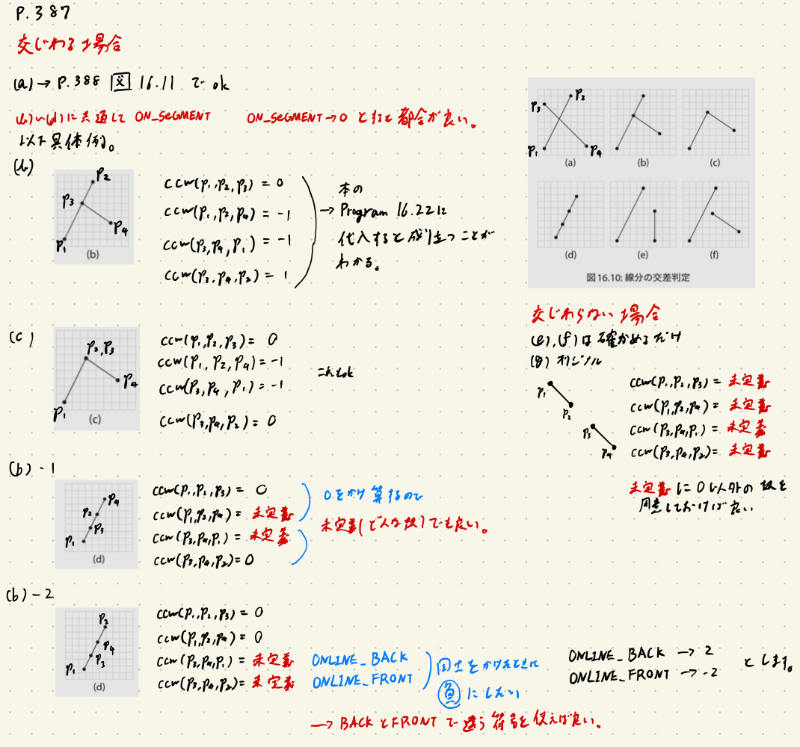
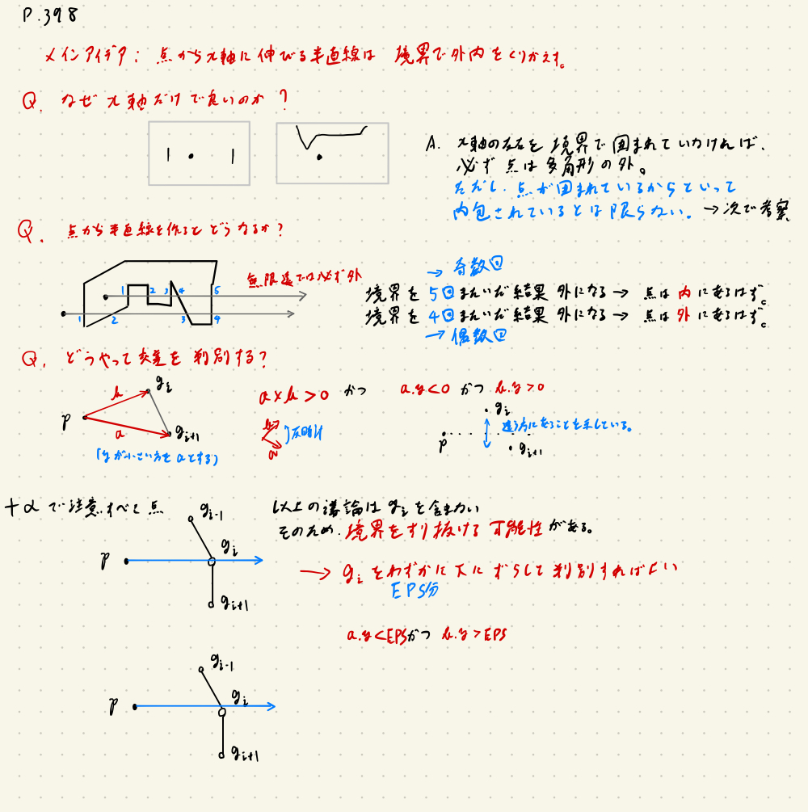
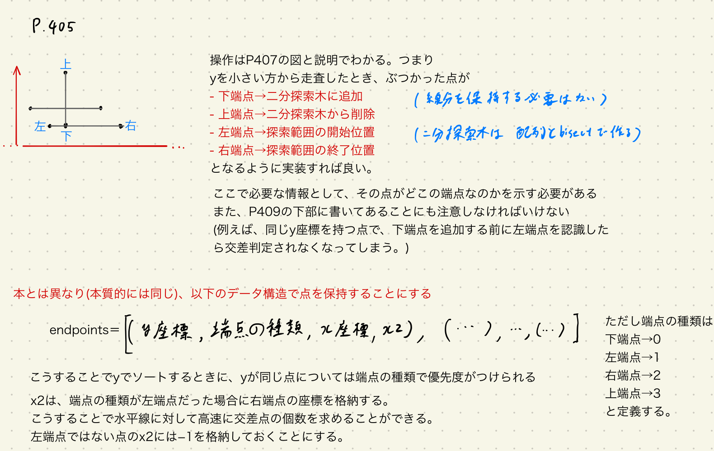

螺旋本をPythonで解く Part3
===

### はじめに
データサイエンティストがAutoML等によって駆逐されても、アルゴリズムをすばやく正確に実装できるエンジニアの需要は消えないと思うので競プロをやる。

[プログラミングコンテスト攻略のためのアルゴリズムとデータ構造](https://www.amazon.co.jp/プログラミングコンテスト攻略のためのアルゴリズムとデータ構造-渡部-有隆-ebook/dp/B00U5MVXZO)の14章高度なデータ構造から16章計算幾何学までの問題に対して、解答例と本では分かりづらいと感じた部分を解説していく。

この本の問題は[AOJ](https://onlinejudge.u-aizu.ac.jp/courses/list)の問題と対応しており、ジャッジできる。

ここではあくまで本の**補足**説明とpythonの解答例をするだけなので、ぜひ本を購入して参考にしてほしい。

この記事は前回の記事の続きである。

https://aotamasaki.hatenablog.com/entry/2019/10/11/%E8%9E%BA%E6%97%8B%E6%9C%AC%E3%82%92Python%E3%81%A7%E8%A7%A3%E3%81%8F_Part1

https://aotamasaki.hatenablog.com/entry/2019/11/03/%E8%9E%BA%E6%97%8B%E6%9C%AC%E3%82%92Python%E3%81%A7%E8%A7%A3%E3%81%8F_Part2

(螺旋本効果が現れたのか直近4回のコンテストでは毎回レートが少し伸びて、1ヶ月で90上がりました。このペースならあと2ヶ月もかからず水色...?)


### 14章 高度なデータ構造
タイトルとは名ばかりで、やることはUnion-Findと領域探索だけである。個人的にはセグメントツリーの解説がほしかった...(強い人達がよく口にするので)
#### P318 DSL_1_A: Disjoint Set: Union Find Tree
このアルゴリズムに関してはAtCoderの高橋社長による解説がわかりやすいと感じている。

https://youtu.be/zV3Ul2pA2Fw?t=1425

そのためここでの実装も、これに従っている。
仕組みやメソッドで何をやっているかは図に示したので、参照されたい。



```python
# https://onlinejudge.u-aizu.ac.jp/courses/library/3/DSL/all/DSL_1_A
# 本とはやや違う実装だがこちらのほうがスマート(だとおもってる)

class UnionFind:
    def __init__(self, N):
        self.N = N  # ノード数
        # 親ノードをしめす。負は自身が親ということ。
        self.parent = [-1] * N  # idxが各ノードに対応。
        # 本で言うrankはこの実装では扱っていない。

    def root(self, A):  # 本で言うfindset
        # print(A)
        # ノード番号を受け取って一番上の親ノードの番号を帰す
        if (self.parent[A] < 0):
            return A
        self.parent[A] = self.root(self.parent[A])  # 経由したノードすべての親を上書き
        return self.parent[A]

    def size(self, A):  # 本で言うrankではない
        # ノード番号を受け取って、そのノードが含まれている集合のサイズを返す。
        return -self.parent[self.root(A)]

    def unite(self, A, B):
        # ノード番号を2つ受け取って、そのノード同士をつなげる処理を行う。
        # 引数のノードを直接つなぐ代わりに、親同士を連結する処理にする。
        A = self.root(A)
        B = self.root(B)

        # すでにくっついている場合
        if (A == B):
            return False

        # 大きい方に小さい方をくっつけたほうが処理が軽いので大小比較
        if (self.size(A) < self.size(B)):
            A, B = B, A

        # くっつける
        self.parent[A] += self.parent[B]  # sizeの更新
        self.parent[B] = A  # self.rootが呼び出されればBにくっついてるノードもすべて親がAだと上書きされる

        return True

    def is_in_same(self, A, B):
        return self.root(A) == self.root(B)


N, Q = list(map(int, input().split()))
ds = UnionFind(N)
for q in range(Q):
    com, x, y = list(map(int, input().split()))
    if com == 0:
        # unite
        ds.unite(x, y)
    elif com == 1:
        # same?
        print(1 if ds.is_in_same(x, y) else 0)
```

#### P324 DSL_2_C: Range Search (kD Tree)
思考難易度と実装難易度がどちらともマックスの難しい問題。
しかし、P326の1D Treeを実装し、図で書いて考えを整理すると意外とわかりやすい。

なのでまずP326の1D Treeのpython版をおいておく

```python
class OneDTree:
    def __init__(self, P):
        N = len(P)
        self.P = sorted(P)
        # 配列[ノード]でそのノードの内容を返す。
        self.location = [None] * N  # 整列した配列Pにおける位置
        self.left = [None] * N  # そのノードの左子
        self.right = [None] * N  # そのノードの右子
        self.np = 0  # ノード番号の初期化
        self.make1DTree(0, N)  # 1dtreeを作る

    def make1DTree(self, l, r):
        # 再帰関数なので終了条件
        if not (l < r):
            # 左<右の関係性が崩れたら終わり
            return None
        # P = sorted(self.P)  # ぶっちゃけ意味ないの省略

        mid = (l + r) // 2  # Pのidx 真ん中が二分探索木(もしくはその部分木)で根になる。

        t = self.np  # 二分木におけるノード番号を割り当てる
        self.np += 1  # ノード番号の更新

        self.location[t] = mid
        self.left[t] = self.make1DTree(l, mid)
        # 左部分木の中央値は親の左子となる。(右部分木のrootになるのは確定なので)
        self.right[t] = self.make1DTree(mid + 1, r)

        return t  # 現在のノードを返す

    def find(self, sx, tx):
        '''
        sx ... 範囲の最初
        tx ... 範囲の終わり 閉区間に注意
        '''
        ret = []  # 範囲に含まれる点を格納しておく

        def dfs(v, sx, tx):
            x = self.P[self.location[v]]
            if sx <= x <= tx:  # もし今のノードの指す値が範囲に入っていればok
                ret.append(x)

            # 続いて右と左の子が領域に含まれているかも探索する。
            if self.left[v] is not None and sx <= x:
                dfs(self.left[v], sx, tx)  # 左部分木について再帰的に探索
            if self.right[v] is not None and x <= tx:
                dfs(self.right[v], sx, tx)
        dfs(0, sx, tx)  # rootのノード番号が0なのは確定
        return ret


from random import shuffle
# test
P = [0, 2, 4, 5, 9, 12, 13, 15, 18, 20]
shuffle(P)
print(P)

kdtree = OneDTree(P)
print(kdtree.find(6, 15))
```

2D TreeのアイデアはP330で図示されているが、点の数が多い上に操作が可視化されていない。そのため単純化した場合での操作の説明を以下に図示した。



これを実装すると以下のようになる。
しかし、pythonが遅いためかTLEしてしまう。入力を高速化もしてみたが2DTreeではACできなさそうだ。(pythonでACしてる人の解答でも2DTreeぽい実装ではなかった)

```python
# https://onlinejudge.u-aizu.ac.jp/courses/library/3/DSL/2/DSL_2_C
# むずい、普通にむずい
# また定数倍が遅いせいかpythonだとTLEが取れない
# ACしている人のコードを見ると二分探索をもっとうまく使っているようだった(でもこれも二分探索木のはずでは？)

from operator import itemgetter
from sys import stdin


class TwoDTree:
    def __init__(self, P):
        '''
        Pの形式として[(pointID, x, y),...,()]となっていることを想定する
        '''
        N = len(P)
        self.P = P.copy()  # Pをコピーしておく
        # 配列[ノード]でそのノードの内容を返す。
        self.location = [None] * N  # 整列した配列Pにおける位置
        self.left = [None] * N  # そのノードの左子
        self.right = [None] * N  # そのノードの右子
        self.np = 0  # ノード番号の初期化
        self.make2DTree(0, N, 0)  # 1dtreeを作る

    def make2DTree(self, l, r, depth):
        # 再帰関数なので終了条件
        if not (l < r):
            # 左<右の関係性が崩れたら終わり
            return None

        mid = (l + r) // 2  # Pのidx 真ん中が二分探索木(もしくはその部分木)で根になる。
        t = self.np  # 二分木におけるノード番号を割り当てる
        self.np += 1  # ノード番号の更新

        # ここからx,y軸の分岐
        if depth % 2 == 0:
            # はじめの要素がx軸だと仮定して
            self.P[l:r] = sorted(self.P[l:r], key=itemgetter(1))
        else:
            self.P[l:r] = sorted(
                self.P[l:r], key=itemgetter(2))  # depthが奇数のときはy軸

        self.location[t] = mid
        self.left[t] = self.make2DTree(l, mid, depth + 1)
        self.right[t] = self.make2DTree(mid + 1, r, depth + 1)
        return t  # 現在のノードを返す

    def find(self, sx, tx, sy, ty):
        '''
        sx ... xの範囲の最初
        tx ... xの範囲の終わり 閉区間に注意
        sy ... yの範囲の最初
        ty ... yの範囲の終わり 閉区間に注意
        '''
        ret = []  # 範囲に含まれる点を格納しておく

        def dfs(v, sx, tx, sy, ty, depth):
            id, x, y = self.P[self.location[v]]

            if (sx <= x <= tx) and (sy <= y <= ty):  # もし今のノードの指す値が範囲に入っていればok
                ret.append((id, x, y))

            # 続いて右と左の子が領域に含まれているかも探索する。
            # ここでdepthが偶数奇数で場合分けをする
            if depth % 2 == 0:
                if self.left[v] is not None and sx <= x:
                    dfs(self.left[v], sx, tx, sy, ty, depth + 1)
                if self.right[v] is not None and x <= tx:
                    dfs(self.right[v], sx, tx, sy, ty, depth + 1)
            else:
                if self.left[v] is not None and sy <= y:
                    dfs(self.left[v], sx, tx, sy, ty, depth + 1)
                if self.right[v] is not None and y <= ty:
                    dfs(self.right[v], sx, tx, sy, ty, depth + 1)

        dfs(0, sx, tx, sy, ty, 0)
        return ret


# load data
N = int(input())
Points = []
lines = stdin.readlines()  # ctrlDまでの文字列を読み込む #入力高速化のための魔改造
for id in range(N):
    x, y = list(map(int, lines[id].split()))
    Points.append((id, x, y))


kdtree = TwoDTree(Points)

# Q = int(input())
Q = int(lines[N])
# print(Q)
for q in range(Q):
    sx, tx, sy, ty = list(map(int, lines[N + q + 1].split()))
    # ID_ls = list(map(itemgetter(0), kdtree.find(sx, tx, sy, ty)))
    ID_ls = [x[0] for x
             in kdtree.find(sx, tx, sy, ty)]  # itemgetterよりも内包表記のほうが早い
    if len(ID_ls) == 0:
        print()
    else:
        print(*sorted(ID_ls), sep='\n')
        print()
```

### 15章 高度なグラフアルゴリズム
いよいよ競プロに役立ちそうなアルゴリズムがどんどん出てきた。

#### P336 GRL_1_C: All Pairs Shortest Path
全点対最短経路問題はダイクストラ法などを全点に適応すれば溶けるが、この問題では負の重みが許されているためダイクストラ法は使えない。

そこでワーシャルフロイドなる方法を用いるのだが、螺旋本ではこの説明がとっっっても分かりづらい。

自分はまずこの記事をざっくり読んで、操作のイメージを掴んだ。
https://qiita.com/okaryo/items/8e6cd73f8a676b7a5d75 

その後、このサイトでワーシャルフロイドによって最適であることが保証されることに納得した覚えがある。
https://triple-four.hatenablog.com/entry/2019/04/02/143939 

とくに2つ目の記事はお金が取れるレベルで丁寧に説明してくれているので是非一度目を通しておきたい。

```python
# https://onlinejudge.u-aizu.ac.jp/courses/library/5/GRL/1/GRL_1_C
# ここでは隣接行列を更新して、i→jに行くときの最短経路としたい(なのでshapeは隣接行列と同じ)
# 操作を理解した後に、螺旋本の証明を読むとわかった気になれる。

from copy import deepcopy

INF = 2**36 - 1

# 実装自体は簡単
def warshall_floyd(adj_mat: list):
    '''
    隣接行列を受け取る(隣接していないノード間のコストはINFを前提)
    全点間の最短距離を示す行列を返す。
    '''
    n = len(adj_mat)
    ret = deepcopy(adj_mat)
    for k in range(n):  # kは経由を示す。
        for i in range(n):  # iは出発を示す
            if ret[i][k] == INF:
                # ノード同士がつながってなければ更新しない
                continue
            for j in range(n):  # jは終点を示す。
                if ret[k][j] == INF:
                    continue
                ret[i][j] = min(ret[i][j], ret[i][k] + ret[k][j])
                # 直接行ったほうが近いか、kを経由したほうが近いか
    return ret  # 閉路が存在するかどうかは対角成分を見れば良い(自己に戻ってくるのに距離が負ならば負の閉路があるということ)


n_V, n_E = list(map(int, input().split()))
adj_mat = [[INF] * n_V for _ in range(n_V)]  # INFで初期化
# 対角成分だけは0で初期化
for ij in range(n_V):
    adj_mat[ij][ij] = 0
for _ in range(n_E):
    s, t, d = list(map(int, input().split()))
    adj_mat[s][t] = d

ans = warshall_floyd(adj_mat)

# 負のループの調査
for ij in range(n_V):
    if ans[ij][ij] < 0:
        print('NEGATIVE CYCLE')
        exit()

for i in range(n_V):
    for j in range(n_V):
        print(ans[i][j] if ans[i][j] != INF else "INF", end='')
        if j == n_V - 1:
            print()
        else:
            print(' ', end='')
```

当然ながらAtCoderではscipyが使えるため、実装をサボることができる。

```python
# https://onlinejudge.u-aizu.ac.jp/courses/library/5/GRL/1/GRL_1_C
# AtCoderではscipyが使える
# https://note.nkmk.me/python-scipy-shortest-path/ ワーシャルフロイド法: floyd_warshall()の章
# あとここで言われているように0の重みを自動で消してしまうという発狂案件が存在します。 https://juppy.hatenablog.com/entry/2019/06/04/scipyのFloyd-WarshallとDijkstraのすすめ_Python_競技プログラミング_Atcoder_1#floyd_warshall


from scipy.sparse import csr_matrix, lil_matrix
from scipy.sparse.csgraph import floyd_warshall, csgraph_from_dense, NegativeCycleError
from numpy import isinf

n_V, n_E = list(map(int, input().split()))
adj_mat = lil_matrix((n_V, n_V), dtype='int')  # INFで初期化
# 対角成分だけは0で初期化
for ij in range(n_V):
    adj_mat[ij, ij] = 0
for _ in range(n_E):
    s, t, d = list(map(int, input().split()))
    adj_mat[s, t] = d
try:
    ans = floyd_warshall(adj_mat)
except NegativeCycleError:
    # 負のループ
    print("NEGATIVE CYCLE")
    exit()

for i in range(n_V):
    for j in range(n_V):
        print(int(ans[i, j]) if not isinf(ans[i, j]) else "INF", end='')
        if j == n_V - 1:
            print()
        else:
            print(' ', end='')
```

#### P342 GRL_4_B: Topological Sort
仕事の手順を決めるときに使えるアルゴリズム。実務で実装する機会もありそう(?)。

有向グラフに対して、流入量の更新を行っていくことで、流入量が0になったノードの仕事からできるというアイデア。
図に示すと以下のようになる。



```python
# https://onlinejudge.u-aizu.ac.jp/courses/library/5/GRL/all/GRL_4_B
# 仕組みは単純ゆえに、本では解説がバッサリ省略されている。操作の可視化を行うと図のようになる。
# ここでは隣接リストを用いて実装する。

from collections import deque
# 隣接リストはdefaultdictで管理すると楽。
from collections import defaultdict
adj = defaultdict(lambda: [])

# input data
n_V, n_E = list(map(int, input().split()))
indeg = [0] * n_V  # 流入量管理
for _ in range(n_E):
    s, t = list(map(int, input().split()))
    indeg[t] += 1  # 流入量更新
    adj[s].append(t)


# Topological Sort by BFS
def topological_sort(adj, indeg):
    '''
    adj ... default dictで定義された隣接リスト
    indeg ... 各ノードについての流入量のリスト(inputのときについでにやったほうが計算量若干少なく済むでしょ？本質じゃないけど)
    '''
    is_visited = [False] * len(indeg)  # 訪問間利用
    ret = []  # グラフをソートしたあとに返す答え

    def bfs(s):  # bfsを定義する
        # 与えた始点からbfsしていく関数。
        que = deque([s])
        is_visited[s] = True
        while que:
            u = que.popleft()  # uは流入量0のノード
            ret.append(u)  # なので答えに加えていく

            for v in adj[u]:  # uに隣接するノードvについて深さ優先探索
                indeg[v] -= 1  # 隣接するノードは流入量を減らす
                if (indeg[v] == 0) and (not is_visited[v]):  # 未訪問かつ流入0のノードだったら
                    que.append(v)  # 次の訪問候補に追加
                    is_visited[v] = True

    # 初期bfsを駆動させるための初期(?)ループ
    for u in range(n_V):  # すべてのノードについて
        if (indeg[u] == 0) and (not is_visited[u]):
            # 流入0かつ未訪問
            bfs(u)

    return ret


ans = topological_sort(adj, indeg)
print(*ans, sep='\n')
```

#### P348 GRL_3_A: Articulation Point
個人的には理解に苦労した。思考★★★★ぐらいだと思うんだけど。

まず、個人的な解説を示す前に、一度P349-450に書かれている操作を暗記してほうが良いだろう。
操作を覚えたところで、疑問となるのはlowestはナニモンで、なんでこの操作で関節点が求まるのか、ということだ。

自分なりのお気持ちを図示した。(自分の中の整理も兼ねて)



次に、dfsでlowestを作って行くのだが、手順を書き出すとどうなるのかというイメージを示す。dfsを用いて木の葉の方から確定させていくというのがポイントである。



```python
# https://onlinejudge.u-aizu.ac.jp/courses/library/5/GRL/all/GRL_3_A
# 関節点を求めるには主に2パートに分かれる
# 1. dfsによる各ノードのprenum(深さ優先探索でたどる順番), parent(深さ優先探索でたどる木構造), lowest(こいつはわかりにくいので求め方を図解した)
# 2. 以上で求めた情報に基づいて、そのノードが関節点か決定する。

# 1について`dfs()`で求めて
# 2について`art_points()`で求める
INF = 10**6 + 1
import sys
sys.setrecursionlimit(2**16 - 1)
from collections import defaultdict
G = defaultdict(lambda: [])
# input data
n_V, n_E = list(map(int, input().split()))

for _ in range(n_E):
    s, t = list(map(int, input().split()))
    G[s].append(t)
    G[t].append(s)


def get_art_point(G, n_V):
    # graph Gがdefaultdictで定義された隣接リストであること前提とする。
    # n_Vは頂点数
    prenum = [None] * n_V
    parent = [None] * n_V
    lowest = [INF] * n_V
    timer = 0  # dfsに入った順番を記録(prenum用)
    is_visited = [False] * n_V  # 木を作るために循環してはいけない
    root = 0

    # 1のフェーズ、prenumとparent,lowestについて確定していく。
    def dfs(cur, prev):  # 次に訪問するノードが以前のノードprevではないことを識別する必要があるので引数がこうなっている
        # 関数に入るときにprenumとparentを確定してく
        nonlocal timer  # nonlocalは指定した変数が見つかるまでスコープを広げて探す
        prenum[cur] = lowest[cur] = timer  # 教科書の説明とは違ってprenumは0スタートだが本質的な違いはない
        timer += 1
        parent[cur] = prev
        is_visited[cur] = True

        # 次のノードに訪問していく
        for nx in G[cur]:  # nxは次に探索すべきノード
            if (not is_visited[nx]):
                dfs(nx, cur)
                lowest[cur] = min(lowest[cur], lowest[nx]
                                  )  # 子のlowestの最小値が取得できる
            elif nx != prev:  # 探索済みにつながる木以外の経路 いわゆるback-edge
                # back-edge先のノードの方とどっちが小さいか比較
                lowest[cur] = min(lowest[cur], prenum[nx])

    # 2のフェーズ。次にprenumとlowestに注目して間接点を決定してく
    def art_points(root):
        # 間接点の重複を許したくないので集合型で管理
        ret = set()
        n_p_is_root = root  # 螺旋本でいうところのnp。rootから2つ以上の子が存在するならば、rootは間接点
        # 0を根にしているのでその親はNoneであり、これを考慮する必要はない
        for u, p in enumerate(parent):
            if p is None:
                # rootの親はないので
                continue
            elif p == root:
                # uはあるノード。pはその親.
                n_p_is_root += 1

            if prenum[p] <= lowest[u]:
                ret.add(p)
        if n_p_is_root == 1:
            # rootが間接点でないならroot(0)を消す
            ret.remove(0)
        return ret

    # ここから具体的な処理
    dfs(root, None)
    return art_points(root)


ans = list(get_art_point(G, n_V))
ans.sort()
if ans:
    print(*ans, sep='\n')
else:
    pass
```

関節点を求める関数はscipyにはないんですか？これは本番でできる自信がない。

#### P353 GRL_5_A: Diameter of a Tree
感覚的にしっくり来る操作なので、証明は理解してない。
操作もイメージしやすいので、解説は省略する

```python
# https://onlinejudge.u-aizu.ac.jp/courses/library/5/GRL/all/GRL_5_A
# 全点間の距離を求めているとO(n**2)でパソコンが爆発する。
# P354はO(n)のシンプルなアルゴリズム。
# 厳密な証明は知らないけど、直感的に良さそう

from collections import deque, defaultdict
Tree = defaultdict(lambda: [])

# input data
N = int(input())
for _ in range(N - 1):
    s, t, w = list(map(int, input().split()))
    Tree[s].append((t, w))
    Tree[t].append((s, w))


def bfs(Tree, n_V, s):
    '''
    指定した点sからの単一始点で各点までの距離を返す。
    n_Vは頂点の数
    Treeはdefault dictで、valueには(隣接ノード,そこまでのコスト)がリスト形式で格納されているとする。
    '''
    INF = 10**9
    Dists = [INF] * n_V  # 距離の初期化 #こいつを更新して返すことにする
    is_visited = [False] * n_V
    is_visited[s] = True
    que = deque([(s, 0)])  # (ノード番号,そこまでたどり着くためのコスト)
    while que:
        cur, cost = que.popleft()
        Dists[cur] = cost
        for nx_node, nx_cost in Tree[cur]:
            if is_visited[nx_node]:
                continue
            que.append((nx_node, nx_cost + cost))
            is_visited[nx_node] = True

    return Dists


# 任意の点から一番遠い点を求めて、そこからさらに一番遠い点がほしい
Dists = bfs(Tree, N, 0)
next_node = Dists.index(max(Dists))  # numpyでいうargmaxしてる
Dists = bfs(Tree, N, next_node)

print(max(Dists))
```


#### P358 GRL_2_A: Minimum Spanning Tree
最小全域木は実はPart2でも扱ったテーマ。P296ではプリムのアルゴリズムで解いていた。
ここでは、クラスカルのアルゴリズムで解く。実は前述したUnion-Findを使うと非常に楽に実装できるので、ここに配置されたのだろう。

クラスカルのアルゴリズムは貪欲法とも解釈できる。つまり「辺の重みが小さい方から解候補に追加していく」というアイデア。しかし、木でないと行けないので、閉路ができる場合には追加しないという選択肢が必要である。
解の候補に追加するかしないかのところにUnion-Findを用いると高速にMSTを求めることができる。

詳細は螺旋本がわかりやすいので参照されたい。

```python
# https://onlinejudge.u-aizu.ac.jp/courses/library/5/GRL/all/GRL_2_A
# 最小全域木、またお前か(プリムのアルゴリズムでできるやつ)
# ここではクラスカルのアルゴリズムを用いて解く。
# アイデアとしては辺の重みの小さい順にgreedyにノード同士をつないでいけば、必ず最小全域木になるでしょうというもの
# ただし木とならないような辺は省かなければ行けない。
# 辺を追加する際に木であることを崩さないように効率よく判定するのにunion-find木を使っている


class UnionFind:
    def __init__(self, N):
        self.N = N  # ノード数
        # 親ノードをしめす。負は自身が親ということ。
        self.parent = [-1] * N  # idxが各ノードに対応。
        # 本で言うrankはこの実装では扱っていない。

    def root(self, A):  # 本で言うfindset
        # print(A)
        # ノード番号を受け取って一番上の親ノードの番号を帰す
        if (self.parent[A] < 0):
            return A
        self.parent[A] = self.root(self.parent[A])  # 経由したノードすべての親を上書き
        return self.parent[A]

    def size(self, A):
        # ノード番号を受け取って、そのノードが含まれている集合のサイズを返す。
        return -self.parent[self.root(A)]

    def unite(self, A, B):
        # ノード番号を2つ受け取って、そのノード同士をつなげる処理を行う。
        # 引数のノードを直接つなぐ代わりに、親同士を連結する処理にする。
        A = self.root(A)
        B = self.root(B)

        # すでにくっついている場合
        if (A == B):
            return False

        # 大きい方に小さい方をくっつけたほうが処理が軽いので大小比較
        if (self.size(A) < self.size(B)):
            A, B = B, A

        # くっつける
        self.parent[A] += self.parent[B]  # sizeの更新
        self.parent[B] = A  # self.rootが呼び出されればBにくっついてるノードもすべて親がAだと上書きされる

        return True

    def is_in_same(self, A, B):
        return self.root(A) == self.root(B)


Edges = []
# load data
n_V, n_E = list(map(int, input().split()))
for _ in range(n_E):
    s, t, w = list(map(int, input().split()))
    Edges.append((w, s, t))


def kruskal(N, Edges):
    '''
    Nは頂点数、Ndgesは各要素が(w,s,t)を前提としたlist
    '''
    edges = sorted(Edges)
    ret = 0
    union = UnionFind(N)
    n_edges = 0
    for w, s, t in edges:
        if n_edges == N - 1:
            # 全域木になったら早期終了可
            break
        if union.is_in_same(s, t):
            continue
        union.unite(s, t)
        ret += w
        n_edges += 1
    return ret


print(kruskal(n_V, Edges))
```

いつものAtCoder版解答

```python
# https://onlinejudge.u-aizu.ac.jp/courses/library/5/GRL/all/GRL_2_A
# もちろんこいつもscipyで実装可能https://docs.scipy.org/doc/scipy/reference/generated/scipy.sparse.csgraph.minimum_spanning_tree.html

from scipy.sparse import lil_matrix
from scipy.sparse.csgraph import minimum_spanning_tree  # この関数の引数は隣接行列

# load data
n_V, n_E = list(map(int, input().split()))
adjmat = lil_matrix((n_V, n_V))
for _ in range(n_E):
    s, t, w = list(map(int, input().split()))
    adjmat[s, t] = w
    adjmat[t, s] = w

mst = minimum_spanning_tree(adjmat)
print(int(mst.sum()))
```

### 16章 計算幾何学
申し訳ないですが、numpyが使えない環境でベクトルの演算を全部実装するのは流石にめんどくさかったので何問か簡単な問題を省略する。

具体的には以下の問題については取り組まない。

- P374 CGL_2_A: Parallel/Orthigonal
- P376 CGL_1_A: Projection
- P378 CGL_1_B: Reflection
- P380 CGL_2_D: Distance
- P390 CGL_2_C: Cross Point
- P393 CGL_7_D: Cross Points of a Circhle and a Line
- P396 CGL_7_E: Cross Points of Circles (この問題の解き方は高校のときに知りたかった...)

#### P384 CGL_1_C: Counter-Clockwise
点a,b,cがあったときに、ベクトル(b-a)とベクトル(c-a)の位置関係を調べる問題。
この問題の概念は以下の様々なところで出てくるので、わかっておきたい。

```python
# https://onlinejudge.u-aizu.ac.jp/courses/library/4/CGL/all/CGL_1_C
from math import sqrt
class Vector:
    def __init__(self, ls):
        '''
        ls ... list
        '''
        self.vec = ls

    def __len__(self):
        return len(self.vec)

    def __getitem__(self, idx):
        return self.vec[idx]

    def __repr__(self):
        return f'Vector({self.vec})'

    def add(self, vec):
        '''
        vec ... vector class
        '''
        assert len(self) == len(vec)
        ret = [a + b for a, b in zip(self.vec, vec.vec)]
        return Vector(ret)

    def sub(self, vec):
        '''
        vec ... vector class
        '''
        assert len(self) == len(vec)
        ret = [a - b for a, b in zip(self.vec, vec.vec)]
        return Vector(ret)

    def mul(self, vec):
        '''
        vec ... vector class
        '''
        assert len(self) == len(vec)
        ret = [a * b for a, b in zip(self.vec, vec.vec)]
        return Vector(ret)

    def norm(self):
        tmp = sum([x * x for x in self.vec])
        return sqrt(tmp)


def norm(vec):
    '''
    vec ... Vector class
    '''
    return vec.norm()


def cross(a, b):
    '''
    Outer product for 2d
    a,b ... Vector class
    '''
    assert len(a) == 2 and len(b) == 2
    first = a[0] * b[1]
    second = a[1] * b[0]
    return first - second


def dot(a, b):
    return sum(a.mul(b))


EPS = 1e-10


def ccw(p0, p1, p2):
    '''
    問題を解くための関数
    引数はすべてVector
    '''
    a = p1.sub(p0)
    b = p2.sub(p0)
    if cross(a, b) > EPS:
        return 'COUNTER_CLOCKWISE'
    elif cross(a, b) < -EPS:
        return 'CLOCKWISE'
    elif dot(a, b) < 0:  # 同一直線状でa,bが逆を向いている
        return 'ONLINE_BACK'
    elif a.norm() < b.norm():  # a,bが同じ方向を向いて かつ bがaよりも長い
        return 'ONLINE_FRONT'
    else:
        return 'ON_SEGMENT'


# load data
x0, y0, x1, y1 = list(map(int, input().split()))
N = int(input())
p0 = Vector([x0, y0])
p1 = Vector([x1, y1])
for _ in range(N):
    x2, y2 = list(map(int, input().split()))
    p2 = Vector([x2, y2])
    print(ccw(p0, p1, p2))
```

#### P387 CGL_2_B: Intersection
線分の交差判定。P388の下の方の解説がなるほどなぁといった感じ。
成り立つことを確かめるためにさまざまな場合を図示してみた。




```python
# https://onlinejudge.u-aizu.ac.jp/courses/library/4/CGL/all/CGL_2_B
# この問題は後の点の内包に繋がります
from math import sqrt
class Vector:
    def __init__(self, ls):
        '''
        ls ... list
        '''
        self.vec = ls

    def __len__(self):
        return len(self.vec)

    def __getitem__(self, idx):
        return self.vec[idx]

    def __repr__(self):
        return f'Vector({self.vec})'

    def add(self, vec):
        '''
        vec ... vector class
        '''
        assert len(self) == len(vec)
        ret = [a + b for a, b in zip(self.vec, vec.vec)]
        return Vector(ret)

    def sub(self, vec):
        '''
        vec ... vector class
        '''
        assert len(self) == len(vec)
        ret = [a - b for a, b in zip(self.vec, vec.vec)]
        return Vector(ret)

    def mul(self, vec):
        '''
        vec ... vector class
        '''
        assert len(self) == len(vec)
        ret = [a * b for a, b in zip(self.vec, vec.vec)]
        return Vector(ret)

    def norm(self):
        tmp = sum([x * x for x in self.vec])
        return sqrt(tmp)


def norm(vec):
    '''
    vec ... Vector class
    '''
    return vec.norm()


def cross(a, b):
    '''
    Outer product for 2d
    a,b ... Vector class
    '''
    assert len(a) == 2 and len(b) == 2
    first = a[0] * b[1]
    second = a[1] * b[0]
    return first - second


def dot(a, b):
    return sum(a.mul(b))


EPS = 1e-10


def ccw(p0, p1, p2):
    '''
    問題を解くための関数
    引数はすべてVector
    '''
    a = p1.sub(p0)
    b = p2.sub(p0)
    if cross(a, b) > EPS:
        # 'COUNTER_CLOCKWISE'
        return 1
    elif cross(a, b) < -EPS:
        # 'CLOCKWISE'
        return -1
    elif dot(a, b) < 0:  # 同一直線状でa,bが逆を向いている
        # 'ONLINE_BACK'
        return 2
    elif a.norm() < b.norm():  # a,bが同じ方向を向いて かつ bがaよりも長い
        # 'ONLINE_FRONT'
        return -2
    else:
        # 'ON_SEGMENT'
        return 0


def is_intersect(args: list):
    x0, y0, x1, y1, x2, y2, x3, y3 = args
    p0 = Vector([x0, y0])
    p1 = Vector([x1, y1])
    p2 = Vector([x2, y2])
    p3 = Vector([x3, y3])
    return (ccw(p0, p1, p2) * ccw(p0, p1, p3) <= 0) and (ccw(p2, p3, p0) * ccw(p2, p3, p1) <= 0)


# load data
N = int(input())
for _ in range(N):
    if is_intersect(list(map(int, input().split()))):
        print(1)
    else:
        print(0)
```

#### P398 CGL_3_C: Polygon-Point Containment
いよいよ難しくなってきた。
螺旋本では言葉で説明しているが、これを図に書き出すと納得できる。
どうやって点を判定するか図示すると以下のようになる。



```python
# https://onlinejudge.u-aizu.ac.jp/courses/library/4/CGL/all/CGL_3_C
# 本の説明を図に書き出してみるとよく理解できる。
from math import sqrt


class Vector:
    def __init__(self, ls):
        '''
        ls ... list
        '''
        self.vec = ls

    def __len__(self):
        return len(self.vec)

    def __getitem__(self, idx):
        return self.vec[idx]

    def __repr__(self):
        return f'Vector({self.vec})'

    def add(self, vec):
        '''
        vec ... vector class
        '''
        assert len(self) == len(vec)
        ret = [a + b for a, b in zip(self.vec, vec.vec)]
        return Vector(ret)

    def sub(self, vec):
        '''
        vec ... vector class
        '''
        assert len(self) == len(vec)
        ret = [a - b for a, b in zip(self.vec, vec.vec)]
        return Vector(ret)

    def mul(self, vec):
        '''
        vec ... vector class
        '''
        assert len(self) == len(vec)
        ret = [a * b for a, b in zip(self.vec, vec.vec)]
        return Vector(ret)

    def norm(self):
        tmp = sum([x * x for x in self.vec])
        return sqrt(tmp)


def norm(vec):
    '''
    vec ... Vector class
    '''
    return vec.norm()


def cross(a, b):
    '''
    Outer product for 2d
    a,b ... Vector class
    '''
    assert len(a) == 2 and len(b) == 2
    first = a[0] * b[1]
    second = a[1] * b[0]
    return first - second


def dot(a, b):
    return sum(a.mul(b))


EPS = 1e-10


def contains(G, p):
    '''
    Gは多角形を表すリストで、今回ならばvectorが中に並んでいることとする
    pは内容しているか判別したい点で、Vectorで表す

    pが多角形Gの辺上にあれば1
    pが多角形Gに内包されていれば2
    それ以外は0をreturnする
    '''
    is_contain = False  # 内包してるか
    for i in range(len(G)):
        a = G[i].sub(p)
        b = G[(i + 1) % len(G)].sub(p)  # i+1が0に戻るようにこのような形式にしている。
        # もしpがG[i]とG[i+1]の線分上にある場合は即座に1をreturnします
        if abs(cross(a, b)) < EPS and dot(a, b) < EPS:
            # 外積が0→a,bが同一直線上
            # かつ 内積が負→a,bは逆を向いている
            # ならばpは線分上に存在する
            return 1
        # 内包を判定する。前処理として、yの座標によってa,bを入れ替える
        if a[1] > b[1]:  # aの方のy座標を小さくしたい
            a, b = b, a
        if a[1] < EPS and b[1] > EPS and cross(a, b) > EPS:  # 実際に判別する
            is_contain = (not is_contain)
    return (0, 2)[is_contain]  # 書き方キモいけど三項演算子の短い書き方


# load data
N = int(input())
G = []
for _ in range(N):
    g = Vector(list(map(int, input().split())))
    G.append(g)

# answer query
Q = int(input())
for _ in range(Q):
    p = Vector(list(map(int, input().split())))
    print(contains(G, p))
```

#### P401 CGL_4_A: Convex Hull
凸包も作れるなんてすごいなぁと感心する問題。
これは2次元でやっていたが、3次元やそれ以上に拡張するためにはどうしたら良いのかも知りたくなる問題。

アイデア自体は簡単でP403を見ればすぐに理解できるだろう。

```python
# https://onlinejudge.u-aizu.ac.jp/courses/library/4/CGL/all/CGL_4_A

from math import sqrt


class Vector:
    def __init__(self, ls):
        '''
        ls ... list
        '''
        self.vec = ls

    def __len__(self):
        return len(self.vec)

    def __getitem__(self, idx):
        return self.vec[idx]

    def __repr__(self):
        return f'Vector({self.vec})'

    def add(self, vec):
        '''
        vec ... vector class
        '''
        assert len(self) == len(vec)
        ret = [a + b for a, b in zip(self.vec, vec.vec)]
        return Vector(ret)

    def sub(self, vec):
        '''
        vec ... vector class
        '''
        assert len(self) == len(vec)
        ret = [a - b for a, b in zip(self.vec, vec.vec)]
        return Vector(ret)

    def mul(self, vec):
        '''
        vec ... vector class
        '''
        assert len(self) == len(vec)
        ret = [a * b for a, b in zip(self.vec, vec.vec)]
        return Vector(ret)

    def norm(self):
        tmp = sum([x * x for x in self.vec])
        return sqrt(tmp)


def norm(vec):
    '''
    vec ... Vector class
    '''
    return vec.norm()


def cross(a, b):
    '''
    Outer product for 2d
    a,b ... Vector class
    '''
    assert len(a) == 2 and len(b) == 2
    first = a[0] * b[1]
    second = a[1] * b[0]
    return first - second


def dot(a, b):
    return sum(a.mul(b))


EPS = 1e-10


def is_ccw(p0, p1, p2):
    '''
    p1-p0に対してp2-p0が`基本的に`反時計回りならばTrueを返す。
    同一直線上にあってもconvex hulをつくるのには含めて良いので、popする必要はない、したがってFalseをァ得すことにする
    '''
    a = p1.sub(p0)
    b = p2.sub(p0)
    if cross(a, b) > EPS:
        # 'COUNTER_CLOCKWISE'
        return True
    else:
        return False
        # 時計回り、同一直線上の場合,popする必要はないのでFalse
    # # つまり下記のようなこと
    # elif cross(a, b) < -EPS:
    #     # 'CLOCKWISE'
    #     return False
    # else:
    #     return False  # 同一直線上にあるとかそういう場合


# andrewのアルゴリズムで凸包を求める。
# このアルゴリズムの挙動はP403を見るとわかりやすい。
# また凸包でなくなったときに点を取り除いていく作業はP402の下から7行目に示しされている。

def convex_hull(points: list):
    points.sort(key=lambda x: (x[0], x[1]))
    if len(points) < 3:
        # 点が2点しかないならば線しかないが、
        # 今回は制約によりこうなる状況はないので無視する。
        pass

    # 凸包の上部(イメージはP403の図)
    conv_upper = [points[0], points[1]]  # 初期値として最初の二点が与えられます。
    for p in points[2:]:
        # 反時計回りである限りは
        while len(conv_upper) >= 2 and is_ccw(conv_upper[-2], conv_upper[-1], p):
            # conv_upper[-1]は凸包を作る点ではないので捨てる
            conv_upper.pop()
        conv_upper.append(p)

    # 凸包の下部
    points = points[::-1]
    conv_lower = [points[0], points[1]]
    for p in points[2::]:
        # 反時計回りである限りは
        while len(conv_lower) >= 2 and is_ccw(conv_lower[-2], conv_lower[-1], p):
            conv_lower.pop()
        conv_lower.append(p)

    # また、出力は反時計回りにしたい。
    # conv_upperもconv_lowerも時計回りになっているので結合して引っくり返せばよい
    # ただしアルゴリズムの性質上、ソートしたときに端にある点はだぶるので削除する
    ret = conv_upper[1:-1] + conv_lower

    return ret[::-1]


# load data
N = int(input())
points = []
for _ in range(N):
    points.append(Vector(list(map(int, input().split()))))

ans = convex_hull(points)

# print result
# 凸多角形の頂点で最も下にあるものの中でもっとも左にある頂点から順に、反時計回りで出力してくださいというのが一番面倒
print(len(ans))
idx_s = ans.index(min(ans, key=lambda x: (x[1], x[0])))

for i in range(idx_s, idx_s + len(ans)):
    idx = i
    if idx >= len(ans):
        idx -= len(ans)
    p = ans[idx]
    print(p[0], p[1])
```

あと、この問題の可視化用のコードも供養しておく

```python
# https://onlinejudge.u-aizu.ac.jp/courses/library/4/CGL/all/CGL_4_A
# 可視化用

N = int(input())
points = []
for _ in range(N):
    points.append(tuple(map(int, input().split())))


import matplotlib.pyplot as plt
x = [x[0] for x in points]
y = [y[1] for y in points]
plt.scatter(x, y)
plt.show()
```

#### P405 CGL_6_A: Segment Intersections: Manhattan Geometry
水平か垂直しか線分がないときに、高速に線分交差を判定したい。
そのために平面走査という方法を用いる。このアルゴリズムの挙動はP407に示されている。

ただ、実装ではポイントが2つある。

1. 平面走査をするためにデータ構造をどのように持つべきか
2. x座標管理のための二分探索木をどう実装するか

1について、図に示した。


2について。
二分探索木とは言っているが、実装上はソートされたリスト(高速化のためにdequeを用いている)と二分探索のためのbisectで実装できる。
C++のSTLのsetの挙動を真似して`BinarySearchTree`を作り、これを用いた。


```python
# https://onlinejudge.u-aizu.ac.jp/courses/library/4/CGL/all/CGL_6_A


from bisect import bisect_left, bisect_right, insort_left
from collections import deque


class BinarySearchTree:
    def __init__(self, ls: list=[]):
        '''
        C++でいうsetを実装する。二分探索木をガチで実装しようとすると大変なので、ここでは配列二分法を用いる。
        pythonの標準ライブラリがヨイショに抱っこしてくれるおかげで楽に実装できる。
        https://docs.python.org/ja/3/library/bisect.html


        ls ... 渡す初期配列
        '''
        self.bst = deque(sorted(ls))  # insertをO(1)にするためにlistの代わりにdequeを用います

    def __repr__(self):
        return f'BST:{self.bst}'

    def __len__(self):
        return len(self.bst)

    def __getitem__(self, idx):
        return self.bst[idx]

    def size(self):
        return len(self.bst)

    def insert(self, x):
        insort_left(self.bst, x)

    def remove(self, x):
        '''
        xを取り除く。xがself.bstに存在することを保証してください。
        同一のものが存在した場合は左から消していく
        '''
        del self.bst[self.find(x)]

    def bisect_left(self, x):
        '''
        ソートされた順序を保ったまま x を self.bst に挿入できる点を探し当てます。
        lower_bound in C++
        '''
        return bisect_left(self.bst, x)

    def bisect_right(self, x):
        '''
        bisect_left() と似ていますが、 self.bst に含まれる x のうち、どのエントリーよりも後ろ(右)にくるような挿入点を返します。
        upper_bound in C++
        '''
        return bisect_right(self.bst, x)

    def find(self, x):
        '''
        xのidxを探索
        '''
        idx = bisect_left(self.bst, x)
        if idx != len(self.bst) and self.bst[idx] == x:
            return idx
        raise ValueError


    # load data
N = int(input())
lines = []
for _ in range(N):
    x1, y1, x2, y2 = list(map(int, input().split()))
    # 前処理として、x1,y1を必ず下端点or左端点にする
    if y1 == y2:  # 平行線の場合
        if x1 > x2:
            x1, x2 = x2, x1
    else:  # 垂直線の場合
        if y1 > y2:
            y1, y2 = y2, y1
    lines.append((x1, y1, x2, y2))

# P409の下の方に書いてあるが、交差を判定する前に削除してしまったり、追加するまえに判定してしまったりすることを防ぐために
# うまい感じにソートするためにendpointsを導入する
# 各要素は(y,端点の種類,x,左端点のx座標)で定義される)
BOTTOM = 0
LEFT = 1
RIGHT = 2
TOP = 3
# 線分の端点を必ず左下始まりにする
endpoints = []
for x1, y1, x2, y2 in lines:
    if y1 == y2:  # 平行線の場合
        endpoints.append((y1, LEFT, x1, x2))  # 左端点の追加
        endpoints.append((y2, RIGHT, x2, -1))  # 右端点の追加
    else:  # 垂直線の場合
        endpoints.append((y1, BOTTOM, x1, -1))  # 下端点の追加
        endpoints.append((y2, TOP, x2, -1))  # 下端点の追加

# yを下から走査するためにソート
endpoints.sort()

bst = BinarySearchTree()
ans = 0
for y, p_type, x, x_t in endpoints:
    if p_type == RIGHT:
        continue  # 後述しますが、右端点は左端点とセットで処理するためスキップしても問題ないです

    # 以下端点の種類ごとに操作を実装
    if p_type == TOP:
        bst.remove(x)  # 上端点の場合はbstに登録してあるxを削除
    elif p_type == BOTTOM:
        bst.insert(x)  # 下端点の場合はbstにxを登録
    elif p_type == LEFT:
        s = bst.bisect_left(x)  # bstにおいて、水平線の左は何番目に大きいか
        t = bst.bisect_right(x_t)  # bstにおいて、水平線の右は何番目に大きいか(同じ値も含めて)
        ans += t - s

print(ans)
```

### つづく
次で最後。17章(高度な)動的計画法から19章ヒューリスティック探索までやろうと思う。もしかしたらヒューリスティック探索をやらずに18章整数論で終わりにするかもしれないが、いずれにしても次のPart4で螺旋本をPythonで解くことを終わりとする。


