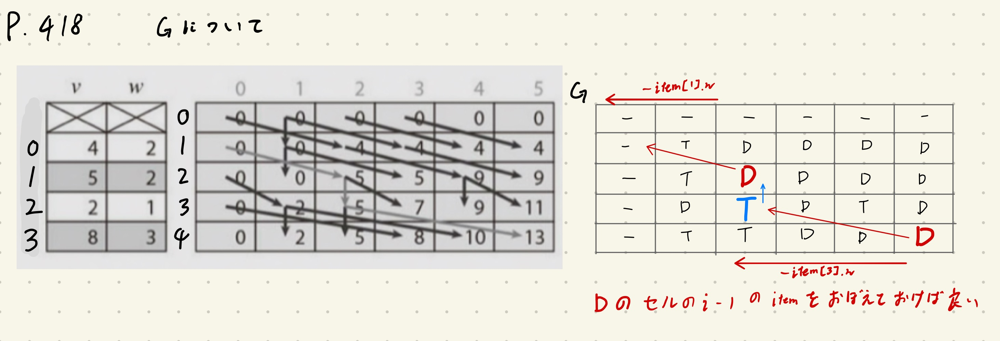
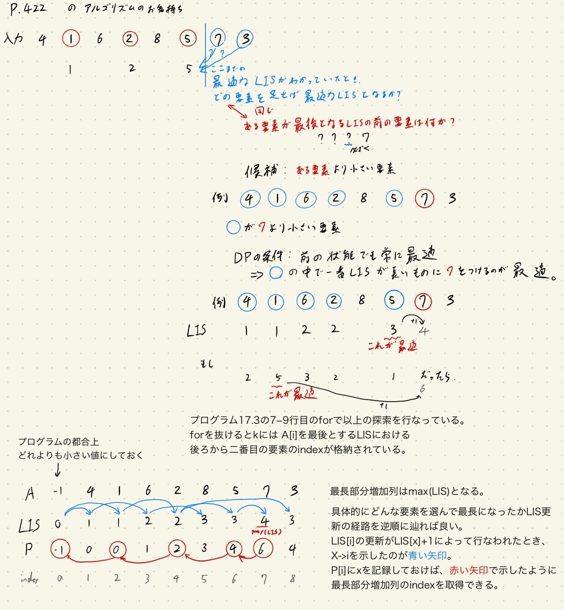
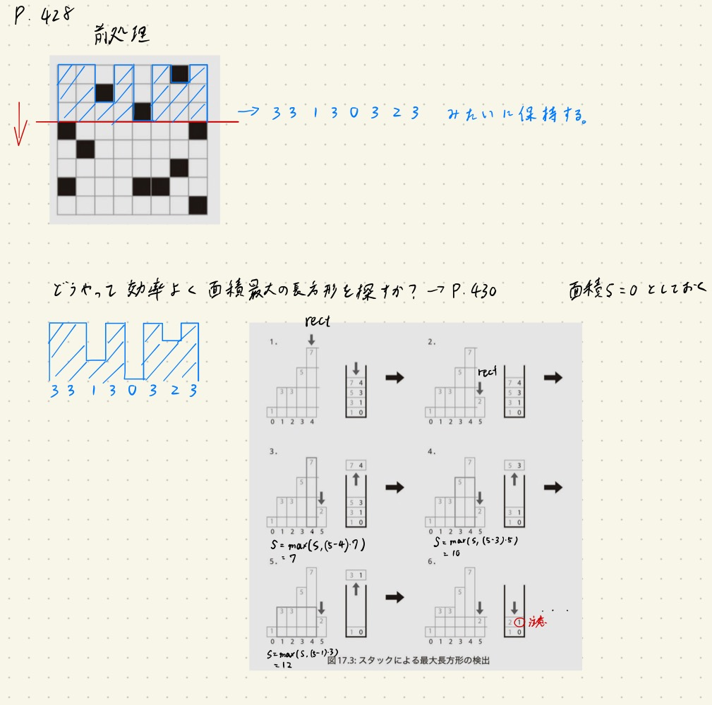

螺旋本をPythonで解く Part4
===

### はじめに
データサイエンティストがAutoML等によって駆逐されても、アルゴリズムをすばやく正確に実装できるエンジニアの需要は消えないと思うので競プロをやる。

[プログラミングコンテスト攻略のためのアルゴリズムとデータ構造](https://www.amazon.co.jp/プログラミングコンテスト攻略のためのアルゴリズムとデータ構造-渡部-有隆-ebook/dp/B00U5MVXZO)の17章動的計画法と18章整数論までの問題に対して、解答例と本では分かりづらいと感じた部分を解説していく。

この本の問題は[AOJ](https://onlinejudge.u-aizu.ac.jp/courses/list)の問題と対応しており、ジャッジできる。

ここではあくまで本の**補足**説明とpythonの解答例をするだけなので、ぜひ本を購入して参考にしてほしい。

この記事は前回の記事の続きである。

https://aotamasaki.hatenablog.com/entry/2019/10/11/%E8%9E%BA%E6%97%8B%E6%9C%AC%E3%82%92Python%E3%81%A7%E8%A7%A3%E3%81%8F_Part1

https://aotamasaki.hatenablog.com/entry/2019/11/03/%E8%9E%BA%E6%97%8B%E6%9C%AC%E3%82%92Python%E3%81%A7%E8%A7%A3%E3%81%8F_Part2

https://aotamasaki.hatenablog.com/entry/2019/12/01/%E8%9E%BA%E6%97%8B%E6%9C%AC%E3%82%92Python%E3%81%A7%E8%A7%A3%E3%81%8F_Part3

なお、螺旋本が解き終わった日に出たコンテストで大爆死してこの本のおかげで上がったレートはすべて溶けました。(D問題から解くのはやめようね！)。

### 17章 動的計画法
もうちょっと問題がほしかったというのが正直なところ。
#### P412 DPL_1_A: Coin Changing Problem
```python
# https://onlinejudge.u-aizu.ac.jp/courses/library/7/DPL/1/DPL_1_A
# 本ではdpテーブルに当たるTを1次元配列にすることによってメモリを削減しているが、ここではしない。

# dpテーブルは初期化と、更新が必要でそれらを意識しながら実装する。
# C ... (m,) i番目のコインの額面
# dp ... (m, n+1) i番目まで(それを含む)のコインをつかってj円払うときのコインの最小枚数

INF = 1e5

# load data
n, m = list(map(int, input().split()))
C = list(map(int, input().split()))

# dpテーブルの作成 minを取りながら更新するときは初期値にINFをぶちこんでおくとよい
dp = [[INF] * (n + 1) for _ in range(m)]  # (m,n+1)のリストの作成

# dpテーブルの初期化
# dp[:][0] は常に0 ∵ 0円はコインを一つも使わなければ良い
# dp[0][:] は即座に決定する。 ∵ dp[0][j]%C[0] == 0ならばdp[0][j]//C[0]の枚数で j 円を達成可能だから
for i in range(m):
    dp[i][0] = 0
for j in range(1 + n):
    dp[0][j] = j  # いまC[0]は必ず1と問題文にあるので、これを用いることにする。

# dpテーブルの更新
# 更新則は T[i][j]=min(T[i-1][j], T[i][j-C[i]]+1)
# 1項目 i-1までのコインでj円が作れるとき、i番目のコインを使わなくてもj円を作る枚数は変わらない。
# 2項目 i番目のコインを使ってちょうどj円を達成するには、j-C[i]円のときに達成可能なコインの枚数に1を足せば良い
# 最小のコインの枚数を知りたいのだから上記の小さい方を採用すれば良い
from itertools import product
# Z字にdpを更新していく.初期値のある列と行は省略
for i, j in product(range(1, m), range(1, n + 1)):
    # 配列外アクセスを防ぐためにminを取る操作を二回に分けている
    dp[i][j] = min(dp[i][j], dp[i - 1][j])
    if 0 <= j - C[i]:
        dp[i][j] = min(dp[i][j], dp[i][j - C[i]] + 1)

print(dp[i][j])
```
#### P416 DPL_1_B: 0-1 Knapsack Problem
ナップサック問題の解説としてけんちょんさんの記事がわかりやすい。

https://qiita.com/drken/items/a5e6fe22863b7992efdb#%E5%95%8F%E9%A1%8C-2%E3%83%8A%E3%83%83%E3%83%97%E3%82%B5%E3%83%83%E3%82%AF%E5%95%8F%E9%A1%8C


```python
# https://onlinejudge.u-aizu.ac.jp/courses/library/7/DPL/1/DPL_1_B
# 王道のナップサック問題

# 実装の都合上本とは少しだけ変えて実装する
# items (N,) ,i番目の品物の価値と重さが記録されているlist item[i]
# dp (N+1,W+1), [0,i)までのitemを考慮して大きさwのナップサックに入れる場合の価値の合計の最大値をdp[i][w]とする二次元list

# load data
N, W = list(map(int, input().split()))
items = []
for _ in range(N):
    items.append(tuple(map(int, input().split())))


# dpテーブルの作成
# 今回は最大化が目的なのですべてのマスを-1で埋めることにする
dp = [[-1] * (W + 1) for _ in range(N + 1)]

# dpテーブルの初期化
# dp[:][0]が0 ∵大きさ0のナップサックには何も入れられない
# dp[0][:]が0 ∵なにもitemを考慮しないときはナップサックに何も入らない。
for i in range(N + 1):
    dp[i][0] = 0
for w in range(W + 1):
    dp[0][w] = 0

# dpテーブルの更新
# i番目のitemが入らない場合→dp[i+1][w]=dp[i][w] ∵iを考慮しないときと価値は変わらない
# i番目のitemが入る場合→dp[i+1][w]=max(dp[i][w], dp[i][w-item[i]の重さ]+item[i]の価値)
# ∵iを入れる前の最善はdp[i][w-item[i]の重さ]にあり、それにitem[i]の価値を足すことで最善になる可能性がある。
# ただしちゃんと、iを入れないときのほうが良いかもしれないことに注意しなければいけない。
from itertools import product
for i, w in product(range(N), range(W + 1)):
    dp[i + 1][w] = dp[i][w]
    value, weight = items[i]
    if w - weight >= 0:
        dp[i + 1][w] = max(dp[i][w], dp[i][w - weight] + value)

print(dp[-1][-1])
```

問題には必要ないが、どんなitemを選択したかも取得することができる。
P418の下の方にGという配列を用いてどんなitemを選んだか記録する方法が書いてあるが、それを図示すると以下のようになる。



```python
# https://onlinejudge.u-aizu.ac.jp/courses/library/7/DPL/1/DPL_1_B
# P418の下の方には、どんなitemを選んだか記録する方法も書いてある。これを実装する。

# load data
N, W = list(map(int, input().split()))
items = []
for _ in range(N):
    items.append(tuple(map(int, input().split())))


# dpテーブルの作成
dp = [[-1] * (W + 1) for _ in range(N + 1)]
G = [[None] * (W + 1) for _ in range(N + 1)]  # 品物の選択状況を記録する
# dpにおいて左上からの経路で更新されていた場合'DIAGONAL'と埋める （新しい品物の追加）
# 上から更新→'top' (i番目の品物はとっていない)
# i,wにDIAGONALと埋めてあったら、[i-1, w-items[i-1]の重さ]のマスを見ていけば良い
DIA = 'DIGONOL'
TOP = 'TOP'

# dpテーブルの初期化
for i in range(N + 1):
    dp[i][0] = 0
for w in range(W + 1):
    dp[0][w] = 0


# dpテーブルの更新
# ついでにGを埋めていく
from itertools import product
for i, w in product(range(N), range(W + 1)):
    dp[i + 1][w] = dp[i][w]
    G[i + 1][w] = TOP
    value, weight = items[i]
    if w - weight >= 0:
        if dp[i][w] < dp[i][w - weight] + value:
            dp[i + 1][w] = dp[i][w - weight] + value
            G[i + 1][w] = DIA

print(dp[-1][-1])

# Gから選択したitemを復元する
w = W
item_in_bag = []
for i in range(N, 0, -1):
    if G[i][w] == DIA:
        w -= items[i - 1][1]
        item_in_bag.append(i - 1)
    elif G[i][w] == TOP:
        pass
    else:
        raise ValueError

print(item_in_bag[::-1])
```

#### P421 DPL_1_D: Longest Increasing Subsequence
P422でいきなりアルゴリズムの説明が始まって混乱すると思いますが、P423が問題を解くために必要な解説なのでそちらだけ見ておけば良いだろう。(ここの構成はめちゃくちゃ混乱した。)

それを実装したのが以下。動的計画法というよりただの貪欲法。
```python
# https://onlinejudge.u-aizu.ac.jp/courses/library/7/DPL/1/DPL_1_D
# P422にはDPによる解法が乗っているが、実際解くにはP423に乗っているようなある種貪欲な方法のほうが計算量が少なく済む。

from bisect import bisect_left, bisect_right, insort_left
from collections import deque


class BinarySearchTree:
    def __init__(self, ls: list = []):
        '''
        C++でいうsetを実装する。二分探索木をガチで実装しようとすると大変なので、ここでは配列二分法を用いる。
        pythonの標準ライブラリがヨイショに抱っこしてくれるおかげで楽に実装できる。
        https://docs.python.org/ja/3/library/bisect.html


        ls ... 渡す初期配列
        '''
        self.bst = deque(sorted(ls))  # insertをO(1)にするためにlistの代わりにdequeを用います

    def __repr__(self):
        return f'BST:{self.bst}'

    def __len__(self):
        return len(self.bst)

    def __getitem__(self, idx):
        return self.bst[idx]

    def size(self):
        return len(self.bst)

    def insert(self, x):
        insort_left(self.bst, x)

    def remove(self, x):
        '''
        xを取り除く。xがself.bstに存在することを保証してください。
        同一のものが存在した場合は左から消していく
        '''
        del self.bst[self.find(x)]

    def bisect_left(self, x):
        '''
        ソートされた順序を保ったまま x を self.bst に挿入できる点を探し当てます。
        lower_bound in C++
        '''
        return bisect_left(self.bst, x)

    def bisect_right(self, x):
        '''
        bisect_left() と似ていますが、 self.bst に含まれる x のうち、どのエントリーよりも後ろ(右)にくるような挿入点を返します。
        upper_bound in C++
        '''
        return bisect_right(self.bst, x)

    def find(self, x):
        '''
        xのidxを探索
        '''
        idx = bisect_left(self.bst, x)
        if idx != len(self.bst) and self.bst[idx] == x:
            return idx
        raise ValueError

    def insert_replace_right(self, x):
        '''
        xを挿入して、xの右の数字(次に大きい)を削除する。idxがはみ出す場合は挿入だけ
        '''
        idx_del = self.bisect_left(x) + 1
        if idx_del - 1 == len(self.bst):  # xがどの要素よりも大きい
            self.insert(x)
        else:
            self.insert(x)
            del self.bst[idx_del]


# load data
N = int(input())
A = []
for _ in range(N):
    A.append(int(input()))


L = BinarySearchTree()
L.insert(A[0])
length = 0
for a in A[1:]:
    L.insert_replace_right(a)
    # # もし最長増加部分列の中身が知りたいなら、新たに長さが更新されたときに最適であることが保証されている
    # if len(L) > length:
    #     length = len(L)
    #     LIS = L.bst

# print(LIS)
print(len(L))
```


一応P422でいきなりアルゴリズムだけ与えられてるやり方のお気持ちを以下に図示して、実装してみた(TLEとなった)。こちらのほうが確かにDPっぽい考え方。



```python
# https://onlinejudge.u-aizu.ac.jp/courses/library/7/DPL/1/DPL_1_D
# P422の解説の方がDPっぽい考え方
# でもこの問題ではTLE

# load data
N = int(input())
A = [-1]
for _ in range(N):
    A.append(int(input()))

 # LIS (N+1,) ... dpテーブルに相当。A[i]を最後に選んだ最長増加部分列の長さ
 # P (N+1) ...LIS更新を逆順にたどるためのもの、P[i]には、その前のindexが格納されている

# DPテーブルの作成 and 初期状態
LIS = [0] * (N + 1)
P = [-1] * (N + 1)

# 最長増加部分列を求める
for i in range(1, N + 1):
    k = 0  # これがA[i]を後ろにつけるときにどのidxの要素よりもつけたらいいのかを格納するためのidx
    for j in range(0, i):
        if A[j] < A[i] and LIS[k] < LIS[j]:
            # 候補となるのはA[i]よりも小さい要素のidxで かつ
            # 一番Pが大きいidx
            k = j
    LIS[i] = LIS[k] + 1  # LISの更新
    P[i] = k  # LISにおけるA[i]の一つ前の要素がA[k]というのを保存しておくためのもの

print(max(LIS))
```


#### P425 DPL_3_A: Largest Square
解くのは単純だけど面白い問題だった。

```python
# https://onlinejudge.u-aizu.ac.jp/courses/library/7/DPL/all/DPL_3_A
# P426の解説がわかりやすい。なるほどなぁという感じ。

from itertools import product, chain

# load data
H, W = list(map(int, input().split()))
C = []
for i in range(H):
    C.append(list(map(int, input().split())))

# dp (H,W) ... dp[i][j]においてはC[i][j]から左上に向かってできる最大の正方形の辺の長さを記録していく

# dpテーブルの作成
dp = [[-1] * W for _ in range(H)]  # (H,W)

# dpテーブルの初期化
# 今回は0行目と0列目が即座にわかる
for j in range(W):
    if C[0][j] == 1:
        dp[0][j] = 0
    else:
        dp[0][j] = 1

for i in range(H):
    if C[i][0] == 1:
        dp[i][0] = 0
    else:
        dp[i][0] = 1


# dpテーブルの更新
for i, j in product(range(1, H), range(1, W)):
    if C[i][j] == 1:
        dp[i][j] = 0
    else:
        dp[i][j] = min(dp[i - 1][j - 1], dp[i - 1][j], dp[i][j - 1]) + 1

side_length = max(chain.from_iterable(dp))  # flatten
print(side_length**2)
```

#### P428 DPL_3_B: Largest Rectangle
この問題も解説がわかりやすい傾向だったが、前処理のデータ構造とP430における変数の変化がわかりにくかったので一応図示。



```python
# https://onlinejudge.u-aizu.ac.jp/courses/library/7/DPL/all/DPL_3_B
# この問題は前処理パートと、効率よく長方形の面積を求めるパートに分かれる。

from itertools import product, chain

# load data
H, W = list(map(int, input().split()))
C = []
for i in range(H):
    C.append(list(map(int, input().split())))


# まず、前処理を行う
# T (H,W) ... そのマスより上に何マスまで濡れるか
T = []
pre_tmp = [0] * W
for c in C:
    tmp = []
    for cc, pre in zip(c, pre_tmp):
        if cc == 1:
            tmp.append(0)
        else:
            tmp.append(pre + 1)
    T.append(tmp)
    pre_tmp = tmp.copy()


def get_largest_rectangle(hist: list):
    '''
    ヒストグラムが渡されたときに、その中の最大の長方形を返す
    '''
    hist = hist.copy()
    hist.append(0)
    ret = 0
    stack = []
    for i, v in enumerate(hist):
        # vが本で言うrectのこと
        if len(stack) == 0:
            stack.append((i, v))
        elif stack[-1][1] < v:
            stack.append((i, v))
        elif stack[-1][1] > v:
            while stack and stack[-1][1] > v:
                # スタックが空でなく、最後の要素がvより大きい限りは、
                # 面積の最大値を更新していく
                i_left, h = stack.pop()
                ret = max(ret, (i - i_left) * h)
            stack.append((i_left, v))
    return ret


# 各行について走査することで長方形の最大値を求める
ans = 0
for t in T:
    ans = max(ans, get_largest_rectangle(t))
print(ans)
```


### 18章 整数論
これももっと高度なことを期待していたが、高校で習うようなことしかやらず残念。
#### P436 ALDS_1_C: Prime Numbers
```python
# https://onlinejudge.u-aizu.ac.jp/courses/lesson/1/ALDS1/all/ALDS1_1_C
# ここに来てめちゃくちゃ簡単になったぞどうした？


from math import sqrt


def is_prime(x):
    if x == 1:
        return False
    if x % 2 == 0:
        if x == 2:
            return True
        else:
            return False

    for i in range(3, int(sqrt(x)) + 1):
        if x % i == 0:
            return False

    return True


# load data
N = int(input())
ans = 0
for _ in range(N):
    x = int(input())
    ans += is_prime(x)

print(ans)
```

P439に書かれていたエラトステネスの篩も実装してみたがメモリが足らずにMLEとなってしまった。

```python
# https://onlinejudge.u-aizu.ac.jp/courses/lesson/1/ALDS1/all/ALDS1_1_C
# 素数判定する場合は表をつくってしまうのが効率的
# それがエラトステネスの篩
# ただしpythonだとメモリエラーになる

from math import sqrt


def ret_erators(N: int):
    is_prime = [True] * (N + 1)

    # 0と1は素数ではない
    is_prime[0] = False
    is_prime[1] = False

    for i in range(2, int(sqrt(N)) + 1):
        if is_prime[i]:
            j = i * 2  # iの倍数は素数ではない
            while j < N + 1:
                is_prime[j] = False
                j += i
    return is_prime


# load data
N = int(input())
ans = 0
x_ls = []
x_max = 0
for _ in range(N):
    x = int(input())
    x_ls.append(x)
    x_max = max(x_max, x)

is_prime = ret_erators(x_max)
for x in x_ls:
    ans += is_prime[x]
print(ans)
```

#### P441 ALDS1_1_B: Greatest Common Divisor
ユークリッド互除法は実装されている。
```python
# https://onlinejudge.u-aizu.ac.jp/courses/lesson/1/ALDS1/all/ALDS1_1_B
# pythonでは組み込み関数を使えば良い
from fractions import gcd

a, b = list(map(int, input().split()))
print(gcd(a, b))
```
#### P445 NTL_1_B: Power
べき乗ももちろん実装されている。
```python
# https://onlinejudge.u-aizu.ac.jp/courses/library/6/NTL/1/NTL_1_B
# pythonのpowが優秀でMODまで取ることができる

MOD = 10**9 + 7
a, b = list(map(int, input().split()))
print(pow(a, b, MOD))
```

### 18章 ヒューリスティック探索 (省略)
AtCoderでは使わなさそうなので実装しない。ここでは無駄な探索を避けたりより速く解を見つけるためのテクニックが提供されているが、AtCoderのテストケースには基本的に最悪な場合のコーナーケースが用意されているのでヒューリスティックな高速化ではどうにもならない事が多い。

ただデータの持ち方などは参考になるので目を通して置きたいところ。


### 終わりに
気づけば螺旋本450ページ分おわった。新たに知ったことも多かったがレートを上げるには知ったことを活かす練習(つまり過去問)が必須だと感じた。一方データサイエンスをするときに、前処理が楽になった。処理の本質をすばやく見極め、計算量の見積もりが自然と身についたからだと思う。


もし、螺旋本をPythonで解き進めている方がいて、実装に困ったときに本ブログを参考にしていただけたならうれしい。

それでは良い競プロライフを！

