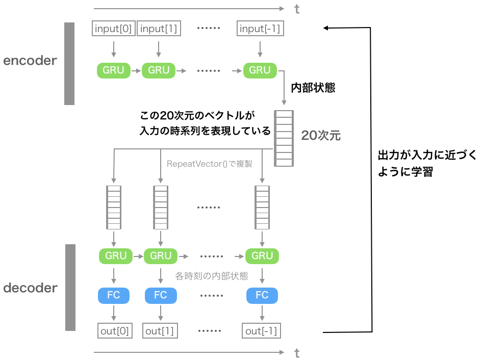
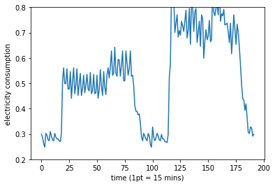
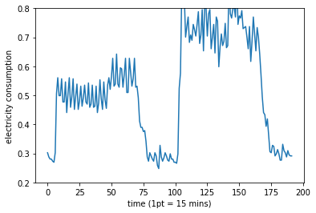
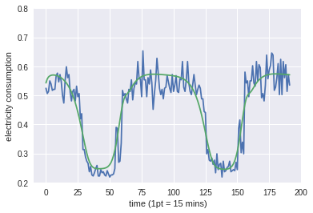
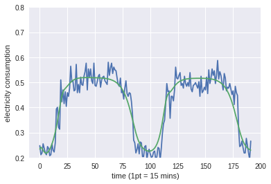
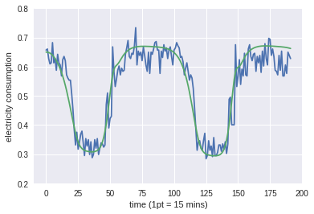

## 時系列でオートエンコーダー

### はじめに
時系列でオートエンコーダーを組む練習。ネットで漁っても見当たらなくて(kerasの日本語記事)、kerasのblogでも放置されていた。

https://blog.keras.io/building-autoencoders-in-keras.html

**""We won't be demonstrating that one on any specific dataset. ""**


→自分でやるしかねぇ

### モデルの概要


encoder部分で、固定長の時系列(今回なら192点分)をGRUに入力して最後に、内部状態(20次元)を取り出している。この内部状態には、入力の時系列の特徴が圧縮されていると捉えることができる。

decoder部分では、先程圧縮された内部状態から再び入力の時系列を再現する。

学習では、入力と出力が近づくようにネットワークの重みを更新している。

kerasのblogの擬似コードでは全結合層がなかったがそれではうまくいかない。試してみたところひたすら全体を通して平均値を吐き続けるモデルになってしまった。

コードはこんな感じ

```python

def seq_autoencoder():
    """
    入力
    ↓
    GRU(encoder)
    ↓
    内部状態 (latent)
    ↓
    GRU(decoder)
    ↓
    全結合層(出力)

    のようなシンプルなネットワーク

    戻り値
     model
    """
    LATENT_DIM = 20
    model = Sequential()
    # (None(batchsize), NUM_TIMESTEMPS, 1)
    model.add(GRU(LATENT_DIM, input_shape=(NUM_TIMESTEPS, 1)))
    # (None, LATENT_DIM)
    model.add(RepeatVector(NUM_TIMESTEPS))
    # (None, NUM_TIMESTEPS, LATENT_DIM)
    model.add(GRU(LATENT_DIM, return_sequences=True))
    model.add(Dense(1))  # 本当はtimedistributedのラッパーで包まないと行けないらしいが、しなくてもできてしまった。

    model.summary()

    return model
```
### データの概要
こちらから取得した。

https://archive.ics.uci.edu/ml/datasets/ElectricityLoadDiagrams20112014

これは電力使用量のデータで15分ごとに記録されている。

あるユーザーのデータだけに注目して、入力とした。時系列の長さは192点分(2日に相当)、ある時刻における次元は1である。

192の幅を持つ窓を1時刻ずつずらして入力に与えるサンプル制作した。
可視化するとこんな感じ。

サンプル9




サンプル17



### 学習の方法
入力を再現する出力がほしいので、損失関数には入力との二乗誤差を用いる。
また、最適化手法はAdamをつかった。バッチサイズは128で学習した。
トレーニングに過適合し始めたら学習を終了させるようにした。

```python
seq_ae = seq_autoencoder()

seq_ae.compile(loss="mean_squared_error", optimizer="adam",
                metrics=["mean_squared_error"])
seq_ae.fit(X_train, X_train,
            epochs=30,
            batch_size=128,
            shuffle=False,
            validation_split=0.1,
            callbacks=[TensorBoard(log_dir="./gru_ae/"), EarlyStopping(patience=2)])
seq_ae.save('./gru_ae/gru_ae.h5')
```

### 結果
```
====================preparating the data...====================
train (126057, 192, 1) test (14007, 192, 1)
====================summary of this model====================
_________________________________________________________________
Layer (type)                 Output Shape              Param #   
=================================================================
cu_dnngru_9 (CuDNNGRU)       (None, 20)                1380      
_________________________________________________________________
repeat_vector_6 (RepeatVecto (None, 192, 20)           0         
_________________________________________________________________
cu_dnngru_10 (CuDNNGRU)      (None, 192, 20)           2520      
_________________________________________________________________
dense_1 (Dense)              (None, 192, 1)            21        
=================================================================
Total params: 3,921
Trainable params: 3,921
Non-trainable params: 0
_________________________________________________________________
Train on 113451 samples, validate on 12606 samples
Epoch 1/30
113451/113451 [==============================] - 53s 469us/step - loss: 0.0272 - mean_squared_error: 0.0272 - val_loss: 0.0234 - val_mean_squared_error: 0.0234
Epoch 2/30
113451/113451 [==============================] - 41s 363us/step - loss: 0.0244 - mean_squared_error: 0.0244 - val_loss: 0.0226 - val_mean_squared_error: 0.0226
Epoch 3/30

中略

Epoch 18/30
113451/113451 [==============================] - 40s 355us/step - loss: 0.0035 - mean_squared_error: 0.0035 - val_loss: 0.0027 - val_mean_squared_error: 0.0027
```

tensorboardで見ると順調に学習できてそう。


では、学習したモデルに実際にtestデータを入力してみる。青い線が実際の値で、緑の線が圧縮してから復元した値である。





これを見ると、周期やおおよそどの程度電気を使うのかは再現できている。
一方で、細かく振動する部分は再現できていない。そもそもデータが難しくて、人間の行動は毎日違うのだから細かい変動は学習ができない（できたとしても相当むずかしい）のでこれで納得することにしよう。

内部状態の次元数を増やしてみたり、全結合層を増やしたりしてみたが、劇的に変化するようなことはなかった。

### まとめ
- 時系列データを圧縮するためのオートエンコーダーを作成した。
- 周期や電力使用量を再現できるモデルになった。

また入力の192次元を20次元まで圧縮したことになるので、この圧縮された表現(潜在変数)を使って、判別などに利用するといったこともできそう。

