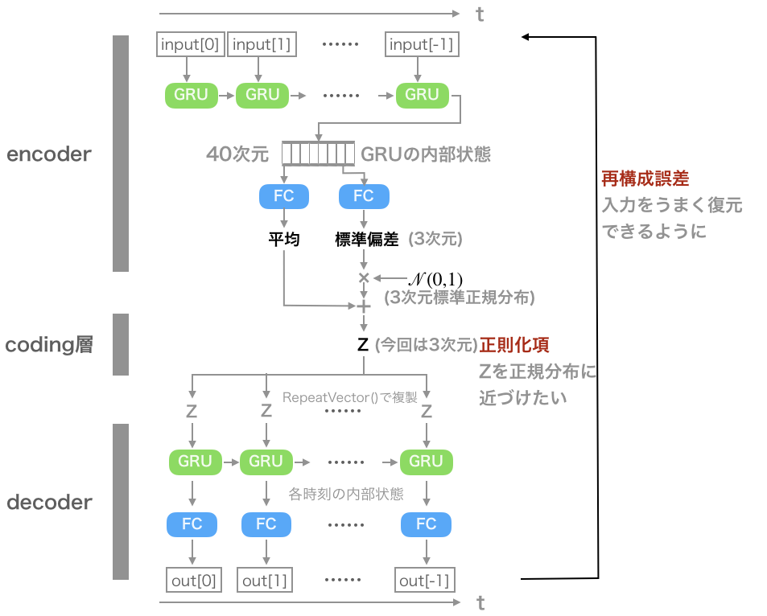
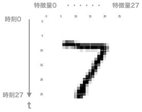
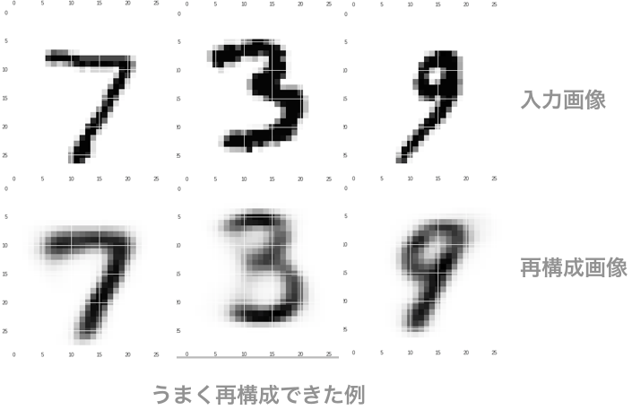
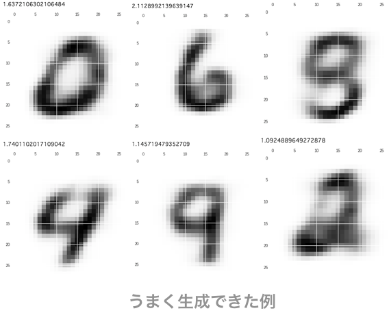
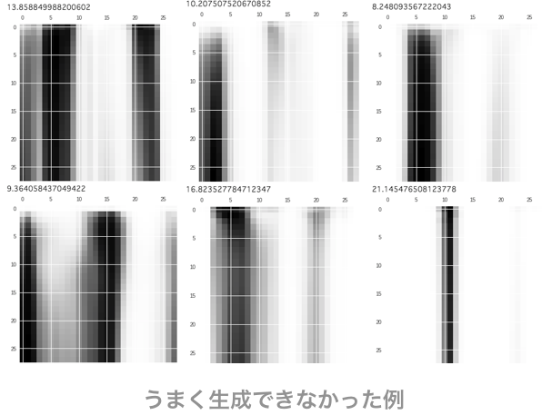

## 時系列データでVariational AutoEncoder

### はじめに
前回の記事で時系列入力に対するオートエンコーダーを組んだ。今回は潜在変数を正規分布に押し込むというVariational AutoEncoderを組んでみた。CNNとVAEを組み合わせる記事は割と見つかるのに、RNNとなったとたん見つからないものである。

データはMNISTであるが後述するように、時系列だと見なして入力した。

まずはモデルとデータの概要を説明する。そのあと、結果で再構成された数字と生成された数字の例を示す。最後に、潜在変数Zが正規分布になっているのか確かめる。

### モデルの概要 


また、赤字で示した損失関数についての数式は以下のようになっている。詳しくは最後に示す参考文献を見ていただきたい。


コードはこんな感じ
```python
def seq_vae():
    """
    入力(input)
    ↓
    GRU(encoder)
    ↓
    内部状態
    ↓   ↓
    mean, log_var
    ↓
    zをサンプリング(ここまでencoder)
    ↓（このzを復元された内部状態だとして）
    GRU(decoder)
    ↓
    全結合層(出力)


    戻り値
     model
    """
    LATENT_DIM = 40
    CODING_DIM=3

    def sampling(args):
        """
        z_mean, z_log_var=argsからzをサンプリングする関数
        戻り値
            z (tf.tensor):サンプリングされた潜在変数
        """
        z_mean, z_log_var = args
        batch = K.shape(z_mean)[0]
        dim = K.int_shape(z_mean)[1]
        epsilon = K.random_normal(shape=(batch, dim))
        # K.exp(0.5 * z_log_var)が分散に標準偏差になっている
        # いきなり標準偏差を求めてしまっても構わないが、負を許容してしまうのでこのようなトリックを用いている
        return z_mean + K.exp(0.5 * z_log_var) * epsilon

    # encoderの定義
    inputs = Input(shape=(NUM_TIMESTEPS, NUM_INPUT_DIM))
    # (None, NUM_TIMESTEPS,NUM_INPUT_DIM)
    x = GRU(LATENT_DIM)(inputs)
    # (None, CODING_DIM)
    z_mean = Dense(CODING_DIM, name='z_mean')(x)
    # (None, CODING_DIM)
    z_log_var = Dense(CODING_DIM, name='z_log_var')(x)
    # (None, LATENT_DIM)

    z = Lambda(sampling, output_shape=(CODING_DIM,), name='z')(
        [z_mean, z_log_var])  # 2つの変数を受け取ってランダムにサンプリング
    # (None, CODING_DIM)
    encoder = Model(inputs, [z_mean, z_log_var, z], name="encoder")
    # encoder部分は入力を受けて平均、分散、そこからランダムサンプリングしたものの3つを返す

    # decoderの定義
    latent_inputs = RepeatVector(
        NUM_TIMESTEPS)(z)
    # (None, NUM_TIMESTEPS, CODING_DIM)
    x = GRU(LATENT_DIM, return_sequences=True)(latent_inputs)
    # (None, NUM_TIMESTEPS, LATENT_DIM)
    outputs = TimeDistributed(
        Dense(NUM_INPUT_DIM, activation='sigmoid'))(x)
    # (None, NUM_TIMESTEPS, NUM_INPUT_DIM)

    # デコーダーとエンコーダーの結合
    # encoderの出力の3つめ、つまりzを入力として、decoderを実行する
    vae = Model(inputs, outputs, name='seq_vae')

    # 損失関数をこのモデルに加える
    def loss(inputs, outputs):
        """
        損失関数の定義
        """
        from keras.losses import binary_crossentropy
        z_mean, z_log_var, _ = encoder(inputs)
        reconstruction_loss = binary_crossentropy(
            K.flatten(inputs), K.flatten(outputs))
#         reconstruction_loss *= NUM_INPUT_DIM*NUM_TIMESTEPS
        kl_loss = 1 + z_log_var - K.square(z_mean) - K.exp(z_log_var)
        kl_loss = K.sum(kl_loss, axis=-1)
        kl_loss *= -0.5
        
        lam = 0.01 #そのままじゃうまく行かなかったので重み付け
        return K.mean((1-lam)*reconstruction_loss + lam*kl_loss)

    vae.add_loss(loss(inputs, outputs))
    print("seq_vaeの構成")
    vae.summary()
    return vae
```
### データの概要
MNISTを時系列だと見なして入力とした。どういうことかというとこう。



### 結果
学習はこのように進んだ。

```
seq_vaeの構成
__________________________________________________________________________________________________
Layer (type)                    Output Shape         Param #     Connected to                     
==================================================================================================
input_1 (InputLayer)            (None, 28, 28)       0                                            
__________________________________________________________________________________________________
cu_dnngru_1 (CuDNNGRU)          (None, 40)           8400        input_1[0][0]                    
__________________________________________________________________________________________________
z_mean (Dense)                  (None, 3)            123         cu_dnngru_1[0][0]                
__________________________________________________________________________________________________
z_log_var (Dense)               (None, 3)            123         cu_dnngru_1[0][0]                
__________________________________________________________________________________________________
z (Lambda)                      (None, 3)            0           z_mean[0][0]                     
                                                                 z_log_var[0][0]                  
__________________________________________________________________________________________________
repeat_vector_1 (RepeatVector)  (None, 28, 3)        0           z[0][0]                          
__________________________________________________________________________________________________
cu_dnngru_2 (CuDNNGRU)          (None, 28, 40)       5400        repeat_vector_1[0][0]            
__________________________________________________________________________________________________
time_distributed_1 (TimeDistrib (None, 28, 28)       1148        cu_dnngru_2[0][0]                
==================================================================================================
Total params: 15,194
Trainable params: 15,194
Non-trainable params: 0
__________________________________________________________________________________________________
/usr/local/lib/python3.6/dist-packages/ipykernel_launcher.py:143: UserWarning: Output "time_distributed_1" missing from loss dictionary. We assume this was done on purpose, and we will not be expecting any data to be passed to "time_distributed_1" during training.
Train on 54000 samples, validate on 6000 samples
Epoch 1/100
54000/54000 [==============================] - 24s 449us/step - loss: 0.2957 - val_loss: 0.2674
Epoch 2/100
54000/54000 [==============================] - 23s 420us/step - loss: 0.2589 - val_loss: 0.2559
Epoch 3/100
54000/54000 [==============================] - 23s 428us/step - loss: 0.2551 - val_loss: 0.2547

中略

Epoch 34/100
54000/54000 [==============================] - 23s 420us/step - loss: 0.2238 - val_loss: 0.2232
Epoch 35/100
54000/54000 [==============================] - 23s 419us/step - loss: 0.2236 - val_loss: 0.2228
```
警告で出てるこれはどうしたらいいんすかね… /usr/local/lib/python3.6/dist-packages/ipykernel_launcher.py:143: UserWarning: Output "time_distributed_1" missing from loss dictionary. We assume this was done on purpose, and we will not be expecting any data to be passed to "time_distributed_1" during training.

とりあえず学習はできたようなので、警告は無視して、画像の再構成を行ってみる。




うまく再構成できなかった入力を見ると、癖の強い書き方だったり、データが欠損していたりする場合が多い(下が消えてる4とか)。

次に標準正規分布から、数字を生成してみる。



また、標準正規分布から外れた点をZにセットして、時系列(というか画像？)を生成してみる。



### Zは本当に正規分布をしているのか？
ここが気になった点なので、Zの平均を3次元空間にプロットしてみた。


見ての通り、なんとなく0を中心とするように点がまとまっているが正規分布かは怪しい

オレンジ色の点の集合(1をコードしている領域)の、0に近い内側の領域とか密度の薄さが顕著である。

生成モデルでは他にGANが存在するが、そちらでは点がどういうふうに分布しているのか今後確かめたい。

### まとめ
- 時系列データに対応したVAEを作った
- MNISTの再構成、及び生成を行った
- コードはGithubに
    - https://github.com/masakiaota/blog/blob/master/vae/article/seq_vae.md

### 参考文献

https://www.slideshare.net/ssusere55c63/variational-autoencoder-64515581?ref=http://sh-tatsuno.com/blog/index.php/2016/07/30/variationalautoencoder/

https://qiita.com/iss-f/items/c43b23815fc6d15ae22e#はじめに

https://github.com/keras-team/keras/blob/master/examples/variational_autoencoder_deconv.py
